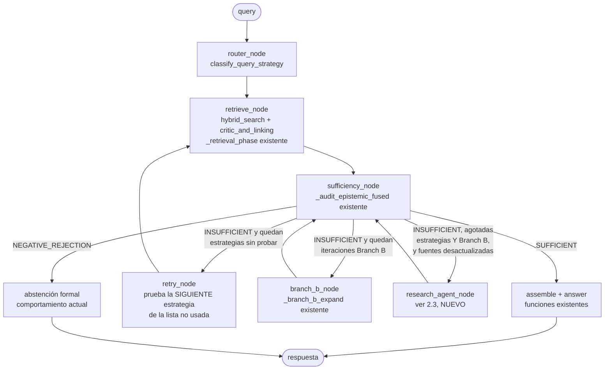
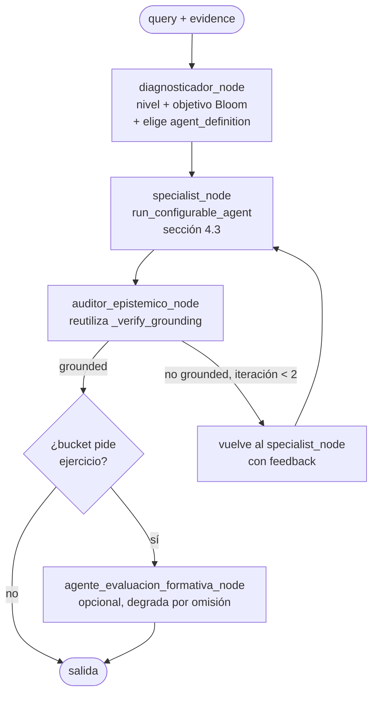
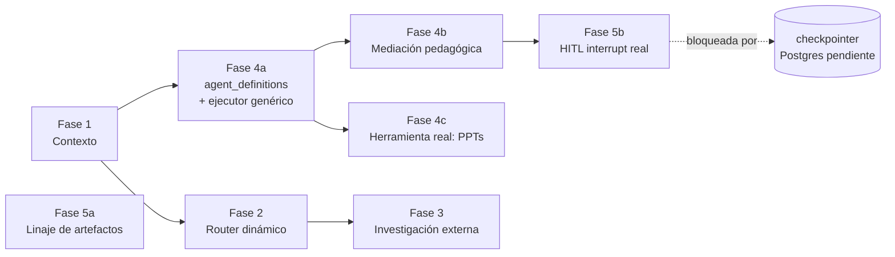

# Diseño — Capa Multiagéntica sobre KAG (Retrieval Dinámico + Gestión de Contexto + Catálogo de Agentes + Mediación Pedagógica + HITL Evaluativo)

**Tipo de documento:** propuesta de expansión/refactorización — capa de agencia sobre la capa de conocimiento
**Estado:** propuesta (no implementada) — para revisión antes de asignar a agentes de desarrollo
**Depende de:** `docs/diseno_sistema_kag.md` (motor KAG, implementado y verificado, 2026-09-14/15), `src/agents/producer_critic.py` (patrón de orquestación LangGraph ya adoptado), `src/tools/registry.py` / `src/tools/mcp_client.py` / `src/db/models.py::ToolAdapter,FormatSpec` (catálogo data-driven de herramientas, ya implementado)
**No modifica:** `src/kag_ingest.py`, ni los pasos del `ask()` clásico de `src/kag_query.py`, ni el orquestador de producción existente (`src/tools/orchestrator.py`). Todo lo que sigue es código nuevo y adyacente, activable por flags, con degradación explícita.

---

## 0. Resumen ejecutivo

La premisa de este documento: **el RAG (KAG) organiza el caos** — indexa, cita *verbatim*, audita epistémicamente, degrada con conservadurismo — y **un sistema multiagéntico opera sobre esos datos ya organizados**, decidiendo cómo buscarlos, cuándo hay suficiente evidencia, y cómo entregarlos. KAG sigue siendo la única fuente de verdad factual; nada de lo propuesto aquí le agrega una segunda fuente de verdad ni un segundo motor de recuperación.

Esto ya tiene un precedente **explícito y documentado** en este mismo repositorio: `src/kag_agents.py` fue un motor "agéntico" de consulta (síntesis, contradicciones, suficiencia, Branch B, grounding) construido como módulo paralelo, con sus propias 5 tablas (`documents`, `document_chapters`, `propositional_chunks`...). El 2026-09-15 se **unificó y se eliminó** (migración `0025_kag_drop_propositional`) porque duplicaba lo que el pipeline clásico ya hacía — sus capacidades se portaron al modo `audited` de `src/kag_query.py`, reutilizando las tablas clásicas. Esa es la lección rectora de todo este documento: **ninguna pieza nueva aquí crea un segundo pipeline de recuperación ni tablas paralelas de chunks/entidades/proposiciones.**

Se proponen capas independientes y activables por flag, cada una resolviendo un problema concreto:

| Capa | Resuelve | Módulo nuevo | Flag / tabla |
|---|---|---|---|
| **Router dinámico** (§2) | elegir, intentar y reintentar distintas estrategias de búsqueda; auto-crítica de suficiencia; escalar a investigación externa cuando el corpus está desactualizado | `src/kag/query_graph.py` | `KAG_QUERY_GRAPH_ORCHESTRATION` |
| **Gestión de contexto** (§3) | el `assemble_context` actual no tiene presupuesto de tokens; no reserva espacio para `history`; no compacta cuando el multi-índice (chunks+paráfrasis+proposiciones) desborda el prompt | función nueva en `kag_query.py` + spec `kag_context_synthesis` | `KAG_CONTEXT_SYNTHESIS` |
| **Catálogo de agentes como datos** (§4) | que un líder pueda crear agentes alternativos propios en cada rama sin tocar código, y que ciertos agentes tengan acceso a herramientas concretas (ej.: generación de PPTs) | `agent_definitions` + `src/agents/configurable_agent.py` | tabla nueva |
| **Mediación pedagógica (MAS)** (§5) | KAG responde en una sola pasada; el aprendizaje es iterativo y depende del nivel del usuario (ZPD, carga cognitiva, fricciones deseables) | `src/agents/pedagogy.py` | `KAG_PEDAGOGY_ENABLED` |
| **HITL evaluativo + linaje** (§6) | el veredicto de KAG hoy no tiene panel de revisión humana con alternativas; los `projects` no registran de qué chunks/proposiciones KAG provienen | `src/agents/grader.py` + migración aditiva a `projects`/`project_versions` | `KAG_PEDAGOGY_HITL` |

Cada capa se diseña para ser **retirable sin dejar rastro**: si se apaga el flag, el sistema se comporta exactamente como hoy.

Un principio transversal gobierna la Sección 4: la personalización se resuelve **con el mismo patrón que el repo ya usa** para `tool_adapters`/`format_specs`/`prompt_templates`/`production_templates` — catálogos en tablas, resueltos en runtime, editables por API — no con un framework de plugins nuevo. Los "agentes" de la capa pedagógica y las "alternativas" que sugiere el panel HITL son, en este diseño, **la misma entidad de datos** (`agent_definitions`), consultada desde dos lugares distintos, en vez de dos implementaciones paralelas de la misma idea.

---

## 1. Restricciones heredadas (extienden literalmente el §8.0 de `diseno_sistema_kag.md`)

Todo agente/nodo nuevo de este documento debe cumplir, sin excepción:

1. **No tocar los pasos del algoritmo clásico.** `ask()` (modo `fast`), `_ask_audited()` y `index_document()` se conservan EXACTOS. Todo lo nuevo es código adyacente que los *envuelve* o los *llama*, nunca los reescribe.
2. **Cero tablas nuevas de retrieval.** Ninguna capa crea su propia versión de `kag_chunks`/`kag_entities`/`kag_propositions`. Si hace falta persistir algo nuevo (perfil pedagógico, catálogo de agentes, linaje de artefactos), se hace en tablas *adyacentes* con FKs hacia las existentes — nunca duplicando su contenido.
3. **Prompt-as-code obligatorio.** Toda spec nueva se agrega a `src/db/seed_kag_prompts.py` con `user_template`, se compila con `python -m src.llm.compile_prompts`, y el runtime la lee con `_get_prompt_pair` (fallback a constantes de código si no hay artefacto — igual que hoy).
4. **Contrato de decisión de `src/llm/base.py`.** Todo nodo que llama a un LLM devuelve `status` (`ok`/`degraded`/`skipped`), y si degrada a lo determinista, decide explícitamente si eso es:
   - **degradación silenciosa** (trabajo de fondo, no bloquea — igual que la ingesta hoy: "si el LLM falla en un paso de ingesta, se salta con log"), o
   - **degradación que exige aceptación humana** (`requires_user_acceptance=True` — igual que Producer-Critic: "la degradación a lo determinista SIEMPRE requiere aceptación del usuario").
   La Sección 8 fija explícitamente en qué categoría cae cada nodo nuevo — no se deja a criterio de cada implementador.
5. **Sesión SQLAlchemy por hilo.** Cualquier paralelismo (fan-out de subconsultas, nodos concurrentes de LangGraph) debe abrir su propia sesión (`_with_own_session`, ya existente) — las sesiones no son thread-safe y esto ya causó bugs reales documentados en el repo.
6. **Testeable sin Postgres.** Cada nodo nuevo recibe sus dependencias (sesión, LLM) de forma inyectable, como ya hace `producer_node(state, producer_fn=...)` — se prueba con fakes, sin DB real.
7. **Sin abstracciones innecesarias.** El repo tiene una regla de estilo explícita: *"código simple y directo, sin dataclasses ni abstracciones innecesarias; SQL crudo vía `session.execute(text(...))`"*. Se sigue el mismo criterio aquí: se usan `dataclass`/`Enum` solo donde el propio repo ya lo hace (p. ej. `GateVerdict`), no se introduce un framework de agentes propio, no se generaliza antes de tener un segundo caso de uso real.
8. **Flags con prefijo consistente**, resueltos con el mismo mecanismo que ya existe (`src/kag/config.py::resolve_config`, env > DB > default): `KAG_*` para las capas de recuperación/contexto, `KAG_PEDAGOGY_*` para la capa pedagógica y su HITL — todas por defecto en `False`.
9. **El checkpointer de LangGraph sigue siendo `InMemorySaver`** en todo el repo (deuda técnica ya reconocida: *"para que un `interrupt()` sobreviva un reinicio del contenedor, cambiar a `langgraph-checkpoint-postgres`"*, ya comentado en `requirements.txt`). Ningún `interrupt()` nuevo de este documento se expone en producción real hasta resolver esa deuda — ver Sección 9, riesgo 1.
10. **Personalizar el "qué" (prompt, modelo, herramienta), nunca el "shape".** Un líder puede registrar un agente nuevo con su propio prompt, su propio modelo y su propia herramienta de salida. Lo que **no** puede personalizar es la forma en que ese agente debe responder (`output_contract`, §4.3) — eso sigue siendo un enum cerrado y validado en código, igual que el repo ya hace con `checklist_results` (`ok`/`fail`/`no_evaluado`) o con `verdict` (`SUFFICIENT_FOR_SYNTHESIS`/`INSUFFICIENT_TRIGGER_BRANCH_B`/`NEGATIVE_REJECTION`). Máxima libertad de contenido, cero libertad de contrato — si no, cualquier nodo que consuma la salida de un agente personalizado se vuelve imposible de testear.

---

## 2. Capa — Router de recuperación dinámico (elegir / intentar / reintentar)

### 2.1 Diagnóstico del estado actual

El pipeline clásico **ya tiene** un router (`classify_query_strategy`, cinco estrategias: `hierarchical`/`graph`/`metadata`/`subqueries`/`multidoc`) y **ya tiene** un bucle de expansión (`_branch_b_expand`, hasta `KAG_BRANCH_B_MAX_ITERS`). Pero dos cosas limitan la "dinámica" real hoy:

- `KAG_QUERY_ALL_CHANNELS=True` es el **default**, y cuando está activo **saltea por completo** el router: siempre se buscan los 6 canales a la vez, sin importar la pregunta. El router "existe" en el código pero no decide nada en producción por defecto.
- La estrategia `multidoc` está literalmente sin implementar (`"planificación LLM pendiente"`, `src/kag_query.py:3368`), y el bucle Branch B es un `while` fijo dentro de una función de 300+ líneas — agregar una nueva vía de expansión hoy exige editar esa función, no agregar una pieza.

### 2.2 Propuesta: envolver, no reescribir

Se agrega `src/kag/query_graph.py` con un `StateGraph` cuyos nodos son **llamadas directas** a las funciones ya existentes de `kag_query.py` (`classify_query_strategy`, `hybrid_search`, `critic_and_linking`, `_branch_b_expand`, `_evaluate_sufficiency`/`_audit_epistemic_fused`, `generate_answer`). Ningún nodo reimplementa lógica de recuperación.

```python
class KagRetrievalState(TypedDict):
    query: str
    strategies_tried: list[str]      # historial de estrategias ya intentadas
    channels_tried: list[str]
    evidence: dict | None            # merged_hits, entity_ids, etc. (shape de _retrieval_phase)
    verdict: str | None              # SUFFICIENT_FOR_SYNTHESIS | INSUFFICIENT_TRIGGER_BRANCH_B | NEGATIVE_REJECTION
    confidence: float
    iteration: int
    escalated_to_research: bool
    requires_user_acceptance: bool
```

Flujo de aristas condicionales (reemplaza el `if/elif` fijo de `ask()`/`_ask_audited()` por un grafo navegable):



Esto es literalmente el mismo patrón de `route_after_critic` en `producer_critic.py`, aplicado al lado de consulta. La diferencia con el `while` actual: **agregar una sexta estrategia, o una segunda vía de expansión, es agregar un nodo y una arista** — no editar una función de cientos de líneas.

**`retry_node` es la pieza que responde literalmente a "elegir, intentar y reintentar distintas estrategias de búsqueda (proposiciones, paráfrasis, texto real)"**: en vez de fijar los `channels` una sola vez al principio (como hoy), cada vuelta al nodo prueba una combinación de canales distinta — por ejemplo, si `graph` (chunks+grafo) no fue suficiente, probar `propositions` solo, luego `paraphrase` solo, antes de rendirse. `strategies_tried`/`channels_tried` evitan repetir la misma combinación dos veces.

**Nota sobre `KAG_QUERY_ALL_CHANNELS`:** este flag no se elimina — se **reinterpreta** como una de las estrategias que el router puede elegir explícitamente ("amplio, todos los canales a la vez") en vez de ser un interruptor global que apaga el router. Si en producción se demostró que "todos los canales" da mejores resultados que el router, eso se puede seguir midiendo con la telemetría existente y, si se confirma, convertirlo en el fallback determinista del router en vez de en un bypass total.

### 2.3 Agente de investigación externa (nuevo) — Ruta B del pipeline, hoy sin implementar

El pipeline unificado de la organización (`docs/pipeline_unificado_produccion_contenidos(1).md`) ya prevé una **Ruta B — Solución previa → `OBSOLETE_CHECK`** con `RESEARCH_UPDATE` (verificación de evidencia) y `RESEARCH_NOTE`/`UPDATE_BRIEF`, marcada ❌ en el checklist del README. Lo que se busca — *agentes que busquen datos faltantes en internet, según las fechas de publicación de los libros (bibtex)* — es exactamente esa ruta, aplicada a nivel de consulta KAG en vez de a nivel de pieza de contenido.

Trigger determinista (no libre): `research_agent_node` solo se activa cuando **todas** estas condiciones se cumplen —
1. el veredicto sigue `INSUFFICIENT_TRIGGER_BRANCH_B` tras agotar `KAG_BRANCH_B_MAX_ITERS` y todas las estrategias/canales locales, **y**
2. las proposiciones/chunks-ancla más relevantes provienen de documentos cuyo `bibtex`/año de publicación supera un umbral configurable — el umbral es distinto para disciplinas básicas que para aplicadas (`KAG_STALENESS_YEARS_BASIC`, `KAG_STALENESS_YEARS_APPLIED`, resueltos vía `resolve_config` como cualquier otro flag KAG), reflejando que un libro de física básica de hace 15 años puede seguir vigente y un paper de ML aplicado de hace 3 no.

Implementación: reutiliza la infraestructura de **`tool_adapters`/`src/tools/registry.py`/`src/tools/orchestrator.py`, que ya existe** para la capa de producción creativa — se registra un adapter de búsqueda web como una herramienta más del catálogo, en vez de escribir un cliente HTTP nuevo desde cero.

**Regla de degradación distinta al resto de KAG, y a propósito:** la ingesta normal degrada en silencio porque es un job de fondo, sin decisión editorial. Esto es lo opuesto: **contenido no verificado por el pipeline epistémico de KAG** (sin `chunk_id`/`proposition_id`, sin grounding verbatim contra un documento indexado) entrando a informar una respuesta. Por eso, `research_agent_node` marca **siempre** `source_type="external_web"` y `requires_user_acceptance=True` — nunca se inyecta directo al contexto de respuesta sin que alguien lo revise, y **nunca** se escribe de vuelta al corpus KAG (no dispara una re-ingesta automática) salvo aprobación humana explícita, que es exactamente el `RESEARCH_NOTE → UPDATE_BRIEF` que ya describe el pipeline.

---

## 3. Capa — Gestión de contexto y síntesis intermedia

### 3.1 El problema

`assemble_context` hoy concatena chunks + tripletas + figuras + resúmenes + proposiciones en un solo string, sin medir tokens, y **el parámetro `history` está preparado pero "sin probar con Docker"** (nota explícita en el código) — no hay ninguna reserva de espacio para él. Con documentos grandes, el multi-índice puede desbordar fácilmente el presupuesto del modelo antes de llegar siquiera al historial de conversación.

### 3.2 Presupuesto explícito de tokens

Usando los valores reales ya registrados en `llm_models` (`src/db/seed_ai.py`): el modelo grande (`DeepSeek-V4-Flash-0731`, el que ya genera la respuesta final en ambos modos) tiene `context_window=131072` y `max_output_tokens=8192`.

```python
# src/kag_query.py (constantes nuevas, junto a CONTEXT_WINDOW/MAX_CONTEXT_CHUNKS existentes)
HISTORY_RESERVE_TOKENS = 8000          # KAG_HISTORY_RESERVE_TOKENS, configurable
SYSTEM_OVERHEAD_TOKENS = 1500          # margen para el prompt de sistema + instrucciones
EVIDENCE_TOKEN_BUDGET = (
    large_model.context_window
    - large_model.max_output_tokens
    - HISTORY_RESERVE_TOKENS
    - SYSTEM_OVERHEAD_TOKENS
)  # ≈ 113.380 tokens con los valores actuales — se lee de session_settings, no se hardcodea
```

`HISTORY_RESERVE_TOKENS` se resta **antes** de decidir si hace falta sintetizar: el historial de conversación tiene un presupuesto propio, no compite por espacio con la evidencia recuperada. (La compactación del propio historial — *sliding window*/resumen cuando el historial crece — queda fuera de alcance de este documento y se deja como ítem explícito de trabajo futuro; hoy `history` ni siquiera se ejercita en producción.)

### 3.3 Contrato único: `EvidenceBundle`

Para que el LLM que sintetiza y el LLM que responde **siempre** vean la misma forma de evidencia — con o sin síntesis intermedia — se define un contrato nuevo, en el mismo espíritu que `ok_result`/`degraded_result` de `src/llm/base.py`:

```python
# EvidenceBundle — shape único devuelto tanto por ensamblado directo
# como por el sintetizador intermedio.
{
    "content": str,              # texto a insertar en el prompt de respuesta
    "references": [
        {
            "ref_id": str,        # [1], [2]... — el mismo marcador citado en `content`
            "doc_id": int,
            "doc_title": str,
            "chapter_title": str,       # section_path
            "chunk_id": int | None,
            "granularity": str,   # "chunk" | "paraphrase" | "proposition" | "summary"
            "citation_span": str,       # texto verbatim citable
        },
        ...
    ],
    "was_synthesized": bool,
    "localized_source": {"doc_title": str, "chapter_title": str} | None,
}
```

`assemble_context` (la función clásica) **no se toca** — se agrega `assemble_context_bundled(...)` como envoltorio nuevo que arma el mismo string de hoy pero devuelve además la lista `references` estructurada (esto ya es casi gratis: `assemble_context` ya etiqueta cada fragmento con `doc_title`/`chapter_title`/`chunk_index` al armar las secciones — solo falta capturar esas etiquetas en una lista en vez de solo interpolarlas en texto).

### 3.4 `context_synthesizer_node` (nuevo)

Solo se invoca si `len(bundle.content en tokens) > EVIDENCE_TOKEN_BUDGET`. LLM **grande** (el mismo que ya usa `generate_answer`), `thinking` **activo** (ver tabla 3.5).

- **Prompt (spec nueva `kag_context_synthesis`, prompt-as-code):** recibe la evidencia por las mismas tres capas de granularidad que ya usa `_audit_epistemic_fused` (MARCO TEMÁTICO / EVIDENCIA TEXTUAL / CAPA ATÓMICA), con la instrucción explícita de (a) señalar en qué documento/capítulo está *de hecho* la respuesta a la consulta, (b) comprimir preservando cada `ref_id` efectivamente usado, (c) prohibido introducir afirmaciones que no estén en el bundle original (esto se verifica después con `_verify_grounding`, ya existente, reutilizado sin cambios).
- **Salida:** el mismo shape `EvidenceBundle`, con `content` = resumen, `references` = subconjunto realmente citado, `was_synthesized=True`, `localized_source` poblado.
- **Degradación:** si el LLM falla o el JSON es inválido → se cae al comportamiento ya existente hoy (truncar por `apply_relevance_threshold`/`MAX_CONTEXT_CHUNKS`), `was_synthesized=False`, log — nunca bloquea la respuesta. Esta es degradación **silenciosa**: comprimir mejor o peor el contexto no es una decisión editorial, es una optimización de ingeniería.

El nodo de respuesta final (`generate_answer`) pasa a recibir siempre un `EvidenceBundle`, nunca un string plano a secas.

### 3.5 Política de `thinking` — formalización de un patrón que ya existe

El propio código **ya implementa** casi exactamente lo pedido: `call_with_retries(..., thinking=False)` ya se usa explícitamente en clasificación de estrategia, extracción de metadatos/subconsultas, crítico+entity linking, y en *todas* las llamadas de ingesta (entidades, proposiciones, paráfrasis, resumen documental). El default de `complete()` cuando **no** se pasa `thinking` es `None` → razonamiento activo — y así quedan hoy, implícitamente, tanto `_audit_epistemic_fused` como `generate_answer` y la respuesta final de `_ask_audited`.

Lo que falta es **hacerlo explícito** (para que no dependa de un default que puede cambiar) y **extender la misma regla a los nodos nuevos**:

| Función / nodo | Etapa | `thinking` hoy | `thinking` propuesto | Razón |
|---|---|---|---|---|
| `classify_query_strategy` | consulta | `False` (ya) | sin cambio | clasificación de opción fija de un set cerrado |
| `critic_and_linking`, `extract_metadata_filters`, `generate_subqueries` | consulta | `False` (ya) | sin cambio | extracción estructurada, JSON mode |
| extracción de entidades/proposiciones, paráfrasis, `summarize_document` | ingesta | `False` (ya) | sin cambio | trabajo de fondo, en lote |
| `_audit_epistemic_fused` (síntesis+contradicciones+suficiencia) | consulta audited | implícito (`None`) | **`True` explícito** | reconciliar evidencia contradictoria es razonamiento multi-paso |
| `generate_answer` / respuesta final audited | consulta | implícito (`None`) | **`True` explícito** | síntesis final, debe distinguir capas de evidencia |
| `context_synthesizer_node` (§3.4, nuevo) | consulta | — | `True` | localizar + comprimir + preservar citas es razonamiento, no clasificación |
| `research_agent_node` (§2.3, nuevo) | consulta | — | `True` | debe juzgar relevancia y vigencia de fuentes externas |
| Diagnosticador pedagógico (§5.3, nuevo) | entrega | — | `False` | clasificación de nivel/objetivo, igual patrón que el router de KAG |
| Especialistas pedagógicos, Auditor Epistémico (§5.4/§5.5, nuevo) | entrega | — | `True` | mediación didáctica y verificación son razonamiento |

Esta tabla se convierte literalmente en comentarios/constantes en cada llamada nueva (`thinking=True,  # razonamiento multi-paso — ver docs/diseno_capa_multiagente.md §3.5`), para que quede auditable igual que hoy.

---

## 4. Registro de agentes como datos (`agent_definitions`) y acceso a herramientas concretas

### 4.1 Por qué esto y no un framework de plugins

El repo ya tiene la respuesta a "cómo dejo que alguien sin acceso al código agregue una opción nueva al catálogo": una tabla + CRUD por API + un resolver data-driven que la lee en runtime. Es el patrón de `tool_adapters`/`format_specs`/`production_templates`/`prompt_templates`. Construir un sistema de plugins (paquetes Python cargados dinámicamente, sandboxing de código de terceros, etc.) sería precisamente la clase de abstracción innecesaria que el propio repo evita a propósito (regla 7, §1). La tabla `agent_definitions` es la misma idea que esas cuatro tablas, aplicada a "qué agente responde en la rama X".

Esto resuelve al mismo tiempo un problema de diseño: sin este catálogo, "los especialistas de entrega" (Sección 5: socrático/carga cognitiva/dialéctico) y "las alternativas que sugiere el panel HITL" (Sección 6.3: investigación/diseño/comunicación) terminan siendo la misma idea — un agente que produce una variante de un mismo material — implementada dos veces con dos mecanismos distintos. Con `agent_definitions`, ambos leen de la misma tabla: un especialista de entrega y una alternativa sugerida por el Grader son la misma fila, consultada desde dos lugares distintos del sistema.

### 4.2 Esquema

```sql
-- Migración aditiva. No reemplaza pipeline_templates ni ninguna tabla existente.
CREATE TABLE agent_definitions (
    id UUID PRIMARY KEY DEFAULT gen_random_uuid(),
    branch VARCHAR(30) NOT NULL,             -- 'investigacion' | 'diseno' | 'comunicacion'
                                              -- ('diseno' es la rama de enseñanza / diseño
                                              -- instruccional y pedagógico)
    key VARCHAR(80) NOT NULL,                -- slug único dentro de la rama, ej. 'microlearning'
    name VARCHAR(150) NOT NULL,
    description TEXT NOT NULL DEFAULT '',
    prompt_task_key VARCHAR(100) NOT NULL,   -- task_key en prompt_templates (prompt-as-code,
                                              -- se compila y se lee con _get_prompt_pair, IGUAL
                                              -- que cualquier spec existente)
    model_size VARCHAR(20) NOT NULL DEFAULT 'large',   -- 'small' | 'large' (los que ya existen)
    thinking BOOLEAN NOT NULL DEFAULT TRUE,
    output_contract VARCHAR(50) NOT NULL DEFAULT 'pedagogy_draft',  -- enum cerrado, ver §4.3
    format_spec_id UUID REFERENCES format_specs(id),   -- NULL si el agente no materializa
                                                        -- un artefacto de producción (solo texto)
    is_builtin BOOLEAN NOT NULL DEFAULT FALSE,   -- TRUE para los agentes que vienen seed
    is_active BOOLEAN NOT NULL DEFAULT TRUE,
    created_by UUID REFERENCES app_users(id),
    created_at TIMESTAMPTZ NOT NULL DEFAULT now(),
    updated_at TIMESTAMPTZ NOT NULL DEFAULT now(),
    UNIQUE (branch, key)
);
```

No hay un campo `allowed_tools` de texto libre: el acceso a herramientas se declara **exclusivamente** vía `format_spec_id` → `format_specs.tool_chain` (columna que ya existe y ya es la única fuente de verdad de qué `tool_adapters` puede invocar un `artifact_type`). Un agente que quiere generar PPTs no "llama a una herramienta" directamente — apunta a un `format_spec` cuyo `tool_chain` ya declara esa herramienta, y el orquestador ya existente (`src/tools/orchestrator.py`) hace el resto. Esto evita inventar un segundo mecanismo de permisos de herramientas en paralelo al que ya existe.

### 4.3 Ejecutor genérico — un nodo, no N funciones hardcodeadas

```python
# src/agents/configurable_agent.py (nuevo)

OUTPUT_CONTRACTS = {
    "pedagogy_draft": {"required_keys": ["content", "cited_refs"]},
    "slide_outline": {"required_keys": ["units", "slides_per_unit", "notes"]},
    "social_copy": {"required_keys": ["hook", "body", "cta"]},
}  # enum cerrado — igual criterio que QUERY_STRATEGIES/CHANNEL_SET en kag_query.py


def run_configurable_agent(session, agent_definition_id, state) -> dict:
    """Ejecuta CUALQUIER fila de agent_definitions — seed o creada por un
    líder — con el MISMO contrato de decisión (status/degradación) que ya
    usa producer_node. Nunca reescribe agent_definitions ni format_specs;
    solo las lee.
    """
    agent_def = _load_agent_definition(session, agent_definition_id)
    system, user_template = _get_prompt_pair(
        session, model=None, task_key=agent_def.prompt_task_key,
        fallback_short=None,  # sin fallback de código: si no hay artefacto
                              # compilado para un agente CREADO por un líder,
                              # no existe un "prompt por defecto" razonable —
                              # degrada a requires_user_acceptance=True (§8)
    )
    try:
        text_out, _model, _used_fallback = call_with_retries(
            session, prompt=user_template.format(**state), system=system,
            model_size=agent_def.model_size, response_format={"type": "json_object"},
            retries=..., thinking=agent_def.thinking,
        )
        draft = parse_llm_output(text_out)
        _validate_output_contract(draft, agent_def.output_contract)  # AttributeError si no calza
    except Exception:  # noqa: BLE001 — degradación natural
        return {"status": "degraded", "requires_user_acceptance": True, "draft": None}

    result = {"status": "ok", "draft": draft, "requires_user_acceptance": False}
    if agent_def.format_spec_id:
        result["materialize_via"] = agent_def.format_spec_id  # el grafo, NO este nodo,
        # decide cuándo llamar a POST /projects/{id}/produce con este format_spec — ver §4.4
    return result
```

En el grafo de LangGraph, esto reemplaza a tener un nodo por cada especialista por **un solo nodo topológico**, `specialist_node`, parametrizado en runtime por `state["chosen_agent_definition_id"]` — el Diagnosticador (§5.3) ya no elige entre nombres de función Python, elige un `id` de fila. Agregar una cuarta alternativa a la rama "diseño" es un `INSERT INTO agent_definitions`, no un cambio de grafo ni un deploy.

### 4.4 Ejemplo end-to-end: generación de PPTs en la rama de enseñanza

**Estado actual (verificado en el código), y por qué Canva no alcanza tal cual:** `src/tools/mcp_client.py` opera hoy en **modo simulado** para todos los adapters salvo que se configure un `base_url` real (`McpClient._call_direct` construye un comando de texto y una ruta de salida falsos). El adapter `canva` ya registrado simula una salida `.png`, no `.pptx` — Canva está pensado ahí como herramienta de diseño/imagen con "modo IA nativa del programa o recomendaciones como fallback" (README), no como generador programático de mazos de diapositivas a partir de un syllabus estructurado.

**Lo mínimo nuevo, todo como datos salvo una pieza de infraestructura real:**

1. Un `tool_adapter` nuevo (fila, no código): `name="pptx_engine"`, `mcp_server_name` apuntando a un MCP server real que envuelva una librería madura de generación de `.pptx` (equivalente a `python-pptx`), `execution_mode="mcp"`. Esta es la única pieza que requiere trabajo de infraestructura real (levantar ese MCP server una vez) — no distinto en naturaleza a integrar ElevenLabs o Veo 3, que ya están en el catálogo.
2. Un `format_spec` nuevo (fila): `brand_objective="ESCAPE"`, `artifact_type="diapositivas_curso"`, `tool_chain=["pptx_engine"]`, con sus `phases`/`structure`/`qa_checks` propios (igual mecanismo que los `format_specs` ya existentes).
3. Un `agent_definition` en la rama `diseno` con `format_spec_id` apuntando a ese `format_spec`.

Con eso: cuando el especialista de esa fila termina su borrador (`output_contract="slide_outline"`), el grafo llama a lo que **ya existe y ya está probado de punta a punta** — `POST /project/new` → `POST /projects/{id}/generate` (o directamente inyectar el `snapshot` que el agente ya escribió) → `POST /projects/{id}/produce`, que ejecuta la cadena mecánica declarada en `format_specs.phases` + `tool_chain`. El agente pedagógico **no llama a ninguna herramienta directamente** — entrega un JSON con la forma que su `output_contract` exige, y el orquestador de producción hace el resto, exactamente como ya lo hace hoy para un `video_corto`.

### 4.5 CRUD y control de acceso — un gap real que esto no debe heredar

`GET/POST/PATCH/DELETE /tool-adapters` **hoy no exige ningún rol** (`src/api/main.py:1384-1453` — solo `Depends(get_session)`, sin `Depends(require_role(...))`, a diferencia de `POST /briefs/{id}/approve` o `POST /kag/ingest`, que sí lo exigen). Antes de exponer un CRUD nuevo para `agent_definitions` — que puede terminar disparando llamadas a APIs externas con costo real (ElevenLabs, Veo 3, y ahora potencialmente un motor de PPTs) — corresponde:

- `POST/PATCH/DELETE /agent-definitions` exige `require_role("lider")` (igual que ingesta KAG, igual que aprobar un brief) — crear y editar agentes es una decisión editorial/de producto, no una operación de lectura.
- `GET /agent-definitions` puede quedar abierto a cualquier rol autenticado (igual que hoy `GET /tool-adapters`).
- **Primera ejecución en modo de prueba obligatorio:** un `agent_definition` nuevo (`is_builtin=False`) cuyo `format_spec_id` apunta a un `tool_chain` con costo real corre su primer `/produce` con `requires_user_acceptance=True` forzado, sin importar el veredicto del Auditor — un líder debe ver al menos una salida real antes de que ese agente pueda auto-materializar en producción. Esto es la misma lógica que ya rige para toda degradación determinista en el resto del sistema, aplicada aquí a "agente nunca antes ejecutado" en vez de "LLM no disponible".

*(Esto no corrige el estado actual de `/tool-adapters` — eso es una decisión aparte, fuera de alcance de este documento — pero si se construye `agent_definitions` copiando literalmente el patrón de `/tool-adapters`, se hereda el mismo hueco; se deja anotado para que no se repita sin decisión explícita.)*

---

## 5. Capa — Mediación pedagógica (MAS)

### 5.1 Encaje con lo existente

Esta capa **consume** el `EvidenceBundle` de la Sección 3 como una herramienta compartida — no toca `kag_chunks`/`kag_entities`/`kag_propositions`, no reimplementa retrieval. Vive en `src/agents/pedagogy.py`, **mismo patrón LangGraph** que `producer_critic.py`. Se activa solo para la marca **ESCAPE** (comunicación científica dirigida a "docentes, estudiantes y profesionales", según el canon de marca ya registrado en `brand_knowledge`) — Ergalia (consultoría B2B) no pasa por esta capa salvo que se pida explícitamente.

No reemplaza los modos `fast`/`audited` de `ask()`: es un **modo de entrega adicional**, seleccionado por `content_bucket` (mecanismo ya existente) o explícitamente vía un parámetro nuevo `delivery_mode="pedagogico"` en `POST /kag/ask`.

### 5.2 Estado del grafo

```python
class PedagogyState(TypedDict):
    query: str
    evidence: dict                      # EvidenceBundle (§3.3), tal cual
    contradiction_report: dict | None   # reutilizado sin cambios de _audit_epistemic_fused
    learner_level: str | None           # "novato" | "intermedio" | "avanzado"
    bloom_target: str | None            # "recordar"|"comprender"|"analizar"|"evaluar"|"crear"
    scaffolding_level: str              # "alto" | "guiado" | "autonomo"
    chosen_agent_definition_id: str | None   # fila de agent_definitions elegida (§4)
    draft: dict
    auditor_feedback: str | None
    iteration: int
    requires_user_acceptance: bool
```



### 5.3 Diagnosticador/Router pedagógico

LLM **pequeño**, `thinking=False`, JSON mode — **mismo patrón exacto** que `classify_query_strategy`: clasifica nivel + objetivo Bloom, y elige un `agent_definition.key` de un set cerrado — pero ese set ya no es una constante de Python: es `SELECT key FROM agent_definitions WHERE branch='diseno' AND is_active=true` (leído una vez al construir el prompt, igual que `_corpus_metadata_brief` ya construye un resumen del corpus para inyectar en un prompt). Esto es lo que permite que un líder agregue una cuarta alternativa a la rama "diseño" sin tocar código: el Diagnosticador la ve automáticamente en su próxima consulta.

Degradación determinista: si la llamada falla o la clave elegida no está en el catálogo activo, cae al agente **`is_builtin=True`** marcado como default (el más seguro/genérico — no asume que el usuario quiere el modo socrático, que introduce fricción, y nunca cae a un agente creado por un líder que pueda no estar probado).

**Regla determinista, no un fallo:** el agente de variante "dialéctica" solo puede elegirse si `contradiction_report.contradictions_detected` es verdadero (viene de KAG `audited`, ya calculado). Si el Diagnosticador lo elige sin contradicciones disponibles, se reasigna automáticamente al default — es una regla de código que depende de un dato de KAG, no del catálogo de personalización, así que vive en `diagnosticador_node`, no en la tabla.

### 5.4 Especialistas — las tres filas semilla (`is_builtin=True`)

Cada uno es una fila de `agent_definitions` (branch=`diseno`), ejecutada por el nodo genérico `specialist_node` (§4.3), con su propia spec de prompt-as-code (`kag_pedagogy_socratico`, `kag_pedagogy_carga_cognitiva`, `kag_pedagogy_dialectico`), `thinking=True`, y **el mismo `EvidenceBundle`** como input — ninguno vuelve a consultar KAG por su cuenta:

- **Socrático:** ofrece pista mínima, pregunta de sondeo, no revela la evidencia completa de una vez (Zona de Desarrollo Próximo / andamiaje).
- **Carga cognitiva:** reformula con analogías, descompone en viñetas progresivas, modula complejidad técnica (Sweller); es el default de degradación del Diagnosticador.
- **Dialéctico:** expone el `contradiction_report` como un problema abierto entre autores/documentos, sin resolverlo por el usuario.

Un líder puede agregar una cuarta fila (`is_builtin=False`) — por ejemplo, un agente de "microlearning" o de "aprendizaje basado en problemas" — sin que estas tres cambien.

### 5.5 Auditor Epistémico — reutilización literal, no reinvención

Este nodo **no implementa un verificador nuevo**: llama a `_verify_grounding` (ya existente en `kag_query.py`) sobre la salida del especialista, no solo sobre el bundle crudo. Si una analogía o simplificación introduce una afirmación que no ancla contra `citation_span` en `references`, se marca y se fuerza una reescritura (máx. 2 iteraciones — mismo estilo `MAX_ITERATIONS` que `producer_critic.py`, aquí 2 porque el costo por vuelta es mayor con `thinking=True`). Si se agotan las iteraciones, degrada a citar el texto original sin parafrasear — nunca entrega una simplificación sin verificar.

### 5.6 Memoria pedagógica externa (perfil del aprendiz)

No se mete el historial de aprendizaje en el contexto del LLM: se lee/escribe como una tabla tipada.

```sql
-- Migración nueva, aditiva — no toca kag_* ni content_briefs.
CREATE TABLE learner_profiles (
    id SERIAL PRIMARY KEY,
    app_user_id UUID NOT NULL REFERENCES app_users(id) ON DELETE CASCADE,
    topic_key VARCHAR(200) NOT NULL,        -- p.ej. doc_id o un tema normalizado
    scaffolding_level VARCHAR(20) NOT NULL DEFAULT 'guiado',  -- alto|guiado|autonomo
    mastered_concepts JSONB NOT NULL DEFAULT '[]',
    recurring_gaps JSONB NOT NULL DEFAULT '[]',
    consulted_documents JSONB NOT NULL DEFAULT '[]',   -- doc_id + bibtex_key, trazabilidad de fuentes
    updated_at TIMESTAMPTZ NOT NULL DEFAULT now(),
    UNIQUE (app_user_id, topic_key)
);
```

El Diagnosticador la lee al empezar y el Auditor/especialista la actualiza al final — dos llamadas SQL directas, sin abstracción adicional. Si el aprendiz responde bien a las preguntas de sondeo sucesivas, `scaffolding_level` baja de `alto` a `guiado` a `autonomo`; si se bloquea, sube — lógica determinista en código, no una decisión del LLM.

---

## 6. Capa — HITL evaluativo + linaje de artefactos

### 6.1 Diferencia de responsabilidad con el Gatekeeper existente

El repo ya tiene un patrón de veredicto con enum (`GateVerdict` en `src/agents/gatekeeper.py`: `auto_pass`/`needs_human_review`/`fail`) para **gobernanza de publicación**: ¿esto pasa el checklist mecánico + LLM conservador? Ese Gatekeeper **no se toca**. Lo que propone esta capa es un **Grader distinto**, para una pregunta distinta: ¿es *pedagógicamente bueno* este material, y qué alternativas hay? Vive en `src/agents/grader.py`, mismo estilo de `dataclass`/`Enum` que `gatekeeper.py`.

### 6.2 Separación generador/juez

El generador (especialistas de la Sección 5) y el juez corren en el **modelo grande** por defecto — ya es el modelo "de juicio" del resto del sistema (p. ej. `extract_metadata_filters`/`generate_subqueries` ya usan `model_size="large"` para tareas de planificación/evaluación, no el pequeño). Se deja preparado, pero **no se implementa todavía**, un `model_size="judge"` opcional en `session_settings` (igual patrón que `is_vision`) para registrar un modelo separado del generador si en producción se detecta sesgo de autocomplacencia — no se construye infraestructura para un problema que aún no se ha medido.

### 6.3 El menú de alternativas es el mismo catálogo de la Sección 4

El Grader **no mantiene su propio diccionario de alternativas**: consulta la misma tabla `agent_definitions` que usa el Diagnosticador pedagógico, filtrando por la rama correspondiente (`investigacion`/`diseno`/`comunicacion`):

```python
def build_grader_prompt(session, branch: str) -> str:
    rows = session.execute(
        text("SELECT key, name, description FROM agent_definitions "
             "WHERE branch = :b AND is_active = true ORDER BY is_builtin DESC, key"),
        {"b": branch},
    ).fetchall()
    # ... se inyectan como el menú cerrado de opciones que el juez puede rankear
```

El validador de la respuesta del juez (mismo patrón que la validación de canales del router de KAG) rechaza cualquier `key` que no esté en ese `SELECT` — incluidas las que un líder haya creado y desactivado después. Se deja un valor explícito `alternativa_libre` (baja confianza, generado solo si ninguna fila activa aplica) como única vía de salida de texto libre, siempre marcada como de confianza baja — así no se pierde flexibilidad, pero el caso común queda 100% validable contra un catálogo conocido.

El JSON de salida del Grader sigue esta forma:

```json
{
  "artifact_id": "art_syllabus_v1",
  "overall_score": 4,
  "rationale": "...",
  "detailed_feedback": ["..."],
  "concerns": ["..."],
  "recommended_action": "...",
  "actionable_alternatives": [
    {"agent_definition_key": "andamiaje_socratico", "why": "..."},
    {"agent_definition_key": "microlearning", "why": "..."}
  ]
}
```

### 6.4 Punto de interrupción real

`human_review_node`, **idéntico patrón** a `producer_critic.py` (`interrupt()` real de LangGraph, no un `input()` bloqueante): el payload es el JSON del Grader completo con las alternativas rankeadas; la decisión humana llega vía `Command(resume={"decision": "approve"|"pick_alternative", "alternative_key": ...|"regenerate", "instructions": "..."})`. Igual que hoy, **cualquier** degradación determinista (juez no disponible) fuerza este mismo nodo con `requires_user_acceptance=True`.

### 6.5 Linaje de artefactos — extensión aditiva, no tabla paralela

`projects`/`project_versions` **ya implementan** versionado inmutable estilo GitHub (*"nunca se hace UPDATE: cada cambio... es un INSERT con versión nueva"*). No hace falta una tabla `ArtifactLineage` nueva — se extiende lo que existe:

```sql
-- Migración aditiva, nullable/default — no rompe nada existente.
ALTER TABLE projects ADD COLUMN parent_project_id UUID
    REFERENCES projects(id) ON DELETE SET NULL;

ALTER TABLE project_versions ADD COLUMN source_refs JSONB NOT NULL DEFAULT '[]';
-- source_refs: [{"kag_doc_id": int, "kag_chunk_id": int | null,
--                "kag_proposition_id": int | null, "content_hash": str}]
```

`parent_project_id` resuelve la dependencia existencial entre artefactos (unas diapositivas son hijas de su syllabus) reutilizando el mismo modelo `Project` — un curso y sus diapositivas son dos filas de `projects` enlazadas, cada una con su propio historial de versiones inmutable, en vez de un tipo de entidad nuevo.

`source_refs` guarda el `content_hash` de cada chunk/proposición de KAG usado al generar esa versión. Con eso, un endpoint nuevo y barato —

```
GET /projects/{id}/staleness
→ compara content_hash guardado vs. content_hash ACTUAL de kag_chunks/kag_documents
→ {"stale_sources": [...]} si alguno cambió desde que se generó el artefacto
```

— alerta cuando una fuente KAG se actualiza y el artefacto que la citó queda potencialmente desactualizado, con una sola query de comparación, sin motor de eventos nuevo.

---

## 7. Spec-driven harness (EARS) y separación Leader/Implementer/Reviewer

Esto **no es un componente nuevo**, es una formalización de lo que ya existe:

| Rol | Ya implementado como |
|---|---|
| Leader | `ContentBrief` (bloques A–H) + `OWNER_APPROVAL` humano |
| Implementer | Productor (`src/llm/producer.py`, `producer_node`) |
| Reviewer | Crítico + Gatekeeper (ya son dos roles separados: LLM conservador + regla dura) |

Lo único genuinamente nuevo: un campo `acceptance_criteria JSONB` en `content_briefs` (migración aditiva) para los artefactos pedagógicos, con criterios en formato EARS ligero (*"When \<condición\>, the system shall \<acción\>"*) que el Reviewer usa como checklist **adicional** al `pipeline_templates.checklist` mecánico ya existente — se extiende `critic_checklist` (ya data-driven) para leer este campo cuando existe, en vez de crear un segundo motor de checklists.

---

## 8. Tabla de degradación — obligatoria para cada nodo nuevo

| Nodo | Si el LLM falla / caso límite | Categoría |
|---|---|---|
| `retry_node` (§2) | se detiene tras agotar estrategias, veredicto queda como está | silenciosa (optimización de recuperación) |
| `research_agent_node` (§2.3) | se omite, veredicto sigue `INSUFFICIENT`/abstención | silenciosa en el *intento*, pero cualquier resultado que SÍ obtiene siempre exige `requires_user_acceptance=True` |
| `context_synthesizer_node` (§3.4) | cae a truncado por score existente | silenciosa |
| `run_configurable_agent` con un agente **`is_builtin=True`** (seed) | LLM falla o JSON inválido | silenciosa hacia el agente default |
| `run_configurable_agent` con un agente **`is_builtin=False`** (creado por un líder), sin artefacto de prompt compilado, o en su **primera ejecución** contra un `tool_chain` con costo real | — | **exige aceptación humana siempre** (§4.5) — no hay un "algo razonable" definido para contenido que el propio líder acaba de inventar |
| Diagnosticador pedagógico (§5.3) | LLM falla o clave inválida | silenciosa, cae al agente default |
| Especialistas pedagógicos (§5.4) | se entrega el `content` del `EvidenceBundle` sin mediar (texto KAG crudo, ya grounded) | silenciosa — nunca bloquea la entrega de la evidencia ya verificada |
| Auditor Epistémico (§5.5) | si no está disponible, TODO el checklist de grounding queda `no_evaluado` → fuerza `human_review_node` | **exige aceptación humana** (mismo patrón que el Crítico de contenido: nunca simular `auto_pass`) |
| Grader (§6) | veredicto `needs_human_review` automático, sin alternativas rankeadas | **exige aceptación humana** (es, por definición, un paso de revisión) |

---

## 9. Riesgos explícitos, y por qué esto no repite `kag_agents.py`

| | `src/kag_agents.py` (2026-06→09, eliminado) | Esta propuesta |
|---|---|---|
| Tablas propias de retrieval | 5 tablas paralelas (`documents`, `document_chapters`, `propositional_chunks`...) | Ninguna — reutiliza `kag_chunks`/`kag_entities`/`kag_propositions` sin cambios |
| Motor de recuperación | Propio, duplicado del clásico | Cero: llama a `hybrid_search`/`critic_and_linking`/`_branch_b_expand` tal cual |
| Orquestación | Funciones encadenadas a mano (mismo estilo que el clásico de hoy) | LangGraph explícito — mismo framework que `producer_critic.py`, no uno nuevo |
| Resultado histórico | Mantenimiento duplicado → unificado y eliminado en ~3 meses | — |

**Riesgo 1 — checkpointer en memoria.** `InMemorySaver` es el checkpointer de *todo* el repo hoy, Producer-Critic incluido. Cualquier `interrupt()` nuevo del panel HITL (§6.4) se pierde igual que ya le pasaría a un `interrupt()` de Producer-Critic si el contenedor reinicia a mitad de una revisión. **Mitigación:** no exponer `KAG_PEDAGOGY_HITL` en producción real hasta resolver `langgraph-checkpoint-postgres` (ya está comentado, listo para activar en `requirements.txt`) — es la misma deuda técnica ya reconocida en el README, no una nueva.

**Riesgo 2 — costo/latencia.** La capa pedagógica completa (Diagnosticador + especialista + Auditor) son mínimo 3 llamadas LLM adicionales *sobre* las ~6–9 que ya hace `audited`. **Mitigación:** flag por `content_bucket`, nunca default global; medir con la telemetría ya existente (`telemetry_events`, `production_logs`) antes de generalizar a toda la marca ESCAPE.

**Riesgo 3 — un menú abierto puede no cubrir un caso real.** **Mitigación:** el valor `alternativa_libre` explícito, marcado de baja confianza, ya contemplado (§6.3) — no se fuerza al LLM a elegir mal de un catálogo cerrado.

**Riesgo 4 — la Capa 1 cambia el comportamiento de default de `ask()` si no se aísla bien.** **Mitigación:** `KAG_QUERY_GRAPH_ORCHESTRATION=False` por defecto; el código de `ask()`/`_ask_audited()` no se modifica, el grafo nuevo es un *punto de entrada alternativo* que por ahora coexiste, no reemplaza.

**Riesgo 5 — un catálogo abierto a personalización es, por definición, una superficie para disparar herramientas costosas o no revisadas.** Si crear un agente es tan fácil como un `INSERT`, alguien puede crear uno que apunte a un `format_spec` con `tool_chain=["veo3"]` (costo real por llamada) sin que nadie lo revise. **Mitigación:** las dos reglas de §4.5 (RBAC `lider` para escritura, primera ejecución siempre con `requires_user_acceptance=True`) no son opcionales — son la condición para que la personalización no se convierta en gasto sin control.

---

## 10. Plan de trabajo por fases (scopes disjuntos, estilo del documento base de KAG)

**Fase 1 — Gestión de contexto (§3).** Sin dependencias de las otras capas, riesgo bajo, resuelve el problema de contexto de inmediato. Archivos: `src/kag_query.py` (funciones nuevas `assemble_context_bundled`/`context_synthesizer_node`, sin tocar `assemble_context`), `src/db/seed_kag_prompts.py` (+1 spec), tests nuevos sin DB.

**Fase 2 — Router dinámico (§2), detrás de flag, comportamiento default sin cambios.** Archivo nuevo `src/kag/query_graph.py`. Depende de Fase 1 (el grafo debe usar `EvidenceBundle`, no el string plano).

**Fase 3 — Agente de investigación externa (§2.3).** Bloqueada hasta decisión de producto: qué herramienta de búsqueda web se registra en `tool_adapters`. Diseño ya cerrado; implementación puede esperar.

**Fase 4a — Catálogo `agent_definitions` + ejecutor genérico (§4).** Migración, `run_configurable_agent`, CRUD con RBAC, y el seed de los agentes `is_builtin=True` que cubren las tres ramas.

**Fase 4b — Mediación pedagógica (§5).** Requiere Fase 1 (`EvidenceBundle`) y Fase 4a (catálogo). Sub-fases independientes por especialista: primero Diagnosticador + `carga_cognitiva` (el default, menor riesgo), luego `socratico`, luego `dialectico` (depende de que `contradiction_report` esté disponible, ya lo está hoy vía modo `audited`).

**Fase 4c — Herramienta real de ejemplo: PPTs (§4.4).** Requiere decisión de producto (qué MCP server de generación de `.pptx` se levanta) — igual naturaleza de bloqueo que la Fase 3: diseño cerrado, implementación puede esperar a esa decisión.

**Fase 5 — HITL evaluativo + linaje (§6).** El linaje de artefactos (§6.5, migración aditiva) **no depende de nada más** y puede ir en paralelo con cualquier fase. El HITL evaluativo con `interrupt()` real (§6.4) queda bloqueado por el Riesgo 1 (checkpointer Postgres) para uso en producción, aunque puede desarrollarse y testearse con `InMemorySaver` desde ya.



---

## 11. Resumen de flags y tablas nuevas

| Elemento | Tipo | Capa |
|---|---|---|
| `KAG_QUERY_GRAPH_ORCHESTRATION` | flag | Router dinámico (§2) |
| `KAG_STALENESS_YEARS_BASIC` / `KAG_STALENESS_YEARS_APPLIED` | flag | Investigación externa (§2.3) |
| `KAG_CONTEXT_SYNTHESIS` | flag | Gestión de contexto (§3) |
| `KAG_HISTORY_RESERVE_TOKENS` | flag | Gestión de contexto (§3) |
| `agent_definitions` | tabla nueva | Catálogo de agentes (§4) |
| `pptx_engine` (u homólogo) en `tool_adapters`, `diapositivas_curso` en `format_specs` | filas nuevas, catálogo existente | Catálogo de agentes (§4) |
| `KAG_PEDAGOGY_ENABLED` | flag | Mediación pedagógica (§5) |
| `learner_profiles` | tabla nueva | Mediación pedagógica (§5) |
| `KAG_PEDAGOGY_HITL` | flag | HITL + linaje (§6) |
| `parent_project_id` / `source_refs` en `projects`/`project_versions` | columnas nuevas | HITL + linaje (§6) |

---

**Nota final:** este documento es una *propuesta*, no una especificación verificada — a diferencia de `diseno_sistema_kag.md`, que documenta código ya implementado y probado. Antes de asignar cualquier fase a un agente de desarrollo, corresponde el mismo tratamiento que tuvo la Unificación KAG: una sección de filosofía y restricciones (Sección 1) leída primero por cada agente, scopes de archivo disjuntos, y verificación de contratos de shape (sobre todo el de `EvidenceBundle`, §3.3, y el de `output_contract`, §4.3) entre las fases que se toquen entre sí. "Qué tan abierto" debe estar `agent_definitions` — ¿cualquier líder, o solo un rol nuevo `admin_agentes`? — es una decisión de gobernanza, no de arquitectura; este documento deja la puerta técnica lista para cualquiera de las dos respuestas.
