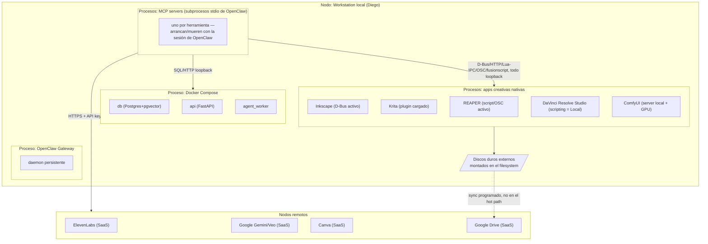
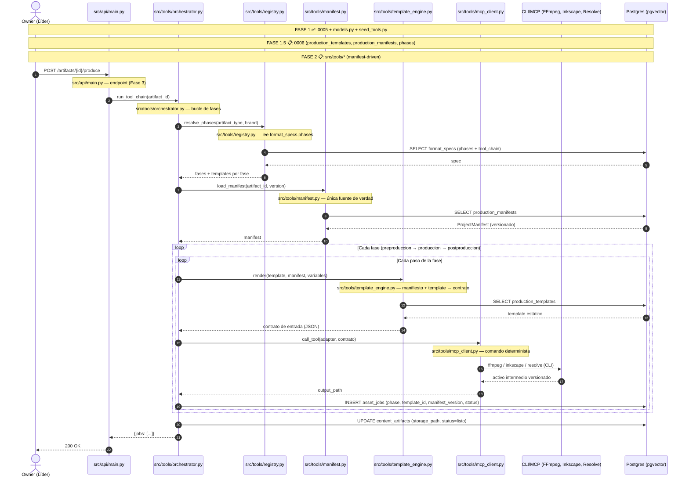
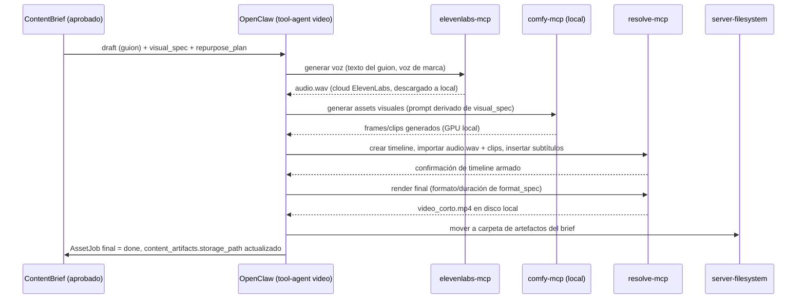
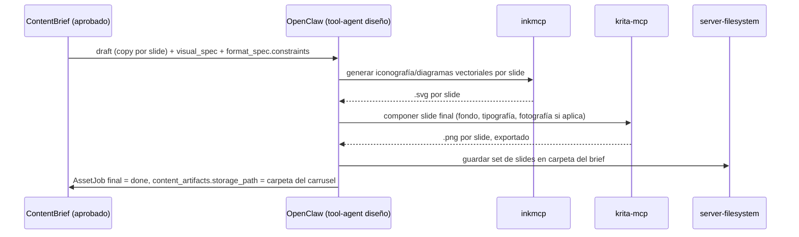
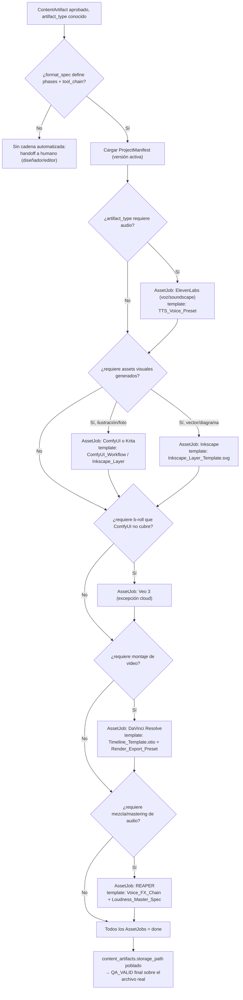
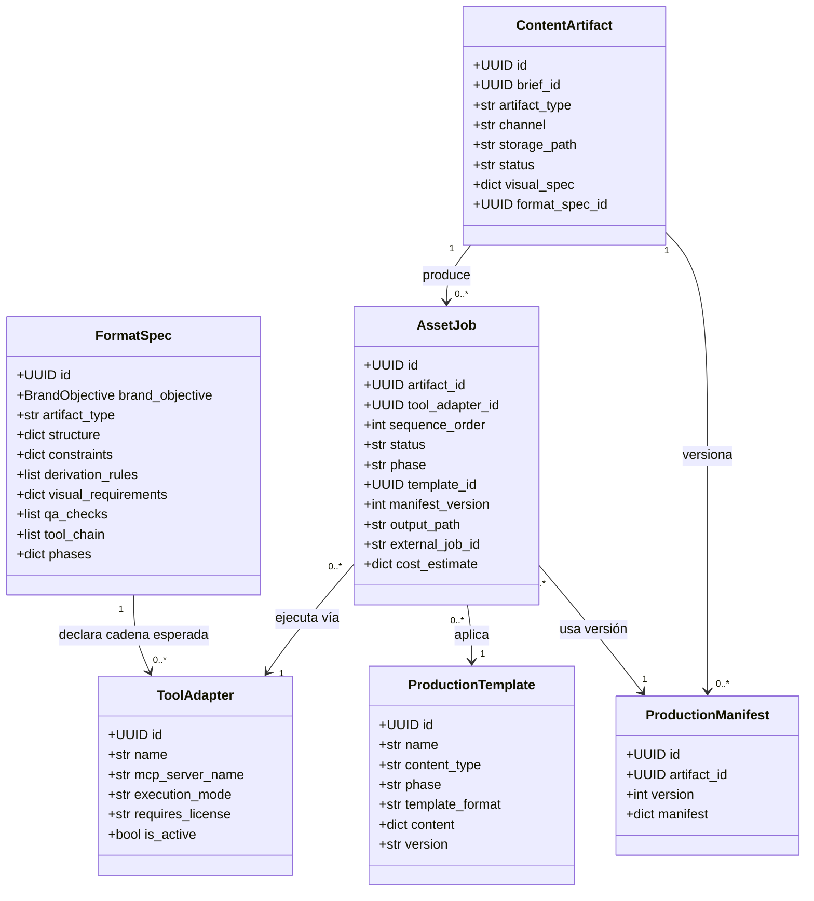
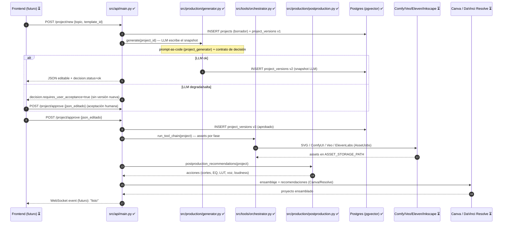

# Arquitectura de Producción Creativa Local — Agentes, Software Externo y OpenClaw

**Estado:** diseño de referencia — expandido con el marco universal de
producción en 4 etapas, la arquitectura manifest-driven (ProjectManifest +
templates estáticos + invocación determinista) y la capa de IA como
compilador. Deriva de `docs/plan_infraestructura_produccion.md` y del
estado actual del backend (Fase 0 + Producer-Critic + infraestructura IA
modular + Fase 1 de producción creativa).

**Objetivo:** un sistema de generación de contenidos **multipropósito** —
textual, visual, audio y video, en formatos largos y cortos — que funcione
como un **sistema determinista y modular** de gestión de contenidos, no
como una serie de herramientas sueltas. Cada tipo de contenido se
descompone en una secuencia estricta de transformaciones de datos: cada
fase lee un **contrato de entrada (JSON/Manifiesto)**, aplica un conjunto
de **plantillas estáticas deterministas** y genera **activos intermedios
versionados**.

---

## 0. Alcance y principio rector

> **La orquestación y el procesamiento pesado corren en local. Las
> capacidades que ningún software local puede replicar (voz sintética de
> calidad de producción, video generativo, diseño colaborativo en
> navegador) siguen viviendo en la nube del proveedor — pero se invocan
> desde el mismo lugar que todo lo demás.**

Esto no es una contradicción con "todo el procesamiento en local": es una
distinción entre **dónde vive el orquestador** (tu máquina, vía OpenClaw)
y **dónde corre cada capacidad** (local para software con motor propio,
cloud para las tres excepciones inevitables).

| Capa                                                 | Dónde corre                                             | Ejemplos                                                                       |
| ---------------------------------------------------- | ------------------------------------------------------- | ------------------------------------------------------------------------------ |
| Orquestación (OpenClaw + Gateway + backend Postgres) | 100% local                                              | tu workstation                                                                 |
| Software creativo con motor local                    | 100% local, GPU/CPU propia                              | Inkscape, Krita, Reaper, DaVinci Resolve, ComfyUI                              |
| Almacenamiento                                       | Local primero, sincronizado                             | discos duros externos (fuente de verdad), Google Drive (respaldo/colaboración) |
| Excepciones cloud inevitables                        | Orquestación local, inferencia en la nube del proveedor | ElevenLabs (voz), Veo 3/Gemini (video generativo), Canva (diseño colaborativo) |

Ninguna de las tres excepciones tiene alternativa local viable hoy: no
existe un modelo de voz de calidad ElevenLabs que corra en una GPU de
consumo, Veo 3 es propietario de Google, y Canva es una app web sin motor
instalable. Se tratan como **proveedores externos con contrato explícito**
(misma tabla `api_keys` ya construida en el backend), no como partes del
sistema local.

### 0.1 Principio rector: determinismo antes que IA

El sistema es **determinista y modular por construcción**. La IA (LLMs
pequeños o grandes) es una capa posterior que actúa como **compilador**:
su único trabajo es **poblar o modificar los JSONs del Manifiesto** y
**seleccionar qué templates aplicar**. Nunca edita directamente el video,
el audio o la imagen.

```
[Manifiesto (JSON)] + [Template estático] → [Contrato de entrada] → [CLI/MCP determinista] → [Activo intermedio versionado]
        ↑                                                                                              ↓
   IA (compilador) puebla/modifica el manifiesto                                          asset_jobs registra todo
```

**Regla de oro:** si una variable cambia en el manifiesto (ej.
`mic_profile: "shure_sm7b"` → `mic_profile: "lavalier_clip"`), el
orquestador invalida **únicamente** la fase afectada y re-aplica la cadena
de templates correspondiente — nunca re-ejecuta el pipeline completo.

---

## 1. El Marco Universal de Producción en 4 Etapas

Independientemente del formato final (texto, imagen, audio, video; largo
o corto), la producción de contenido sigue un flujo de **cuatro fases
clave**. Este marco es el esqueleto de `format_specs.phases` (ver §13).

### Etapa 1: Preproducción (Investigación, Estrategia y Planificación)

- **Mapeo de Audiencia (Buyer Personas):** definir necesidades, problemas
  y estilo de aprendizaje del público objetivo antes de crear cualquier
  pieza.
- **Definición de Objetivos y Mensaje Central:** clarificar si la meta es
  educar, inspirar o convertir.
- **Briefing y Guionizado (Scripting / Storyboarding):** crear un
  documento guía (quién, qué, cuándo, dónde y por qué) y estructurar la
  narrativa. Para videos o posts, planificar un inicio, desarrollo y
  cierre claro.
- **Elección de la Estructura Narrativa:**
  - _Venta / Marketing:_ modelo de embudo **AIDA** (Atención, Interés,
    Deseo, Acción) o la fórmula de **Desafío, Acción y Transformación**.
  - _Educativo / Informativo:_ estructuras pedagógicas como el bloque de
    subtemas (_Stack of Blocks_) o el desglose temático con contexto e
    ilustración.

### Etapa 2: Producción (Ejecución y Captura de Activos Atómicos)

- **Pensar como un Editor (Think like a publisher):** generar valor útil
  y resolver problemas del usuario de forma genuina antes de intentar
  vender.
- **Captura Técnica de Calidad:**
  - _Video/Audio:_ trípode, micrófonos independientes para un sonido
    nítido y abundante material de apoyo (_B-roll_). Formato vertical
    (9:16) para plataformas móviles o horizontal (16:9) para pantallas
    tradicionales o formatos extensos.
  - _Texto e Imágenes:_ lenguaje claro e imágenes auténticas de la marca o
    equipo en lugar de fotografías de stock genéricas que restan
    credibilidad.

### Etapa 3: Postproducción (Ensamblaje, "Feed-Proofing" y Control de Calidad)

- **Redundancia Audiovisual y Subtitulado ("Feed-Proofing"):** la
  coincidencia entre imagen y texto refuerza la retención. La mayoría de
  los usuarios ven videos en redes sociales sin sonido → es imprescindible
  integrar subtítulos y grafismos que permitan entender el mensaje en
  silencio.
- **Edición Orientada a la Atención:** los primeros **3 a 10 segundos**
  determinan si el usuario continúa consumiendo el contenido. En esta fase
  se aplican recortes, transiciones, música de fondo, ecualización de
  audio, nivelación de volumen y retoque de color.
- **Accesibilidad y Control de Calidad (QC):** verificar legibilidad,
  contraste cromático, transcripciones para audio y etiquetas de texto
  alternativo para usuarios con limitaciones sensoriales.

### Etapa 4: Distribución, Reutilización (Repurposing) y Medición

- **Modelo PESO y SEO:** distribuir integrando medios Propios (_Owned_),
  Pagados (_Paid_), Compartidos (_Shared_) y Ganados (_Earned_),
  optimizando títulos y metadatos para motores de búsqueda (SEO) a fin de
  asegurar tráfico recurrente.
- **Atomización de Contenido (Repurposing):** desglosar una pieza larga
  (un webinar o artículo extenso) en múltiples fragmentos pequeños
  (_snackable content_: carruseles, clips verticales, infografías, breves
  audios) para maximizar el retorno de inversión. Esto ya está soportado
  por `repurpose_links` (derivación multi-formato) y
  `format_specs.derivation_rules`.

---

## 2. El Manifiesto (ProjectManifest) — única fuente de verdad

El orquestador **solo lee el JSON del proyecto**. El manifiesto es la
única fuente de verdad de cada artefacto en producción: contiene todas las
variables que parametrizan las plantillas.

### 2.1 Estructura del manifiesto

```json
{
  "project": {
    "artifact_id": "uuid",
    "brand_objective": "ESCAPE_SOCIAL",
    "artifact_type": "video_corto",
    "channel": "instagram",
    "version": 1
  },
  "audience": {
    "buyer_persona": "profesional curioso, sin tiempo",
    "segment_client": "S1",
    "segment_community": "C1"
  },
  "objective": {
    "goal": "educar | inspirar | convertir",
    "message_central": "texto",
    "narrative_structure": "aida | desafio_accion_transformacion | stack_of_blocks"
  },
  "audio": {
    "mic_profile": "shure_sm7b",
    "voice_preset": "voice_id_123",
    "loudness_target": "-16 LUFS",
    "sample_rate": 48000,
    "bit_depth": 24
  },
  "video": {
    "aspect_ratio": "9:16",
    "fps": 30,
    "color_space": "rec709",
    "scene_breakdown": [
      {
        "inicio": 0,
        "fin": 3,
        "tipo_plano": "closeup",
        "prompt_visual": "...",
        "texto_pantalla": "...",
        "sfx": "..."
      }
    ],
    "timeline_spec": { "pistas": ["V4", "V3", "V2", "V1", "A1", "A2", "A3"] }
  },
  "graphic": {
    "canvas": "1080x1920",
    "layout_grid": { "cajas": [], "margenes": {}, "areas_foco": [] },
    "color_palette": ["#hex", "#hex"]
  },
  "distribution": {
    "peso": { "owned": [], "paid": [], "shared": [], "earned": [] },
    "seo": { "titulo": "", "metadatos": {} },
    "repurpose_plan": [{ "artifact_type": "post", "channel": "linkedin" }]
  }
}
```

### 2.2 Versionado e inmutabilidad

Cada cambio al manifiesto crea una **versión nueva** (INSERT), nunca un
UPDATE — mismo patrón que `prompt_artifacts` (inmutables). Esto da:

- **Trazabilidad de auditoría:** qué versión del manifiesto produjo cada
  activo.
- **Invalidación selectiva:** si cambia `mic_profile`, se re-aplica solo
  la Fase 3 de audio (el `Voice_FX_Chain_Preset`), no todo el pipeline.
- **Reproducibilidad:** un activo versionado + manifiesto versionado +
  templates versionados = el mismo resultado siempre.

---

## 3. Templates estáticos por tipo de contenido

Cada fase lee un conjunto de **plantillas estáticas deterministas**. Las
plantillas viven en la base (`production_templates`, ver §13) — no son
archivos sueltos — y se versionan. La IA no las edita en runtime: las
selecciona y las parametriza con el manifiesto.

### 3.1 Audio (Podcast, Locuciones, Audiolibros)

| Fase               | Pasos                                                                                                                                                       | Templates                                                                                                                                                                                                                                                                                         |
| ------------------ | ----------------------------------------------------------------------------------------------------------------------------------------------------------- | ------------------------------------------------------------------------------------------------------------------------------------------------------------------------------------------------------------------------------------------------------------------------------------------------- |
| **Preproducción**  | Estructuración del guion (limpieza, pausas, énfasis, pronunciaciones fonéticas, marcas de tiempo); asignación de roles/voces; generación del mapa de pistas | `Script_SSML_Template.json` (tags de pausa, tono, velocidad, emoción por párrafo); `Audio_Track_Manifest.json` (qué archivo va en qué canal, in/out points)                                                                                                                                       |
| **Producción**     | Generación/ingesta de voz raw (TTS ElevenLabs o `.wav` humano); obtención/selección de BGM y SFX desde librería                                             | `TTS_Voice_Preset.json` (estabilidad, claridad, latencia, voice_id, 48kHz/24-bit); `Raw_Audio_Spec.json` (Mono voces, Stereo música, WAV sin comprimir)                                                                                                                                           |
| **Postproducción** | Procesamiento de voz (channel strip); duck & mix (sidechain); masterización de sonoridad (loudness matching)                                                | `Voice_FX_Chain_Preset` (HPF 80Hz, EQ quirúrgico por micrófono, De-Esser 6.5kHz, compresor VCA 3:1); `Sidechain_Ducking_Preset.json` (umbral -22dB, atenuación -12dB, attack 20ms, release 250ms); `Loudness_Master_Spec.json` (-16 LUFS podcasts/Spotify, -14 LUFS YouTube, True Peak -1.0 dBFS) |

### 3.2 Video (Shorts, Reels, Explainer Videos, Documentales)

| Fase               | Pasos                                                                                                                                                | Templates                                                                                                                                                                                                                           |
| ------------------ | ---------------------------------------------------------------------------------------------------------------------------------------------------- | ----------------------------------------------------------------------------------------------------------------------------------------------------------------------------------------------------------------------------------- |
| **Preproducción**  | Desglose de escenas (storyboard); definición de aspect ratio y formato; generación del project timeline spec                                         | `Storyboard_Spec.json` (`[inicio, fin] → [tipo_plano, prompt_visual, texto_pantalla, sfx]`); `Timeline_Template.otio` / `DRP_Template` (pistas V4 subtítulos, V3 lower-thirds, V2 b-roll, V1 principal, A1 voz, A2 SFX, A3 BGM)     |
| **Producción**     | Renderizado de b-roll/imágenes (ComfyUI/SD o stock); generación de subtítulos sincronizados (Whisper word-level); generación de gráficos vectoriales | `ComfyUI_Workflow_Template.json` (seeds, modelo base, LORAs de marca, resolución fija); `Subtitles_Style_Template.ass`/JSON (tipografía, posición Y, color, stroke, sombra, karaoke)                                                |
| **Postproducción** | Ensamblaje automático (V1-V4 + A1-A3 según `.otio`); color y LUTs; transiciones y motion FX; renderizado final                                       | `Color_Grade_LUT_Template.cube`/`DRX_Preset`; `Transitions_Rules_Spec.json` (corte limpio entre b-roll, dissolve 10 frames al cambiar de capítulo); `Render_Export_Preset.json` (H.264/HEVC, bitrate, 1080x1920@30fps, AAC 320kbps) |

### 3.3 Gráfico / Vectorial / Imagen Estática (Infografías, Thumbnails, Banners)

| Fase               | Pasos                                                                                                                           | Templates                                                                                                        |
| ------------------ | ------------------------------------------------------------------------------------------------------------------------------- | ---------------------------------------------------------------------------------------------------------------- |
| **Preproducción**  | Definición del layout grid (cajas de texto, márgenes de seguridad, áreas de enfoque); extracción de textos y copies             | `Canvas_Layout_Spec.json` (dimensiones 1280x720 thumbnail, 1080x1080 post, rejilla de composición)               |
| **Producción**     | Generación/aislamiento del sujeto principal (ComfyUI con máscaras/remove background); inyección de datos en plantilla vectorial | `Inkscape_Layer_Template.svg` (capas e IDs fijos: `#background`, `#illustration`, `#title_text`, `#brand_logo`)  |
| **Postproducción** | Composición raster/vector; procesamiento de filtros (sombras, trazos, grano); exportación y optimización                        | `Image_Composite_FX_Spec.json` (modos de fusión Multiply/Overlay, radio de sombra paralela, compresión WebP/PNG) |

---

## 4. Invocación determinista por CLI/MCP

Cada herramienta ejecuta un **comando determinista** pasando la plantilla
y las variables del manifiesto. El contrato de entrada es siempre
`manifiesto + template → JSON de entrada para la herramienta`.

```bash
# FFmpeg — audio postproducción (channel strip + duck + loudness)
ffmpeg -i raw_voice.wav -filter_complex_script voice_fx_chain.txt processed_voice.wav

# Inkscape — gráfico vectorial (inyección de datos en SVG con IDs fijos)
inkscape --actions="select-by-id:title_text; action-process" template.svg -o output.png

# DaVinci Resolve — video (ensamblaje desde timeline spec)
resolve.LoadProject('DRP_Template.drp'); import_otio('timeline.otio')

# ComfyUI — generación de b-roll (workflow determinista con seed fija)
comfy run --workflow comfyui_workflow.json --seed 42 --output frames/
```

**Regla:** el orquestador (`src/tools/orchestrator.py`) nunca decide _qué_
producir — ejecuta la cadena mecánica de transformaciones que el
`format_spec.phases` + `tool_chain` declaran, con los parámetros del
manifiesto. LLM decide contenido y parámetros (vía manifiesto), código y
herramientas ejecutan producción, checklist verifica el resultado.

---

## 5. Capa de IA como compilador (no edita archivos)

Cuando se integre la capa de IA (LLMs pequeños locales o vía Together),
estos **no editarán directamente el video, el audio o la imagen**. Actúan
como **compiladores** cuyo único trabajo es:

1. **Poblar o modificar los JSONs del Manifiesto** — ej. elegir la
   estructura narrativa (AIDA vs Stack of Blocks), el perfil de voz, el
   desglose de escenas, el tono.
2. **Seleccionar qué templates aplicar** — ej. qué `Voice_FX_Chain_Preset`
   según `mic_profile`, qué `ComfyUI_Workflow_Template` según el estilo de
   marca.

Esto es exactamente el patrón compilador ya construido para prompts:
`prompt_templates` (specs agnósticas) → `src/llm/compiler.py` →
`prompt_artifacts` (inmutables, versionados). La capa de producción
extiende el mismo principio: **el LLM escribe datos, el código ejecuta**.

```
LLM (compilador) → escribe/actualiza production_manifests
                 → selecciona production_templates
                 → el orquestador ejecuta la cadena determinista
```

---

## 6. Catálogo de herramientas externas y su MCP server

| Herramienta               | Rol en producción                                                                              | MCP server recomendado                                                                                                  | Transporte                                 | Local/Cloud                              | Licencia/requisito                                                                      |
| ------------------------- | ---------------------------------------------------------------------------------------------- | ----------------------------------------------------------------------------------------------------------------------- | ------------------------------------------ | ---------------------------------------- | --------------------------------------------------------------------------------------- |
| **Inkscape**              | Vectores: iconografía, posters/QR, diagramas de one-pager                                      | `inkmcp` (Shriinivas/inkmcp)                                                                                            | D-Bus local, expuesto como stdio           | 100% local                               | Inkscape 1.x instalado; extensión oculta activada por D-Bus                             |
| **Krita**                 | Raster: ilustración, retoque, composición de carrusel                                          | `krita-mcp` (plugin + bridge HTTP local)                                                                                | stdio → HTTP `localhost:5678`              | 100% local                               | Plugin Python instalado dentro de Krita                                                 |
| **Reaper**                | Audio: mezcla, mastering, música, soundscapes                                                  | `total-reaper-mcp` o `ReaperMCP` (xDarkzx)                                                                              | stdio → bridge Lua (IPC por archivo) u OSC | 100% local ("nada sale de tu máquina")   | REAPER con API de scripting/OSC habilitada                                              |
| **ElevenLabs**            | Voz sintética (narración, doblaje), soundscapes                                                | `elevenlabs-mcp` (oficial)                                                                                              | stdio local (`uvx elevenlabs-mcp`)         | Orquestación local, inferencia cloud     | `ELEVENLABS_API_KEY`; créditos de uso                                                   |
| **Canva**                 | Maquetación de campañas, plantillas de marca, exportación multi-formato                        | AI Connector oficial (`mcp.canva.com/mcp`)                                                                              | Streamable HTTP remoto, OAuth              | 100% cloud                               | Plan Pro/Teams/Business/Nonprofit — **no disponible en el plan gratuito**               |
| **ComfyUI**               | Generación/edición de imagen y video con modelos locales (Stable Diffusion y similares)        | `comfy-mcp` (oficial, Comfy-Org), modo local                                                                            | stdio local, shells a `comfy`              | 100% local, GPU propia                   | ComfyUI instalado + al menos un checkpoint                                              |
| **DaVinci Resolve**       | Edición y montaje final de video, color, mezcla de audio embebida                              | `resolve-mcp` (215+ tools) o `davinci-resolve-mcp` (440+ tools)                                                         | Local, vía Scripting API (`fusionscript`)  | 100% local                               | **Requiere DaVinci Resolve Studio** (la edición gratuita no expone la API de scripting) |
| **Veo 3**                 | Video generativo (b-roll, transiciones, secuencias que ComfyUI/Resolve no producen desde cero) | `veo-mcp-server` / `gemini-media-mcp` (vía Gemini API)                                                                  | stdio local, llama a la API de Google      | Orquestación local, inferencia cloud     | `GEMINI_API_KEY` con acceso a Veo habilitado                                            |
| **Google Drive**          | Respaldo/colaboración de artefactos finales                                                    | `mcp-gdrive` (isaacphi) o StackOne (lectura+escritura; el de referencia de Anthropic quedó archivado y es solo lectura) | stdio local, OAuth 2.1 a la API de Drive   | Orquestación local, almacenamiento cloud | Credenciales OAuth de la cuenta de Drive                                                |
| **Discos duros externos** | Almacenamiento primario de assets pesados (video crudo, proyectos de Resolve/Reaper)           | `@modelcontextprotocol/server-filesystem` apuntado a cada punto de montaje                                              | stdio local                                | 100% local                               | Ninguno — es filesystem plano                                                           |

**Nota sobre Canva:** es la única pieza de este catálogo que no tiene
ninguna vía local — ni siquiera parcial. Si "todo el procesamiento en
local" es un requisito estricto y no solo preferente, Canva es candidato
a **excluirse** del sistema y reemplazarse por la combinación
Inkscape+Krita (que ya cubre vectores y raster) para todo lo que hoy se
resolvería en Canva. Lo dejo como decisión abierta en §18, no la tomo por
ti.

---

## 7. Mapeo formato → fases → templates → herramientas

Esto extiende `format_specs`/`derivation_rules` del diseño de producción
multi-formato: cada `artifact_type` obtiene ahora una **cadena de
herramientas real** y su **estructura de fases** con templates.

| `artifact_type`                                  | Fases (templates clave)                                                                                                  | Cadena de herramientas (en orden)                                                                                                             | Agente/rol que dispara cada paso       |
| ------------------------------------------------ | ------------------------------------------------------------------------------------------------------------------------ | --------------------------------------------------------------------------------------------------------------------------------------------- | -------------------------------------- |
| `post` (solo texto)                              | Preproducción (estructura narrativa) → Producción (redacción) → Postproducción (formateo visual)                         | `producer` (LLM) → QA_VALID                                                                                                                   | Producer-Critic (ya existente)         |
| `video_corto`                                    | Preproducción (Storyboard_Spec, Timeline_Template) → Producción (TTS, ComfyUI, Subtitles) → Postproducción (LUT, Render) | `producer` (guion) → ElevenLabs (voz) → ComfyUI o Krita (assets visuales) → DaVinci Resolve (montaje + subtítulos)                            | Producer-Critic + 3 tool-agents nuevos |
| `video_largo`                                    | ídem video_corto + b-roll generativo                                                                                     | `producer` (guion extendido) → ElevenLabs (voz) → ComfyUI/Veo 3 (b-roll donde no hay footage real) → DaVinci Resolve (montaje, color, mezcla) | ídem, con Veo 3 como paso opcional     |
| `carrusel`                                       | Preproducción (Canvas_Layout) → Producción (copy por slide, Inkscape, Krita) → Postproducción (composición, export)      | `producer` (copy por slide) → Inkscape (iconografía/diagramas) → Krita (fotografía/composición) → ensamblaje final                            | tool-agent de diseño                   |
| `poster_qr`                                      | Preproducción (Canvas_Layout) → Producción (Inkscape vector) → Postproducción (export imprimible)                        | `producer` (copy + CTA) → Inkscape (vector imprimible, QR embebido)                                                                           | tool-agent de diseño                   |
| `one_pager` / `white_paper`                      | Preproducción (estructura) → Producción (texto, diagramas) → Postproducción (maquetación)                                | `producer` (texto) → Inkscape/Krita (diagramas y cifras) → maquetación (Canva, si se mantiene en el sistema)                                  | tool-agent de diseño                   |
| broadcast/soundscape (WhatsApp, podcasts cortos) | Preproducción (Script_SSML) → Producción (TTS, BGM/SFX) → Postproducción (mezcla, loudness)                              | `producer` (guion) → ElevenLabs (voz/soundscape) → Reaper (mezcla/mastering)                                                                  | tool-agent de audio                    |

**Regla:** ningún tool-agent decide _qué_ producir — eso lo sigue
decidiendo `producer_draft` + `format_spec` (ya validados por QA). Los
tool-agents solo ejecutan la cadena mecánica de herramientas para
materializar lo que ya pasó por Producer-Critic. Esto mantiene la
separación de responsabilidades ya establecida: LLM decide contenido,
código/herramientas ejecutan producción, checklist verifica el resultado.

---

## 8. Matriz por propósito y extensión del contenido

El sistema debe ser flexible para los cuatro casos de uso principales.
Esta matriz alimenta `format_specs.constraints` y el manifiesto
(`objective.goal`, `narrative_structure`).

### Formatos Cortos (Snackable Content: Reels, TikToks, Posts breves, Infografías)

- **Propósito:** captar **Atención** rápida (_Top of Funnel_) y generar
  interacción inicial.
- **Buenas prácticas:**
  - Plantear el problema o conflicto en los primeros 3 segundos (_Hook_).
  - Mantener un ritmo ágil y entregar una sola idea concisa por pieza.
  - Usar formato vertical (9:16) e incorporar subtítulos estilizados.

### Formatos Largos (E-books, Webinars, Podcasts, Artículos en profundidad)

- **Propósito:** profundizar en la **Educación**, construir autoridad
  (_Middle/Bottom of Funnel_) y cultivar la lealtad del cliente o
  estudiante.
- **Buenas prácticas:**
  - Estructurar el contenido en capítulos o secciones lógicas para guiar
    al usuario.
  - Combinar datos analíticos con narrativas explicativas o casos reales.
  - Facilitar la navegación mediante índices, marcas de tiempo o
    resúmenes.

### Contenido Educativo ("Edutainment" e Inbound)

- **Estrategia:** "ofrecer un regalo antes de pedir la venta". Enseñar
  habilidades útiles, responder a las preguntas más frecuentes de la
  audiencia y posicionar a la marca como una autoridad de confianza sin
  recurrir a un tono comercial agresivo.

### Contenido de Venta de Servicios

- **Estrategia:** acompañar el proceso de decisión de compra. Utilizar
  casos de estudio, demostraciones de producto o transformaciones de
  clientes. Finalizar siempre con un **Llamado a la Acción (CTA)** claro y
  accesible (enlace a una página de aterrizaje, formulario de contacto o
  reserva).

---

## 9. Buenas prácticas por formato técnico

| Formato                                        | Preproducción                                                | Producción                                                       | Postproducción                                                                             |
| ---------------------------------------------- | ------------------------------------------------------------ | ---------------------------------------------------------------- | ------------------------------------------------------------------------------------------ |
| **Texto** (Blogs, E-books, Posts)              | Investigación de palabras clave y esquema de encabezados.    | Redacción enfocada en la solución del problema del lector.       | Formateo visual (negritas, listas, viñetas) para facilitar la lectura rápida.              |
| **Imágenes / Posts** (Infografías, Carruseles) | Definición de paleta de color corporativa y maquetación.     | Diseño limpio evitando la saturación de elementos (_chartjunk_). | Exportación en alta resolución y verificación de proporciones por red social.              |
| **Video / Audio** (Reels, Podcasts, Webinars)  | Guion con marcas de tiempo, tono de voz y desglose de tomas. | Grabación con iluminación adecuada y micrófono dedicado.         | Edición dinámica, eliminación de ruido de fondo, subtitulado y masterización de sonoridad. |

Estas buenas prácticas se codifican como **datos** en
`format_specs.qa_checks` (verificaciones mecánicas) y en los templates de
cada fase — no como reglas hardcodeadas en el código del agente.

---

## 10. Diagrama de Componentes — sistema completo

```mermaid
flowchart TB
    subgraph LOCAL["🖥️ Máquina/red local"]
        subgraph OC["OpenClaw"]
            GW["Gateway (routing, auth, políticas de herramientas)"]
            AGENTS["agents.list[] — Producer, Critic, tool-agents por formato"]
            SKILLS["skills/ (SKILL.md por flujo: video_corto, carrusel, ...)"]
        end

        subgraph BACKEND["Backend ya construido (Docker Compose)"]
            API["FastAPI (/briefs, /approve, /llm-models, ...)"]
            PG[("PostgreSQL + pgvector\ncontent_briefs, format_specs,\nproduction_manifests,\nproduction_templates, asset_jobs")]
            WORKER["agent_worker (LISTEN/NOTIFY)"]
        end

        subgraph MCP_LOCAL["MCP servers locales (stdio)"]
            M_INK["inkmcp\n(Inkscape, D-Bus)"]
            M_KRITA["krita-mcp\n(Krita, bridge HTTP)"]
            M_REAPER["reaper-mcp\n(REAPER, Lua/OSC)"]
            M_RESOLVE["resolve-mcp\n(DaVinci Resolve, fusionscript)"]
            M_COMFY["comfy-mcp local\n(ComfyUI, GPU propia)"]
            M_FS["server-filesystem\n(discos externos)"]
        end

        subgraph APPS["Aplicaciones nativas (GUI, corriendo)"]
            INK[Inkscape]
            KRITA[Krita]
            REAPER[REAPER]
            RESOLVE[DaVinci Resolve Studio]
            COMFYUI[ComfyUI + GPU]
        end

        HDD[("Discos duros externos\n(fuente de verdad de assets pesados)")]
    end

    subgraph CLOUD["☁️ Servicios externos (excepciones inevitables)"]
        M_11LABS["elevenlabs-mcp\n(orquestación local)"]
        M_VEO["veo-mcp-server\n(orquestación local)"]
        M_CANVA["Canva AI Connector\n(remoto, OAuth)"]
        M_GDRIVE["mcp-gdrive\n(orquestación local)"]
        ELEVENLABS[("ElevenLabs API")]
        GEMINI[("Gemini API / Veo 3")]
        CANVA[("Canva")]
        GDRIVE[("Google Drive")]
    end

    GW --> AGENTS
    AGENTS --> API
    API --> PG
    WORKER --> PG
    GW <-->|mcp.servers config| M_INK & M_KRITA & M_REAPER & M_RESOLVE & M_COMFY & M_FS
    GW <-->|mcp.servers config, remoto/OAuth| M_11LABS & M_VEO & M_CANVA & M_GDRIVE

    M_INK --> INK
    M_KRITA --> KRITA
    M_REAPER --> REAPER
    M_RESOLVE --> RESOLVE
    M_COMFY --> COMFYUI
    M_FS --> HDD

    M_11LABS -.->|HTTPS| ELEVENLABS
    M_VEO -.->|HTTPS| GEMINI
    M_CANVA -.->|HTTPS OAuth| CANVA
    M_GDRIVE -.->|HTTPS OAuth| GDRIVE

    INK & KRITA & REAPER & RESOLVE & COMFYUI --> HDD
    HDD -.->|sync/respaldo| GDRIVE
```



---

## 11. Diagrama de Despliegue — dónde vive cada proceso



**Lectura clave del diagrama de despliegue:** todo lo que cruza a un nodo
remoto lo hace por HTTPS con credencial explícita (API key u OAuth) — no
hay ninguna ruta donde un asset pesado (video crudo, proyecto de Resolve)
salga de la máquina local salvo el sync deliberado a Drive. Esto es lo
que hace verificable, no solo declarativo, el principio de "todo el
procesamiento en local" del §0.

---

## 12. Comunicación entre agentes internos y cada software externo (detalle)

Esta sección responde específicamente a "detallar toda la comunicación
entre agentes internos y software externo" — protocolo exacto, dirección,
y qué cruza el límite del proceso, para cada herramienta.

### 12.1 Inkscape

```
Tool-agent (OpenClaw) --stdio (MCP)--> inkmcp --D-Bus (loopback)--> Inkscape (proceso GUI activo)
```

- `inkmcp` corre como extensión de Inkscape (oculta del menú), escucha
  por D-Bus — **no hay red involucrada**, es IPC local del sistema
  operativo.
- El agente envía `inkscape_operation` (crear elemento SVG, aplicar
  gradiente, exportar PNG) — Inkscape debe estar corriendo con un
  documento abierto.
- Salida: archivo `.svg`/`.png` escrito directamente al filesystem local
  (no vuelve como payload por MCP salvo metadatos).

### 12.2 Krita

```
Tool-agent --stdio (MCP)--> krita-mcp (FastMCP) --HTTP localhost:5678--> plugin Python (dentro de Krita) --Krita API--> lienzo
```

- Dos saltos locales: el servidor MCP traduce llamadas MCP a peticiones
  HTTP contra un plugin que vive DENTRO del proceso de Krita (necesario
  porque la API de Krita solo es segura de llamar desde el hilo principal
  de Qt — el plugin encola los comandos).
- Pintura por manipulación directa de píxeles (BGRA), no por el motor de
  pinceles nativo — relevante si se espera textura de pincel real.
- Timeout de exportación configurable en ambos lados (agente y plugin)
  deben coincidir, o una de las dos capas corta antes que la otra.

### 12.3 REAPER

```
Tool-agent --stdio (MCP)--> reaper-mcp --Lua IPC por archivo, u OSC--> script Lua cargado en REAPER --ReaScript API--> proyecto/pistas
```

- REAPER debe tener el bridge cargado (`Actions > Run ReaScript`, o
  auto-carga configurada) **antes** de que el agente pueda operar.
- Todo el intercambio es archivos/sockets locales — cero llamadas de red,
  confirmado explícitamente por la documentación del proyecto
  (`xDarkzx/Reaper-MCP`: "No cloud. Nothing leaves your machine").
- Dos modos de transporte alternos según el servidor elegido: IPC por
  archivo (más simple, algo de latencia) u OSC (más rápido, requiere
  habilitar OSC en REAPER).

### 12.4 DaVinci Resolve

```
Tool-agent --stdio (MCP)--> resolve-mcp --fusionscript (biblioteca nativa de Resolve)--> DaVinci Resolve Studio (proceso GUI activo)
```

- Requiere **Resolve Studio** (no la edición gratuita) con
  `Preferences → System → General → External scripting using → Local`.
- El servidor MCP importa el módulo `fusionscript` (`.dll`/`.so` según
  plataforma) que Resolve expone — es la misma API que usan los scripts
  Python/Lua nativos de Resolve, no una capa nueva.
- Limitación real: **debe correr en la misma máquina** que Resolve — no
  hay modo remoto para el servidor "en vivo" (sí existe una variante
  "advanced" que edita archivos `.drp/.drt/.drx` sin Resolve corriendo,
  útil para operaciones batch offline).

### 12.5 ComfyUI

```
Tool-agent --stdio (MCP)--> comfy-mcp (modo local) --comfy-cli / HTTP localhost--> ComfyUI server --GPU local--> imagen/video generado
```

- Todo el cómputo pesado (inferencia de difusión) ocurre en la GPU local
  — el MCP server solo orquesta la cola de trabajos y recupera archivos.
- Workflows como JSON (formato API o exportado desde la UI) en
  `workflows/`; el agente puede generar variantes de un workflow (fan-out)
  sin reescribirlo desde cero cada vez.
- Existe la opción "Comfy Cloud MCP" (ejecuta en GPUs de Comfy) — **no
  se usa aquí** porque rompe el requisito de procesamiento local; se deja
  documentado como fallback si la GPU local no alcanza para un trabajo
  puntual.

### 12.6 ElevenLabs (excepción cloud)

```
Tool-agent --stdio (MCP)--> elevenlabs-mcp --HTTPS + ELEVENLABS_API_KEY--> api.elevenlabs.io --inferencia cloud--> audio generado, descargado a disco local
```

- El servidor MCP corre localmente (`uvx elevenlabs-mcp`), pero cada
  llamada de síntesis es una petición HTTPS real a la nube de ElevenLabs
  — no hay forma de evitarlo, es el único motor de esa calidad.
- `ELEVENLABS_MCP_BASE_PATH` fija dónde se escriben los archivos de
  salida — debe apuntar a la carpeta de trabajo local, no a un default
  genérico (`~/Desktop`).
- Costo real por llamada (consume créditos) — cada invocación debe quedar
  registrada como evento de telemetría/costo, igual que ya se hace con
  Together AI (`api_keys` + logging).

### 12.7 Veo 3 / Gemini (excepción cloud)

```
Tool-agent --stdio (MCP)--> veo-mcp-server --HTTPS + GEMINI_API_KEY--> Gemini API --job asíncrono--> polling hasta video listo --descarga a disco local
```

- Generación asíncrona: la llamada inicial devuelve un job ID de
  inmediato; el servidor hace polling (`POLL_INTERVAL`/`MAX_POLL_TIME`
  configurables) hasta que el video está listo.
- Requiere acceso habilitado a Veo en la cuenta de Gemini/Vertex — no
  todas las claves lo tienen por defecto.
- Nota de producto: la documentación de Gemini ahora recomienda
  **Gemini Omni Flash** como modelo por defecto para video (mejor
  coherencia multi-turno) y reserva Veo 3.1 para casos específicos
  (extensión de escena, control de último frame). Vale la pena evaluar
  Omni Flash como alternativa/complemento antes de fijar Veo 3 como único
  motor de video generativo.

### 12.8 Canva (excepción cloud, remoto)

```
Tool-agent --Streamable HTTP (MCP remoto)--> mcp.canva.com/mcp --OAuth--> cuenta de Canva --diseño/exportación--> archivo descargado
```

- Único servidor de este catálogo que es **100% remoto** — no hay
  binario ni proceso local que orquestar, OpenClaw se conecta
  directamente al endpoint de Canva.
- Autenticación por OAuth (no API key) — el token vive en la sesión de
  OpenClaw, no en la tabla `api_keys` del backend (son mecanismos de
  credencial distintos; ver §18).

### 12.9 Google Drive

```
Tool-agent --stdio (MCP)--> mcp-gdrive --OAuth 2.1--> Google Drive API --subida/descarga--> archivo remoto
```

- El servidor de referencia de Anthropic quedó archivado y es **solo
  lectura** — para subir los artefactos finales (el caso de uso real
  aquí) hace falta un servidor con escritura (`mcp-gdrive` de isaacphi
  cubre Drive+Sheets; StackOne cubre la API completa de Drive con 64
  acciones si se necesita algo más allá de subir/leer archivos).
- Drive se usa como **respaldo/colaboración**, no como fuente de verdad
  — la fuente de verdad son los discos duros externos (§12.10). El
  sincronizado a Drive es un paso posterior al render, no parte del
  hot path de producción.

### 12.10 Discos duros externos

```
Tool-agent --stdio (MCP)--> server-filesystem (apuntado a /mnt/<disco>) --syscalls de FS--> disco montado
```

- Sin protocolo de red: es acceso a filesystem plano, con los controles
  de acceso que ya ofrece `server-filesystem` (raíz permitida, patrones
  incluidos/excluidos).
- Punto de diseño: cada disco externo se declara como un servidor MCP
  separado (no uno solo con múltiples raíces) para que `toolFilter` y
  permisos se puedan otorgar por disco si en el futuro hay datos de
  distinta sensibilidad (ej. un disco solo para material de clientes
  Ergalia bajo NDA).

---

## 13. Entidades de datos (esquema 0005 + 0006)

`content_artifacts` registra QUÉ se produjo; falta registrar CÓMO se
produjo (qué cadena de herramientas, en qué estado, con qué archivos
intermedios). Las tablas de la Fase 1 (0005) ya existen; las de la Fase
1.5 (0006) extienden el esquema con el manifiesto y los templates.

### 13.1 Ya construido (migración 0005)

```python
class ToolAdapter(Base):
    """Catálogo de MCP servers disponibles — igual filosofía data-driven
    que pipeline_templates y format_specs: no hardcodear qué herramienta
    usa cada formato en el código del agente."""
    __tablename__ = "tool_adapters"

    id: Mapped[uuid.UUID]
    name: Mapped[str]                 # "inkscape", "krita", "reaper", "resolve", "comfyui",
                                       # "elevenlabs", "veo3", "canva", "gdrive", "filesystem"
    mcp_server_name: Mapped[str]      # nombre exacto en mcp.servers de OpenClaw
    execution_mode: Mapped[str]       # "local" | "local_orchestration_cloud_inference" | "remote_cloud"
    requires_license: Mapped[str | None]  # ej. "DaVinci Resolve Studio", "Canva Pro+"
    is_active: Mapped[bool]


class AssetJob(Base):
    """Un paso ejecutado en una cadena de herramientas para un
    ContentArtifact — la trazabilidad que hoy no existe entre
    'aprobado por QA' y 'archivo final en disco'."""
    __tablename__ = "asset_jobs"

    id: Mapped[uuid.UUID]
    artifact_id: Mapped[uuid.UUID]    # FK -> content_artifacts
    tool_adapter_id: Mapped[uuid.UUID]  # FK -> tool_adapters
    sequence_order: Mapped[int]       # posición en la cadena (1, 2, 3...)
    status: Mapped[str]               # "pending" | "running" | "done" | "failed"
    input_ref: Mapped[str | None]     # ruta/id del insumo (ej. guion, o salida del paso anterior)
    output_path: Mapped[str | None]   # ruta local final del archivo producido
    external_job_id: Mapped[str | None]  # id del job async si es cloud (ej. Veo 3 polling)
    cost_estimate: Mapped[dict | None]   # créditos/costo si aplica (ElevenLabs, Veo3)
    started_at: Mapped[datetime | None]
    completed_at: Mapped[datetime | None]
    error: Mapped[str | None]
```

`content_artifacts.storage_path` pasa a poblarse recién cuando el último
`AssetJob` de la cadena llega a `done` — antes de eso, el artefacto sigue
en `borrador` con sus `asset_jobs` visibles para dar seguimiento (ej. "la
voz ya está, falta el montaje en Resolve").

### 13.2 Nuevo (migración 0006 — manifiesto + templates)

```sql
-- Templates estáticos por tipo de contenido y fase (única fuente de
-- plantillas; la IA las selecciona, no las edita en runtime)
CREATE TABLE production_templates (
    id UUID PRIMARY KEY DEFAULT gen_random_uuid(),
    name VARCHAR(150) NOT NULL UNIQUE,        -- 'Script_SSML_Template', 'Voice_FX_Chain_Preset'...
    content_type VARCHAR(20) NOT NULL,         -- 'audio' | 'video' | 'grafico'
    phase VARCHAR(20) NOT NULL,                -- 'preproduccion' | 'produccion' | 'postproduccion'
    template_format VARCHAR(20) NOT NULL,      -- 'json' | 'otio' | 'ass' | 'cube' | 'svg' | 'txt'
    content JSONB NOT NULL DEFAULT '{}'::jsonb, -- el template (raw embebido si no es JSON)
    version VARCHAR(20) NOT NULL DEFAULT '1.0',
    is_active BOOLEAN NOT NULL DEFAULT TRUE,
    created_at TIMESTAMPTZ NOT NULL DEFAULT now(),
    updated_at TIMESTAMPTZ NOT NULL DEFAULT now()
);

-- Manifiesto versionado e inmutable (única fuente de verdad por artefacto)
CREATE TABLE production_manifests (
    id UUID PRIMARY KEY DEFAULT gen_random_uuid(),
    artifact_id UUID NOT NULL REFERENCES content_artifacts(id) ON DELETE CASCADE,
    version INT NOT NULL,
    manifest JSONB NOT NULL,                  -- mic_profile, voice_preset, scene_breakdown...
    created_at TIMESTAMPTZ NOT NULL DEFAULT now(),
    UNIQUE (artifact_id, version)
);

-- format_specs: estructura de fases por formato (marco universal §1)
ALTER TABLE format_specs ADD COLUMN phases JSONB NOT NULL DEFAULT '{}'::jsonb;
-- ej. {"preproduccion": {"steps": [...], "templates": ["Script_SSML_Template", ...]}, ...}

-- asset_jobs: trazabilidad completa de cada transformación
ALTER TABLE asset_jobs ADD COLUMN phase VARCHAR(20);
ALTER TABLE asset_jobs ADD COLUMN template_id UUID REFERENCES production_templates(id);
ALTER TABLE asset_jobs ADD COLUMN manifest_version INT;
```

---

## 14. Diagramas de secuencia — flujos completos

### 14.1 Pipeline manifest-driven (genérico, con nombres de archivo)



### 14.2 Producción de un `video_corto` (ESCAPE), de aprobado a archivo final



### 14.3 Producción de un `carrusel` (Ergalia), de aprobado a archivo final



---

## 15. Diagrama de actividad — selección de cadena de herramientas



---

## 16. Diagrama de clases — capa de herramientas



**Nota:** `FormatSpec.tool_chain` + `FormatSpec.phases` son los campos que
hacen que la selección de cadena (§15) sea data-driven en vez de código
hardcodeado — una lista ordenada de `tool_adapter.name` esperados y la
estructura de fases con templates por `artifact_type`, igual filosofía que
`derivation_rules`/`qa_checks`.

---

## 17. Fases de implementación

### Fase 1 — Esquema y datos (día 1-2) ✅ HECHA

1. Migración 0005: `tool_adapters`, `asset_jobs`, `format_specs.tool_chain`,
   `content_artifacts.visual_spec` + `format_spec_id`, `component_library`.
2. Modelos ORM nuevos (`FormatSpec`, `ComponentLibrary`, `ToolAdapter`,
   `AssetJob`).
3. Seed de `tool_adapters` (los 10 del catálogo) + seed de `format_specs`
   con `tool_chain` (los 8 formatos de la tabla §7).

### Fase 1.5 — Manifiesto y templates (día 2-3)

4. Migración 0006: `production_templates`, `production_manifests`,
   `format_specs.phases`, `asset_jobs.phase`/`template_id`/`manifest_version`.
5. Modelos ORM nuevos (`ProductionTemplate`, `ProductionManifest`).
6. Seed de `production_templates` (los 17 templates de §3) + seed de
   `format_specs.phases` por formato.

### Fase 2 — Capa de herramientas (día 3-5)

7. `src/tools/registry.py` — resolución de fases/cadenas (data-driven).
8. `src/tools/manifest.py` — carga/versionado del ProjectManifest.
9. `src/tools/template_engine.py` — manifiesto + template → contrato.
10. `src/tools/mcp_client.py` — cliente MCP genérico (modo directo primero).
11. `src/tools/orchestrator.py` — ejecución de AssetJobs + trazabilidad.
12. Tests unitarios (sin MCP real — mock del cliente).

### Fase 3 — API y eventos (día 6-8)

13. Endpoints CRUD `/tool-adapters` + `/production-templates` +
    `/artifacts/{id}/manifests` + `/artifacts/{id}/jobs` + `/produce`.
14. Canal `asset_jobs_channel` en el worker (o endpoint disparador).
15. Tests de integración (TestClient + DB real).

### Fase 4 — Integración OpenClaw (día 9-12)

16. Config `mcp.servers` + skills/.
17. Modo OpenClaw del `mcp_client` (HTTP al gateway).
18. Prueba en vivo: carrusel Ergalia de punta a punta (Inkscape → Krita).

### Fase 5 — QA final sobre archivo real (día 13-15)

19. Verificaciones mecánicas sobre el archivo (dimensiones, duración,
    tamaño, subtítulos presentes).
20. QA_VALID final integrado al flujo.

---

## 18. Decisiones abiertas (para validar)

1. **¿Canva se mantiene o se excluye?** El diseño lo deja abierto. Si
   "todo local" es estricto → excluir y usar Inkscape+Krita.
2. **¿El tool-agent corre dentro de OpenClaw o como worker del backend?**
   Propuesta: OpenClaw orquesta (tiene los MCP servers); el backend solo
   registra y dispara. Alternativa: el backend habla MCP directo (modo
   directo del mcp_client) y OpenClaw queda como opción.
3. **¿DaVinci Resolve Studio o la edición gratuita?** El diseño exige
   Studio (la gratuita no expone la API de scripting). Es un costo.
4. **¿Veo 3 o Gemini Omni Flash?** El diseño nota que Omni Flash es ahora
   el default recomendado para video. Evaluar antes de fijar.
5. **¿El worker de eventos o el endpoint `/produce` como disparador?**
   Propuesta: ambos — el endpoint para uso manual/agente, el worker para
   automatización.
6. **¿`component_library` se siembra con los patrones de las guías o
   vacía?** Propuesta: sembrar los explícitos de `_lenguaje_visual.md`.
7. **¿Manifiesto como tabla versionada (`production_manifests`) o columna
   en `content_artifacts`?** Propuesta: tabla versionada — alinea con la
   inmutabilidad de `prompt_artifacts` y permite invalidación selectiva.
8. **¿Templates no-JSON (`.otio`, `.ass`, `.cube`, `.svg`) se guardan como
   raw embebido en `production_templates.content` o como archivos en
   `templates/` con referencia?** Propuesta: raw embebido (mismo patrón
   data-driven que `prompt_templates`), con `template_format` para saber
   cómo parsearlos.

---

## 19. Riesgos y mitigaciones

| Riesgo                                                    | Mitigación                                                                                                                                            |
| --------------------------------------------------------- | ----------------------------------------------------------------------------------------------------------------------------------------------------- |
| MCP servers inestables (Krita timeout, Resolve scripting) | Timeouts configurables por adapter; `asset_jobs.status=failed` con `error`; retry endpoint                                                            |
| Costo cloud descontrolado (ElevenLabs, Veo 3)             | `cost_estimate` en cada job; telemetría de costo; límite por brief                                                                                    |
| Licencias (Resolve Studio, Canva Pro)                     | `requires_license` en tool_adapters; warning al activar sin licencia                                                                                  |
| OpenClaw caído                                            | Modo directo del mcp_client como fallback; jobs quedan `pending` y se reintentan                                                                      |
| Discos externos no montados                               | server-filesystem falla ruidoso; job `failed` con error claro                                                                                         |
| Manifiesto inválido (JSON mal formado, campos faltantes)  | Validación de esquema al versionar (`production_manifests`); el orquestador rechaza manifiestos que no pasan el contrato                              |
| Template desactualizado vs formato                        | `production_templates.version` + `format_specs.phases` referencian por nombre; el registry valida que todo template referenciado exista y esté activo |
| Prompt drift en la capa IA                                | La IA solo escribe manifiestos (datos), nunca instrucciones de sistema; los templates son estáticos e inmutables en runtime                           |

---

## 20. Arquitectura de Proyectos — Camino Técnico de Producción (0007)

### 20.1 Dos caminos que se complementan

El sistema tiene DOS caminos que se complementan, no compiten:

```
CAMINO DE GOBERNANZA EDITORIAL (existente, §0-§19)
  brief → alignment (semáforo) → novelty → producer-critic → QA → artifact aprobado

CAMINO TÉCNICO DE PRODUCCIÓN (nuevo, este §20)
  project → generación (LLM escribe datos) → edición humana → assets →
  envío a Canva/Resolve → post-producción → entrega
```

El **project** es la capa de entrada que dispara el flujo: recibe un tema
(topic) y un template de formato, y orquesta la producción técnica. El
camino de gobernanza sigue siendo la puerta editorial (qué se publica y
por qué); el camino técnico es la fábrica (cómo se materializa).

### 20.2 Entidad Project + versionado (rollback)

Cada `project` es un contenedor versionado estilo "github storage":

- **`projects`**: `id`, `name`, `topic`, `template_id` (→
  `production_templates`), `brand_objective`, `artifact_type`, `status`
  (`borrador | en_edicion | aprobado | en_produccion | listo | fallido`),
  `current_version`, `storage_path`, timestamps.
- **`project_versions`**: `id`, `project_id`, `version`, `snapshot` JSONB
  (el JSON editable: `guion_vocal`, `prompts_img`, `prompts_video`,
  `sfx_tags`, `copy_por_slide`, ...), `created_at`. INMUTABLE — nunca
  UPDATE, solo INSERT con versión nueva.
- **Rollback**: `POST /projects/{id}/rollback {version}` restaura un
  snapshot anterior como versión nueva (el historial nunca se pierde).

El snapshot es la **única fuente de verdad editable** del proyecto: la IA
lo escribe, el humano lo edita, el orquestador lo ejecuta.

### 20.3 El flujo agéntico (filosofía compilador)

La aplicación agéntica produce texto/prompts, incorpora templates, genera
insumos (SVGs) o interactúa con generadores (ComfyUI, Veo, ElevenLabs), y
ayuda a editar con IA o programas básicos de PC. Todo bajo la regla de
oro: **el LLM escribe datos, el código ejecuta**.

La generación y el refinamiento son **prompt-as-code** (0007): el prompt
vive en `prompt_templates`/`prompt_artifacts` (tasks `project_generator`
y `project_refine`), nunca hardcodeado. Ambos devuelven el contrato de
decisión de `src/llm/base.py`; si el LLM no está disponible o devuelve
salida inválida, degradan a un resultado determinista con
`requires_user_acceptance=True` y el endpoint NO guarda versión nueva —
el pipeline se pausa para que el humano decida (puede editar y aprobar,
o reintentar).

```
1. GENERACIÓN   LLM (topic + template + reglas de negocio) → snapshot JSON
                {guion_vocal, prompts_img, prompts_video, sfx_tags, copy}
                prompt-as-code (project_generator); degrada con aceptación
2. EDICIÓN      Humano edita el JSON (UI/API) → POST /project/approve
                crea versión nueva (historial completo)
3. ASSETS       Orquestador ejecuta la cadena del formato (AssetJobs):
                SVG vía Inkscape, imágenes vía ComfyUI, voz vía
                ElevenLabs, video vía Veo — cada paso trazado
4. PRE-PROCESO  Módulos pluggable (FFmpeg/OpenCV/Librosa/FCPXML) — se
                construyen modularmente, el proceso central los invoca
5. ENSAMBLAJE   Envío de TODO a Canva / DaVinci Resolve con el template
                de marca (jobs de ensamblaje)
6. POST-PROD    Dos modos (ver §20.4)
```

### 20.4 Post-producción: dos modos

1. **IA nativa del programa**: se le pasa el template de marca a la IA de
   Canva/Resolve y ella ajusta todo (recomendado cuando el programa lo
   soporte).
2. **Recomendaciones algorítmicas**: el servicio de post-producción
   genera acciones concretas y deterministas desde los templates
   (`Voice_FX_Chain_Preset`, `Color_Grade_LUT_Template`,
   `Transitions_Rules_Spec`) + manifiesto: cortes de edición, ecualización
   (HPF 80Hz, De-Esser 6.5kHz), coloración (LUT de marca), aislamiento de
   voz, loudness (-16/-14 LUFS). El LLM puede refinar las recomendaciones
   como compilador, nunca inventar reglas.

### 20.5 Servicio de edición de copywriting/prompts/guiones

Endpoint de refinamiento: recibe un borrador + las reglas de negocio
(`pipeline_templates`, `format_specs`) y devuelve copy/prompt/guion
editado. Informado por reglas de negocio ahora; el RAG (conocimiento
existente vía `artifact_library`) se conecta después como hook pluggable.

### 20.6 Modelos de visión (otra key, misma filosofía)

El generador de prompts sigue la filosofía Prompt-as-Code: specs
agnósticas (`prompt_templates`) → compilador → artefactos inmutables
(`prompt_artifacts`). Para visión:

- Nueva `api_keys` (provider de visión, ej. `together` con key_name
  `together_vision`) — CRUD-editable, nunca en .env.
- `llm_models` con `model_size='vision'` (ej. Llama-3.2-11B-Vision,
  Qwen2-VL) — el compilador los incluye.
- Specs de prompts de visión (descripción de imagen, análisis de asset,
  generación de prompt visual) con `syntax_profile` propio.

### 20.7 Soporte multi-formato

El esqueleto NO es solo video: `projects` + `production_templates` +
`format_specs.phases` cubren audio (broadcast), gráfico (carrusel,
poster_qr, one_pager), texto (post) y video (corto/largo). El template
define el esquema del snapshot JSON editable por formato.

### 20.8 Storage externo (HDD fuera de Docker)

`ASSET_STORAGE_PATH` (env var) configura dónde viven los assets pesados
(video crudo, proyectos de Resolve/Reaper, renders). Puede apuntar a un
HDD externo montado en el host; Docker lo monta como volumen. Los
`storage_path` de projects/artifacts/jobs se resuelven contra esta raíz.

### 20.9 Migración 0007 (SQL)

```sql
CREATE TABLE projects (
    id UUID PRIMARY KEY DEFAULT gen_random_uuid(),
    name VARCHAR(200) NOT NULL,
    topic TEXT NOT NULL,
    template_id UUID REFERENCES production_templates(id),
    brand_objective brand_objective_t,
    artifact_type VARCHAR(50),
    status VARCHAR(30) NOT NULL DEFAULT 'borrador',
    current_version INT NOT NULL DEFAULT 0,
    storage_path TEXT,
    created_at TIMESTAMPTZ NOT NULL DEFAULT now(),
    updated_at TIMESTAMPTZ NOT NULL DEFAULT now()
);
CREATE TRIGGER trg_projects_updated_at
    BEFORE UPDATE ON projects
    FOR EACH ROW EXECUTE FUNCTION set_updated_at();

CREATE TABLE project_versions (
    id UUID PRIMARY KEY DEFAULT gen_random_uuid(),
    project_id UUID NOT NULL REFERENCES projects(id) ON DELETE CASCADE,
    version INT NOT NULL,
    snapshot JSONB NOT NULL,
    created_at TIMESTAMPTZ NOT NULL DEFAULT now(),
    UNIQUE (project_id, version)
);
CREATE INDEX ix_project_versions_project ON project_versions (project_id);
```

### 20.10 Diagrama de secuencia — flujo de proyecto

> **Estado real vs. objetivo (0007):** este diagrama es la arquitectura
> OBJETIVO (fases 4-5 pendientes, ver §20.11). Lo que YA está implementado
> y probado hoy es el flujo de briefs: `POST /briefs` →
> `POST /briefs/{id}/alignment` → `POST /briefs/{id}/approve` →
> `POST /briefs/{id}/produce` (grafo Producer-Critic con sesión real,
> ver §9.3 del pipeline) → artefacto. Los participantes marcados con ⏳
> son objetivo, no realidad.



### 20.11 Fases de implementación (actualizadas)

| Fase | Contenido                                                                                                                                                    | Estado     |
| ---- | ------------------------------------------------------------------------------------------------------------------------------------------------------------ | ---------- |
| 1    | Esquema 0005 + seeds (tool_adapters, format_specs)                                                                                                           | ✅ HECHA   |
| 1.5  | Esquema 0006 + seeds (production_templates, production_manifests, phases)                                                                                    | ✅ HECHA   |
| 2    | Capa de herramientas (`src/tools/`)                                                                                                                          | ✅ HECHA   |
| 3    | API de producción (CRUDs + /produce + /tools/validate)                                                                                                       | ✅ HECHA   |
| 4    | **Proyectos (0007)**: projects + project_versions + rollback + ASSET_STORAGE_PATH + /project/new + /project/approve                                          | ✅ HECHA   |
| 5    | **Flujo agéntico**: generator (LLM, prompt-as-code), refine (copy), postproduction (recomendaciones), /project/generate + /project/refine + /project/produce | ✅ HECHA   |
| 6    | **Visión**: api_key visión + llm_models vision + compilador                                                                                                  | ✅ HECHA   |
| 7    | Integración real de generadores (ComfyUI WebSocket, Veo REST, ElevenLabs REST)                                                                               | ⏳ después |
| 8    | Pre-procesamiento modular (FFmpeg/OpenCV/Librosa/FCPXML)                                                                                                     | ⏳ después |
| 9    | RAG (conocimiento existente en generator/refine)                                                                                                             | ⏳ después |
| 10   | Frontend React/TypeScript + WebSocket                                                                                                                        | ⏳ después |
| 11   | QA final sobre archivo real                                                                                                                                  | ⏳ después |

### 20.12 Decisiones abiertas nuevas

1. **¿La key de visión es la misma de Together o una nueva?** Propuesta:
   nueva entrada en `api_keys` (key_name `together_vision`) aunque el
   proveedor sea el mismo — separa presupuesto/uso y permite rotar claves
   independientemente.
2. **¿Canva recibe el ensamblaje vía su IA nativa o solo recomendaciones?**
   Propuesta: ambas — modo IA nativa cuando el template de marca exista en
   Canva; recomendaciones como fallback determinista.
3. **¿El snapshot del proyecto reemplaza al manifiesto de artefactos?**
   Propuesta: conviven — el snapshot es el JSON editable del proyecto; el
   manifiesto (`production_manifests`) sigue siendo el contrato de
   ejecución por artefacto. El flujo puede derivar manifiestos desde
   snapshots aprobados.
