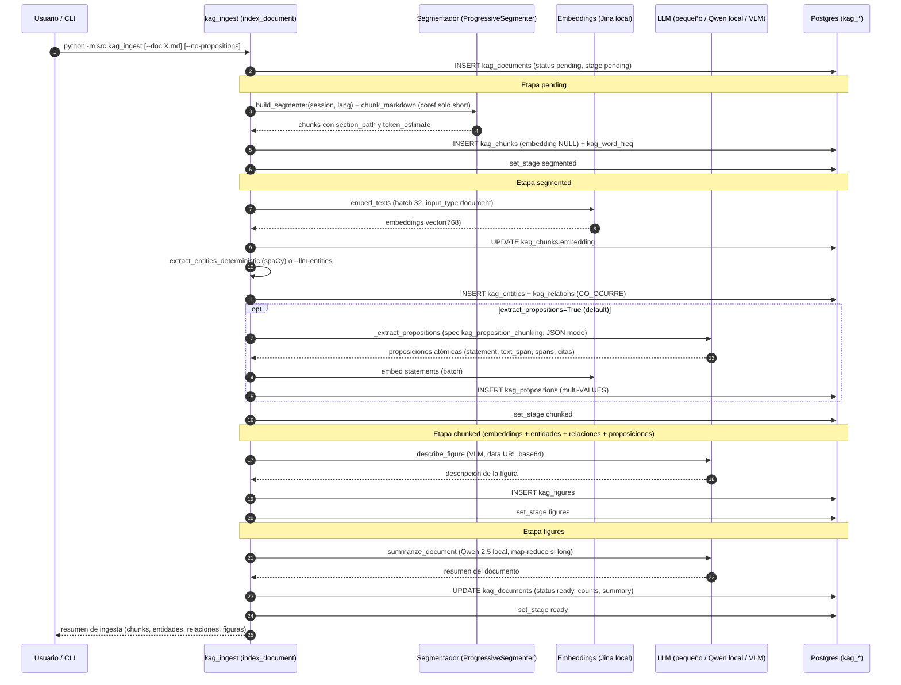
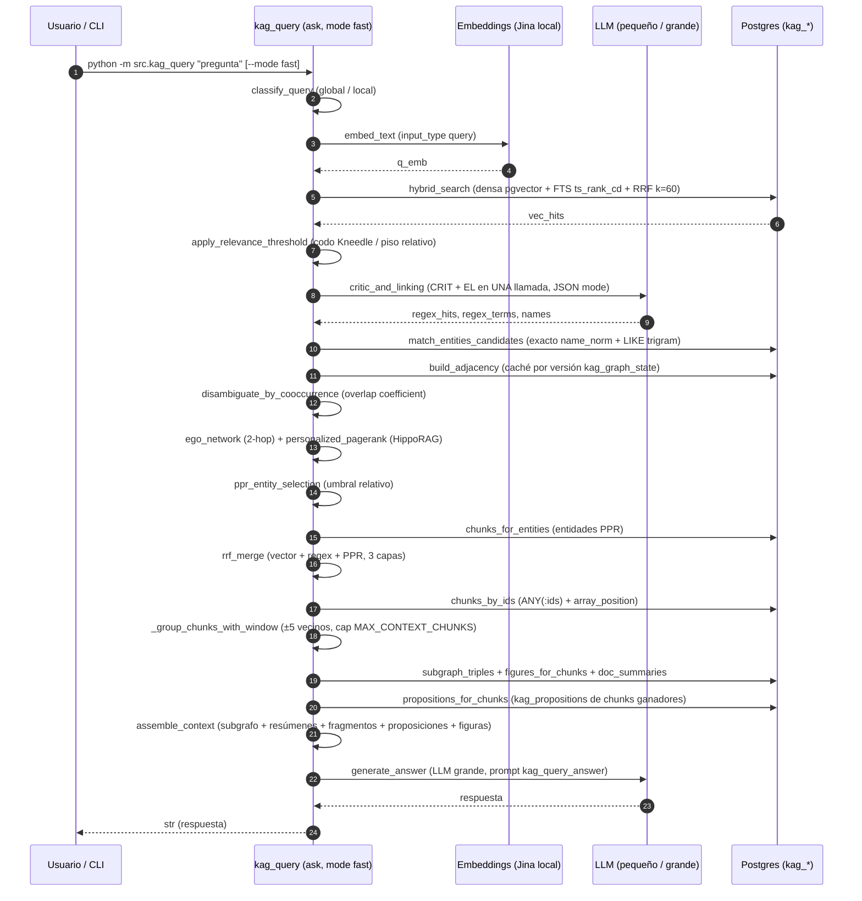
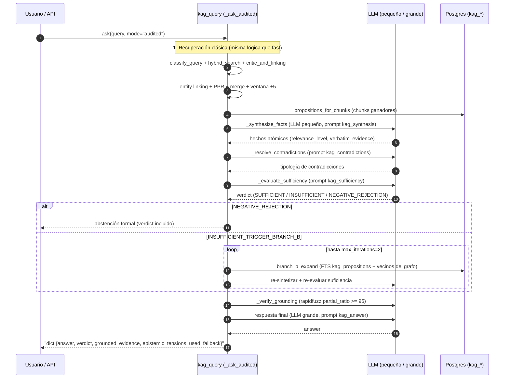
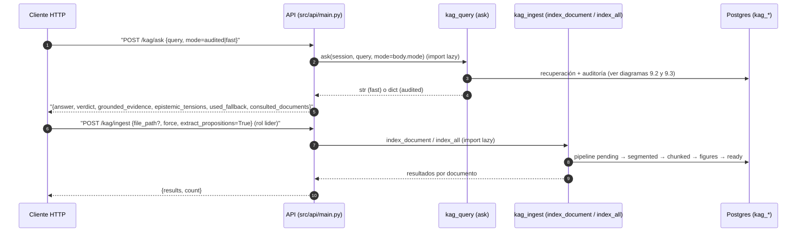

# Diseño — Sistema KAG Pragmático (Vector + Grafo de Entidades + HippoRAG)

**Tipo de documento:** diseño de implementación — capa de conocimiento del pipeline
**Estado:** implementado y verificado (2026-09-14) — migraciones `0013_kag` → `0025_kag_drop_propositional` aplicadas, seed aplicado. Incluye 4 optimizaciones: entity linking anclado con el LLM, desambiguación por copresencia en el grafo, noun chunks con spaCy y búsqueda híbrida densa + FTS + RRF. **Rediseño profundo (2026-09-14):** capa proposicional completa — ingesta proposicional (`src/kag_propositional.py`, 6 pasos), herramientas de ingesta (`src/kag/tools.py`), agentes query-time (`src/kag_agents.py`) y modelos de visión registrados con `is_vision=True` (`src/db/seed_vision.py`). **Unificación (2026-09-15, §8):** el motor proposicional fue **ELIMINADO** (migración `0025_kag_drop_propositional`) y sus capacidades se portaron al clásico expandido — proposiciones atómicas en `kag_propositions` (migración `0024_kag_propositions`) y modo `audited` en `src/kag_query.py` (ver §8 y §9). **Bugs corregidos en verificación con el book stack real (2.8MB):** sombreado de `text()` de SQLAlchemy por la variable local `text` (rompía la ingesta con `'str' object is not callable`), `KeyError` en `EXTRACT_PROMPT` por llaves JSON literales con `.format()`, y `session.rollback()` en el except que deshacía el INSERT (ahora re-inserta con `status='failed'`). **Validación end-to-end (2026-09-13):** fixture temporal `_test_backprop.md` indexado y consultado con éxito (4 chunks, 20 entidades, 16 relaciones; respuesta correcta con cita de fuente). El fixture y sus datos se eliminaron tras validar; la ingesta del book stack real (Handbook of Culture and Psychology, ~712k tokens) quedó corriendo en background.
**Función:** indexar el `knowledge_repository` (`.md` + imágenes) y responder consultas locales y globales (_multi-hop_) sobre ese conocimiento, con el stack existente (Postgres + pgvector + Together) y la filosofía 0007.

---

## 0. Resumen ejecutivo

Construimos un **KAG pragmático**: nada de Neo4j, nada de Leiden/Louvain, nada de GraphRAG completo. Usamos lo que ya existe (Postgres + pgvector + embeddings locales Jina + LLM vía Together) y añadimos **cinco tablas** (`kag_documents`, `kag_chunks`, `kag_entities`, `kag_relations`, `kag_figures`) + una tabla de configuración del segmentador (`kag_segmenter_settings`) + un **Personalized PageRank** estilo **HippoRAG** (Gutiérrez et al., NeurIPS 2024) para la recuperación multi-hop.

> **Por qué HippoRAG y no GraphRAG:** la activación asociativa en 1–2 saltos (PPR simple sobre el grafo de entidades) supera a GraphRAG en precisión multi-hop con **órdenes de magnitud menos costo computacional** — no hay detección de comunidades ni resúmenes sintéticos por cluster. Para consultas globales usamos **resúmenes por documento** generados con un **LLM local ultra pequeño (Qwen 2.5 quantizado)**, mucho más baratos que los community summaries.

**Rediseño profundo (capa proposicional, §4):** sobre la capa clásica construimos una capa de **proposiciones atómicas** — ficha documental ISO 25964 + Library of Congress, capítulos, proposiciones autocontenidas con embeddings, árbol temático secuencial e imágenes con FAQ Reverse HyDE (ingesta en `src/kag_propositional.py`, migración `0018_kag_propositional`). En consulta, un pipeline de agentes (`src/kag_agents.py`) sintetiza hechos, tipifica contradicciones, audita la suficiencia (con abstención formal si el corpus no cubre el dominio), expande con Branch B y verifica el grounding verbatim de cada cita antes de responder. **⚠ Unificación (2026-09-15, §8):** este motor proposicional fue **ELIMINADO** (migración `0025_kag_drop_propositional`); sus capacidades se portaron al pipeline clásico expandido — proposiciones atómicas en `kag_propositions` (migración `0024_kag_propositions`, extraídas en la etapa `chunked` de `src/kag_ingest.py`) y auditoría epistémica en el modo `audited` de `src/kag_query.py` (síntesis, contradicciones, suficiencia, Branch B, grounding).

**Segmentación:** usamos el segmentador propio del proyecto (`src/kag/segmentador.py`, `ProgressiveSegmenter`), adaptado para leer su configuración de la base de datos (`load_segmenter_config`) y elegir el modelo spaCy del idioma del documento (es/en/pt/de/fr). La detección de idioma (`detect_language`, heurística determinista por stopwords) vive en `src/kag_ingest.py` — módulo ligero, testable sin cargar torch/spacy — y `build_segmenter(session, lang, verbose)` la recibe como parámetro.

**Resúmenes como fuente secundaria:** en la consulta, el orden de recuperación es: (1) keywords/búsqueda vectorial, (2) chunks vía PPR (HippoRAG), (3) **resúmenes de documento** (generados con Qwen 2.5 local) como referencia de segundo plano.

**Filosofía 0007 aplicada:**

- El LLM es la opción SIEMPRE presente: extracción de entidades, resúmenes, entity linking y respuesta final son LLM.
- Lo mecánico (segmentación, embeddings, PPR, ensamblado) es determinista y no depende del LLM.
- Degradación elegante: si el LLM falla en un paso de ingesta, se salta con log (la ingesta es un trabajo de fondo, no una decisión que requiera aceptación humana); si falla en la respuesta, se devuelve el contexto crudo con un mensaje claro.
- Claves y modelos: se leen de la base (`session_settings` → `api_keys`, `embedding_settings`, `llm_models`, `kag_segmenter_settings`), nunca de `.env` ni hardcodeados.

---

## 1. Estructura de datos (migración `0013_kag`)

Cadena de migraciones: `0012_brand_knowledge` → `0013_kag` → `0014_kag_fts` → `0015_kag_hnsw` → `0016_kag_graph_version` → `0017_kag_trgm` → `0018_kag_propositional` → `0019_kag_unified` → `0020_kag_stages` → `0021_kag_prompt_user_templates` → `0022_kag_entity_embeddings` → `0023_kag_word_freq` → `0024_kag_propositions` → **`0025_kag_drop_propositional`** (head).

### 1.1 Tablas KAG

```sql
CREATE TABLE kag_documents (
    id SERIAL PRIMARY KEY,
    doc_path VARCHAR(500) NOT NULL UNIQUE,      -- relativo a data/knowledge_repository/docs/
    title VARCHAR(300) NOT NULL,
    doc_type VARCHAR(10) NOT NULL DEFAULT 'short',  -- 'short' | 'long' (>= 20k tokens)
    status VARCHAR(20) NOT NULL DEFAULT 'pending',  -- 'pending' | 'ready' | 'failed'
    content_hash VARCHAR(64) NOT NULL,          -- sha256 del .md (idempotencia)
    token_estimate INT NOT NULL DEFAULT 0,
    chunk_count INT NOT NULL DEFAULT 0,
    entity_count INT NOT NULL DEFAULT 0,
    relation_count INT NOT NULL DEFAULT 0,
    figure_count INT NOT NULL DEFAULT 0,
    summary TEXT NOT NULL DEFAULT '',           -- resumen Qwen 2.5 local (fuente secundaria)
    error TEXT,
    created_at TIMESTAMPTZ NOT NULL DEFAULT now(),
    updated_at TIMESTAMPTZ NOT NULL DEFAULT now()
);

CREATE TRIGGER set_updated_at_kag_documents
BEFORE UPDATE ON kag_documents
FOR EACH ROW EXECUTE FUNCTION set_updated_at();

CREATE TABLE kag_chunks (
    id SERIAL PRIMARY KEY,
    doc_id INT NOT NULL REFERENCES kag_documents(id) ON DELETE CASCADE,
    chunk_index INT NOT NULL,
    section_path VARCHAR(500) NOT NULL DEFAULT '',  -- ej. '## Introducción > ### Métodos'
    content TEXT NOT NULL,
    token_estimate INT NOT NULL DEFAULT 0,
    embedding vector(768),                          -- jina-embeddings-v5-text-nano (dim 768)
    created_at TIMESTAMPTZ NOT NULL DEFAULT now(),
    UNIQUE (doc_id, chunk_index)
);

CREATE TABLE kag_entities (
    id SERIAL PRIMARY KEY,
    doc_id INT NOT NULL REFERENCES kag_documents(id) ON DELETE CASCADE,
    chunk_id INT REFERENCES kag_chunks(id) ON DELETE CASCADE,
    name VARCHAR(300) NOT NULL,
    name_norm VARCHAR(300) NOT NULL,               -- minúsculas + strip (dedup)
    entity_type VARCHAR(100) NOT NULL DEFAULT 'concept',  -- concept|method|law|person|org|figure
    description TEXT NOT NULL DEFAULT '',
    created_at TIMESTAMPTZ NOT NULL DEFAULT now()
);
CREATE INDEX ix_kag_entities_norm ON kag_entities (name_norm);
CREATE INDEX ix_kag_entities_doc ON kag_entities (doc_id);

CREATE TABLE kag_relations (
    id SERIAL PRIMARY KEY,
    doc_id INT NOT NULL REFERENCES kag_documents(id) ON DELETE CASCADE,
    chunk_id INT REFERENCES kag_chunks(id) ON DELETE CASCADE,
    source_entity_id INT NOT NULL REFERENCES kag_entities(id) ON DELETE CASCADE,
    target_entity_id INT NOT NULL REFERENCES kag_entities(id) ON DELETE CASCADE,
    relation_type VARCHAR(200) NOT NULL,            -- ej. 'UTILIZA', 'DEFINE', 'PARTE_DE'
    description TEXT NOT NULL DEFAULT '',
    created_at TIMESTAMPTZ NOT NULL DEFAULT now()
);
CREATE INDEX ix_kag_relations_src ON kag_relations (source_entity_id);
CREATE INDEX ix_kag_relations_dst ON kag_relations (target_entity_id);

CREATE TABLE kag_figures (
    id SERIAL PRIMARY KEY,
    doc_id INT NOT NULL REFERENCES kag_documents(id) ON DELETE CASCADE,
    chunk_id INT REFERENCES kag_chunks(id) ON DELETE CASCADE,
    image_path VARCHAR(500) NOT NULL,               -- relativo a data/knowledge_repository/images/
    caption TEXT NOT NULL DEFAULT '',                -- alt text del .md si existe
    description TEXT NOT NULL DEFAULT '',            -- descripción VLM
    created_at TIMESTAMPTZ NOT NULL DEFAULT now()
);
```

**Nota sobre la dimensión:** el modelo real (`jina-embeddings-v5-text-nano`) produce vectores de **768** dims. La tabla `artifact_library` existente declara `vector(1024)` — inconsistencia pre-existente del repo, no la tocamos. Las tablas KAG usan `vector(768)` que es la dimensión real del modelo.

### 1.2 Tabla de configuración del segmentador

```sql
CREATE TABLE kag_segmenter_settings (
    id SERIAL PRIMARY KEY,
    nli_model VARCHAR(300) NOT NULL DEFAULT 'facebook/bart-large-mnli',
    segmenter_embedding_model VARCHAR(300) NOT NULL DEFAULT 'sentence-transformers/all-MiniLM-L6-v2',
    spacy_models JSONB NOT NULL DEFAULT '{"es": "es_core_news_md", "en": "en_core_web_md", "pt": "pt_core_news_md", "de": "de_core_news_md", "fr": "fr_core_news_md"}',
    is_active BOOLEAN NOT NULL DEFAULT TRUE,
    created_at TIMESTAMPTZ NOT NULL DEFAULT now(),
    updated_at TIMESTAMPTZ NOT NULL DEFAULT now()
);

CREATE TRIGGER set_updated_at_kag_segmenter_settings
BEFORE UPDATE ON kag_segmenter_settings
FOR EACH ROW EXECUTE FUNCTION set_updated_at();
```

Singleton (a lo sumo una fila activa), igual que `embedding_settings`. El seed (`src/db/seed_kag.py`) la puebla con los defaults. El segmentador lee de aquí — nunca de constantes hardcodeadas.

### 1.3 Registro del modelo local Qwen 2.5 (tabla `llm_models`)

El seed inserta/actualiza una fila en `llm_models`:

```python
{
    "model_name": "qwen2.5-3b-instruct-q4_k_m",   # etiqueta; el archivo GGUF lo sirve llama.cpp
    "provider": "local",
    "model_size": "small",
    "context_window": 32768,
    "max_output_tokens": 60,
    "temperature_default": 0.1,
    "strengths": ["local", "gratis", "determinista", "resumen"],
    "weaknesses": ["capacidad limitada", "requiere servidor local"],
    "prompt_style": "ChatML estricto, system/user separados, XML delimiters, one-shot",
    "syntax_profile": {
        "api_style": "openai_chat",
        "base_url": "http://localhost:8080/v1",   # llama.cpp server (CRUD-editable)
        "system_role_name": "system",
        "instruction_formatting": {"style": "chatml", "root_tag": "instructions"},
        "structured_output": {"mode": "none"},
        "sampling": {
            "temperature": 0.1, "top_p": 0.9, "repetition_penalty": 1.05,
            "max_tokens": 60, "stop": ["\n", ""]
        },
        "tool_calling": {"mode": "none"},
        "prompt_caching": {"supports_prefix_caching": False},
        "reasoning_mode": {"supports_reasoning": False}
    },
}
```

Y una fila en `api_keys` (provider `local`, key_name `local-qwen`, api_key `""` — sin auth). El cliente local (`complete_local`) lee el modelo activo con `provider='local'` y llama a `{base_url}/chat/completions` (API compatible con OpenAI, como llama.cpp server).

**Prompt engineering de Qwen 2.5 (reglas del usuario, aplicadas en `summarize_document`):**

- ChatML nativo: `system` (reglas/constraints) y `user` (solo payload) separados — nunca texto crudo fusionado.
- Texto fuente delimitado con etiquetas XML (`<text>...</text>`).
- Constraints negativas explícitas en `system`: "no digas 'Este texto...'", "sin markdown", "máximo una oración", "máx 30 palabras".
- One-shot: exactamente un ejemplo de alta calidad.
- Parámetros: `temperature=0.1–0.2`, `top_p=0.85–0.9`, `repetition_penalty=1.05`, `max_tokens=50–60`, `stop=["\n", ""]`.

### 1.4 Capa proposicional (migración `0018_kag_propositional`)

La migración `0018_kag_propositional` crea **5 tablas nuevas** (nombres literales del diseño — SIN prefijo `kag_`) y añade el flag `is_vision` a `llm_models`:

```sql
-- Ficha documental (ISO 25964 + Library of Congress) con los límites
-- físicos del MultibookFinderTool y el scope_thematic usado en Branch B.
CREATE TABLE documents (
    id SERIAL PRIMARY KEY,
    source_file VARCHAR(500) NOT NULL,               -- ruta del .md maestro
    document_id VARCHAR(100) NOT NULL UNIQUE,        -- ej. '{stem}_doc_001'
    title VARCHAR(300) NOT NULL,
    technical_level VARCHAR(20) NOT NULL DEFAULT 'intermediate',  -- introductory|intermediate|advanced|research
    bibtex TEXT NOT NULL DEFAULT '',
    thematic_areas_iso25964 JSONB NOT NULL DEFAULT '[]',  -- [{preferred_term, non_preferred_terms[], scope_note_disambiguation, broader_term, narrower_term, related_terms[]}]
    library_of_congress JSONB NOT NULL DEFAULT '{}',      -- {lcsh_terms[], lcc_classification{}}
    key_entities JSONB NOT NULL DEFAULT '[]',
    scope_thematic TEXT NOT NULL DEFAULT '',         -- Branch B: scope_thematic ILIKE ANY(...)
    line_start INT NOT NULL DEFAULT 0,               -- límites físicos del MultibookFinderTool
    line_end INT NOT NULL DEFAULT 0,
    status VARCHAR(20) NOT NULL DEFAULT 'pending',   -- pending|ready|failed
    content_hash VARCHAR(64) NOT NULL DEFAULT '',    -- sha256 del slice (idempotencia)
    created_at TIMESTAMPTZ NOT NULL DEFAULT now(),
    updated_at TIMESTAMPTZ NOT NULL DEFAULT now()
);
CREATE TRIGGER set_updated_at_documents
BEFORE UPDATE ON documents FOR EACH ROW EXECUTE FUNCTION set_updated_at();

-- Capítulos del documento; summary alimenta escalate_to_parent_context.
CREATE TABLE document_chapters (
    id SERIAL PRIMARY KEY,
    document_id INT NOT NULL REFERENCES documents(id) ON DELETE CASCADE,
    chapter_index INT NOT NULL,
    title VARCHAR(300) NOT NULL,
    line_start INT NOT NULL,
    line_end INT NOT NULL,
    main_theme TEXT NOT NULL DEFAULT '',
    summary TEXT NOT NULL DEFAULT '',
    subsections JSONB NOT NULL DEFAULT '[]',
    UNIQUE (document_id, chapter_index)
);

-- Proposiciones atómicas autocontenidas con embedding vector(768) + HNSW.
CREATE TABLE propositional_chunks (
    id SERIAL PRIMARY KEY,
    document_id INT NOT NULL REFERENCES documents(id) ON DELETE CASCADE,
    chapter_id INT NOT NULL REFERENCES document_chapters(id) ON DELETE CASCADE,
    core_idea_id VARCHAR(50) NOT NULL DEFAULT '',    -- ej. CI_01
    argument_id VARCHAR(50) NOT NULL DEFAULT '',     -- ej. ARG_01_A
    statement TEXT NOT NULL,                         -- proposición atómica autocontenida
    text_span TEXT NOT NULL DEFAULT '',               -- verbatim_span exacto del original
    char_start INT NOT NULL DEFAULT 0,
    char_end INT NOT NULL DEFAULT 0,
    line_start INT NOT NULL DEFAULT 0,
    line_end INT NOT NULL DEFAULT 0,
    citation_references JSONB NOT NULL DEFAULT '[]',  -- referencias duplicadas en cada átomo
    embedding vector(768),                            -- jina-embeddings-v5-text-nano (misma dim que kag_chunks)
    created_at TIMESTAMPTZ NOT NULL DEFAULT now()
);
CREATE INDEX ix_propositional_chunks_doc ON propositional_chunks (document_id);
CREATE INDEX ix_propositional_chunks_chapter ON propositional_chunks (chapter_id);
CREATE INDEX ix_propositional_chunks_embedding
    ON propositional_chunks USING hnsw (embedding vector_cosine_ops);

-- Imágenes con descripción visual densa y FAQ Reverse HyDE.
CREATE TABLE document_images (
    id SERIAL PRIMARY KEY,
    document_id INT NOT NULL REFERENCES documents(id) ON DELETE CASCADE,
    image_id VARCHAR(100) NOT NULL DEFAULT '',
    file_path VARCHAR(500) NOT NULL,
    anchor_line INT NOT NULL DEFAULT 0,
    caption TEXT NOT NULL DEFAULT '',
    image_type VARCHAR(50) NOT NULL DEFAULT '',      -- diagram|chart_or_plot|flowchart|conceptual_illustration|screenshot|table_image|photograph
    dense_visual_description TEXT NOT NULL DEFAULT '',
    epistemic_contribution TEXT NOT NULL DEFAULT '',
    faq_indexing JSONB NOT NULL DEFAULT '[]',         -- 3-5 preguntas Reverse HyDE
    associated_entities JSONB NOT NULL DEFAULT '[]',
    created_at TIMESTAMPTZ NOT NULL DEFAULT now()
);
CREATE INDEX ix_document_images_doc ON document_images (document_id);

-- Nodos del árbol temático (macro-fases) con start/end apuntando a chunks.
CREATE TABLE topic_tree_nodes (
    id SERIAL PRIMARY KEY,
    document_id INT NOT NULL REFERENCES documents(id) ON DELETE CASCADE,
    sequential_order INT NOT NULL,
    macro_phase_label VARCHAR(300) NOT NULL DEFAULT '',
    representative_keywords JSONB NOT NULL DEFAULT '[]',
    start_chunk_id INT REFERENCES propositional_chunks(id) ON DELETE SET NULL,
    end_chunk_id INT REFERENCES propositional_chunks(id) ON DELETE SET NULL,
    epistemic_summary TEXT NOT NULL DEFAULT '',
    created_at TIMESTAMPTZ NOT NULL DEFAULT now(),
    UNIQUE (document_id, sequential_order)
);
CREATE INDEX ix_topic_tree_nodes_doc ON topic_tree_nodes (document_id);

-- Flag de visión en llm_models: identifica modelos VLM para lectura de imágenes.
ALTER TABLE llm_models ADD COLUMN is_vision BOOLEAN NOT NULL DEFAULT FALSE;
```

**Notas:**

- `documents.document_id` es UNIQUE (identificador del MultibookFinderTool, `{stem}_doc_{NNN}`) — distinto del `id` SERIAL que usan las FKs.
- `propositional_chunks.embedding` usa `vector(768)` (misma dimensión que `kag_chunks`, jina-embeddings-v5-text-nano) con índice HNSW `vector_cosine_ops` (mismo patrón que `0015_kag_hnsw`).
- `topic_tree_nodes.start_chunk_id`/`end_chunk_id` usan `ON DELETE SET NULL` (los nodos sobreviven al borrado de chunks).
- `is_vision` se seedea en `src/db/seed_vision.py` (`is_vision=True` en Llama-3.2-11B-Vision-Instruct-Turbo y Qwen2-VL-72B-Instruct, ambos `model_size='vision'`). `get_vision_model(session)` en `src/llm/together.py` consulta `is_vision=True AND is_active=True` ordenado por `model_size` (prefiere 'large'); `complete_vision` resuelve el modelo desde ahí y, si no hay ningún VLM activo, **lanza `LLMConfigError`** (nunca degrada a un modelo de chat no-visión) — el caller degrada con gracia (imagen registrada con descripción vacía).

---

## 2. Fase 1 — Ingesta (`src/kag_ingest.py`)

### 2.1 Layout del repositorio

```
data/knowledge_repository/
├── docs/                          # los .md (artículos, book stacks)
│   ├── paper_nanotech.md
│   └── book_stack_deep_learning.md
└── images/
    └── paper_nanotech/            # carpeta por documento (nombre = .md sin extensión)
        ├── fig1_architecture.jpg
        └── chart_benchmark.png
```

Las imágenes se leen **solo si existen** en `images/[docname]/`. Si la carpeta no existe, la ingesta de figuras se omite silenciosamente.

### 2.2 Segmentación con el segmentador propio (`src/kag/segmentador.py`)

El segmentador (`ProgressiveSegmenter`) se **adapta** (no se reescribe):

1. **Eliminar la dependencia de `reii.config`** — los defaults pasan a constantes de módulo (`DEFAULT_NLI_MODEL`, `DEFAULT_SEGMENTER_EMBEDDING_MODEL`, `DEFAULT_SPACY_MODEL`, `DEFAULT_SPACY_MODELS`) y la configuración real se lee de `kag_segmenter_settings` en la DB.
2. **`load_segmenter_config(session)`** — lee la fila activa de `kag_segmenter_settings` (SQL crudo); si no hay fila (o la tabla no existe), devuelve los defaults de módulo. Devuelve dict con `nli_model`, `segmenter_embedding_model` y `spacy_models` (dict por idioma).
3. **`build_segmenter(session, lang='es', verbose=False)`** — factory: lee la config, elige el modelo spaCy del idioma (`spacy_models[lang]`, fallback `DEFAULT_SPACY_MODEL`) e instancia `ProgressiveSegmenter` con el NLI model y el embedding model de la DB. Cachea por idioma en un dict de módulo (`_SEGMENTER_CACHE` — no recargar spaCy/SentenceTransformer/NLI por cada documento).
4. **`detect_language(text)`** — heurística determinista por stopwords (es/en/pt/de/fr), default `'es'`. Vive en `src/kag_ingest.py` (módulo ligero, testable sin cargar torch/spacy), NO en el segmentador; `index_document` la llama y pasa el idioma a `build_segmenter`.
5. **`chunk_markdown(md_text, doc_type, segmenter, max_tokens=CHUNK_MAX_TOKENS, use_coref=True)`** (en `src/kag_ingest.py`):
   - Recibe el segmenter como parámetro (duck-typed — los tests pasan un fake con `segment_text`).
   - **Short (<20k tokens):** se parte por encabezados Markdown (`#`, `##`, `###`) preservando `section_path`; cada sección se pasa a `segmenter.segment_text(seccion, max_tokens=max_tokens)` y cada segmento resultante es un chunk.
   - **Long (≥20k tokens):** pre-segmentación por H1/H2 (para acotar cada llamada al segmentador — un book stack de 500k tokens no puede pasar entero por spaCy/coref), y cada sección se segmenta con el segmentador. `section_path` = ruta de encabezados.
   - **Fusión post-segmentación:** el segmentador produce cortes semánticos a veces muy pequeños (~50-100 tokens). `chunk_markdown` fusiona segmentos adyacentes de la MISMA sección hasta `max_tokens` (800), respetando los cortes del segmentador como fronteras duras. Reduce el número de chunks (y de llamadas al extractor de entidades) sin perder los límites semánticos: en el book stack real, ~12.700 segmentos → ~950 chunks.
   - **`use_coref`:** el coref Stanza del segmentador cuesta ~11s por segmento (prohibitivo en book stacks). `index_document` pasa `use_coref=(doc_type == 'short')`: los docs cortos usan coref (costo acotado), los long lo omiten (monkeypatch temporal `resolve_coreferences` en la instancia — el segmentador NO se modifica; el método original se restaura al salir).
   - Cada chunk lleva `section_path` y `token_estimate`.

### 2.3 Flujo de `index_document(session, md_path)`

1. **Leer** el `.md` (utf-8) y calcular `sha256` → `content_hash`.
2. **Idempotencia / reanudación por etapa:** si `kag_documents` ya tiene una fila con ese `doc_path` y el mismo hash → skip (ya indexado). Si el hash cambió → re-indexar (borrar hijos con CASCADE y re-insertar). Flag `--force` para re-indexar a la fuerza.
3. **Clasificar escala:** `token_estimate = len(text) // 4`. `doc_type = 'long'` si ≥ 20k tokens, si no `'short'`.
4. **Chunking** con el segmentador (§2.2).
5. **Embeddings:** `embed_text(chunk.content, input_type="document")` (local, Jina) → `kag_chunks.embedding`. El INSERT usa `embedding_to_sql(emb)` (helper de `src/kag_ingest.py`): convierte la lista de floats al literal pgvector `[0.1,...]` con `CAST(:embedding AS vector)` — psycopg2 adapta las listas Python a `numeric[]`, que pgvector no acepta. Si el embedding falla en un chunk → `emb = None` (chunk sin embedding, con log).
6. **Extracción de entidades y relaciones** — por defecto **determinista con spaCy** (`extract_entities_deterministic` de `src/kag/entities.py`, gratis, sin LLM):
   - Candidatos: noun_chunks + tokens NOUN/PROPN (vía dependency parsing del segmentador, ya cargado).
   - **Supresión NER:** los spans que spaCy reconoce como entidad nombrada (PERSON, ORG, GPE, LOC, ...) NO entran al grafo — se sirven por la capa de búsqueda textual en el querying. Los conceptos que MENCIONAN una entidad NER ("capital cultural de Bourdieu") sí se conservan.
   - Normalización (strip de determinantes + lowercase), filtro de ruido (vacío/numérico/corto; palabras sueltas solo si aparecen ≥2 veces o son PROPN) y **canonicalización por embeddings** (`embed_texts` de la DB, batch): agrupa variantes superficiales por coseno ≥ 0.92 con margen ≥ 0.03 sobre la segunda mejor (evita fusiones ambiguas).
   - Relaciones: co-ocurrencia dentro de la misma oración → `CO_OCURRE`.
   - Si los embeddings fallan → entidades sin agrupar (degradación, no bloqueante).
   - **`--llm-entities`** (opt-in): la extracción LLM por chunk (Together, costosa — 1 llamada por chunk, un leak en docs grandes) con el shape JSON de abajo. Si el LLM falla en un chunk → se salta ese chunk con log (degradación de ingesta, no bloqueante).
   - **Dedup por documento:** `name_norm` (minúsculas + strip). Si la entidad ya existe en el doc, se reutiliza su id.
7. **Figuras:** si existe `images/[docname]/`, para cada imagen (`*.jpg`, `*.jpeg`, `*.png`):
   - Buscar la referencia `` en el markdown para obtener el caption y el chunk que la referencia.
   - `describe_figure`: VLM vía `complete_vision` con la imagen como **data URL base64** (`data:image/jpeg;base64,...`). Si falla → se guarda con `description = ''` y log.
8. **Resumen jerárquico con Qwen 2.5 local** (`summarize_document`):
   - **Short:** una llamada a `complete_local` con el texto completo (truncado a ~16k tokens), `max_tokens=200`.
   - **Long:** map-reduce — una llamada por sección de nivel superior (H1/H2, concatenando sus chunks truncados a ~16k) con `max_tokens=60` + una llamada reduce que combina los resúmenes de sección en el resumen del documento (`max_tokens=200`).
   - Prompt según las reglas de Qwen 2.5 (§1.3): system con constraints, user con `<text>...</text>`, one-shot.
   - Si el servidor local no está disponible → `summary = ''` con log (degradación, no bloqueante). Flag `--no-summary` para omitir.
9. **Actualizar** `kag_documents` (status `ready`, counts) y **print** del resumen de ingesta.

### 2.3.1 Máquina de estados de ingesta (atomicidad por etapa)

La ingesta es **atómica por etapa** (no solo por documento): cada etapa commitea
su trabajo y actualiza la columna `stage` de `kag_documents` (migración
`0020_kag_stages`). Si el proceso se interrumpe (p. ej. durante la segmentación,
que es la etapa lenta), al reanudar se **saltan las etapas completadas** y se
continúa desde la interrumpida — sin borrar ni rehacer lo ya persistido.

```
pending -> segmented -> chunked -> figures -> ready
```

| Etapa       | Qué persiste                                                                         | Commit |
| ----------- | ------------------------------------------------------------------------------------ | ------ |
| `pending`   | Fila en `kag_documents` (status `pending`)                                           | Sí     |
| `segmented` | Chunks en `kag_chunks` con `embedding NULL` (la segmentación lenta queda persistida) | Sí     |
| `chunked`   | Embeddings + entidades + relaciones                                                  | Sí     |
| `figures`   | Figuras en `kag_figures`                                                             | Sí     |
| `ready`     | Resumen + status `ready`                                                             | Sí     |

**Reanudación:** al re-ejecutar `index_document`, se lee `stage` y se reanuda
desde la etapa siguiente a la última completada. Cada etapa re-ejecutada
**limpia primero sus datos parciales** (idempotencia: `DELETE` de su propia
tabla para este `doc_id` antes de re-insertar). La lógica vive en
`src/kag/stages.py` (`resume_from`, `cleanup_stage`, `set_stage`).

**Caso especial `ready` con embeddings NULL:** si el doc está `ready` pero
quedaron chunks sin embedding (fallo transitorio del modelo), se re-embeben
solo los que faltan — sin re-segmentar ni re-extraer entidades.

### 2.4 CLI de ingesta

```bash
python -m src.kag_ingest                 # indexa todo lo pendiente/cambiado
python -m src.kag_ingest --doc paper_nanotech.md
python -m src.kag_ingest --force        # re-indexa todo
python -m src.kag_ingest --no-summary
python -m src.kag_ingest --llm-entities # extracción LLM por chunk (opt-in, costosa)
```

---

## 3. Fase 2 — Consulta (`src/kag_query.py`)

### 3.1 Flujo de `ask(session, query)`

1. **Clasificar** (`classify_query`): heurística determinista de keywords.
   - **Global:** "resumen", "conclusiones", "principales", "temas", "overview", "summary", "main topics", "libro", "book", "¿de qué trata?"...
   - **Local:** todo lo demás (preguntas específicas sobre datos, fórmulas, conceptos).
2. **Búsqueda híbrida (keywords):** `embed_text(query, input_type="query")` → `hybrid_search(session, query, q_emb, k)`: búsqueda densa (pgvector `<=>`, coseno, índice HNSW `ix_kag_chunks_embedding` de la migración `0015_kag_hnsw`) + búsqueda léxica FTS (`ts_rank_cd` sobre `content_tsv`, config `'simple'`) fusionadas con **RRF** (`rrf_merge`, k=60). K = `top_k` (8) local, `global_top_k` (20) global. Si `embed_text` falla (p. ej. sin `embedding_settings` activa) → `q_emb=None` y `hybrid_search` degrada a **solo FTS** (rollback + log). Si la migración `0014_kag_fts` no está aplicada → degrada a solo búsqueda densa (rollback + log). Si todo falla → `session.rollback()` (la transacción queda abortada tras el error) y `vec_hits = []` (degradación natural). Después, `apply_relevance_threshold` descarta la cola larga: score < `MIN_SCORE_RATIO` × max_score o < `MIN_ABS_SCORE` (escala-agnóstico: funciona con RRF, coseno o ts_rank).
   2.5. **CRIT + EL fusionados en UNA llamada LLM** (`critic_and_linking`): el crítico (modelo pequeño) decide si la pregunta contiene términos EXACTOS (nombres propios, países, códigos alfanuméricos como CVE-2024-3094, acrónimos, fechas, cifras) Y selecciona las entidades canónicas del pool del grafo en el mismo prompt estructurado (JSON mode). Devuelve `(regex_hits, regex_terms, names)`: los `hits` son chunks por FTS combinada (config `'simple'`, alta precisión); los `terms` alimentan el entity linking + PPR del paso 3 — el grafo se aplica sobre las keywords de la pregunta Y sobre las del crítico. `names` ya viene anclado al pool (solo entidades reales del grafo). Si el LLM falla → degrada por separado: heurística determinista (`_deterministic_regex_terms`) para los términos y pool determinista (`_noun_chunk_fallback`) para las entidades. Ahorra un round-trip LLM por consulta (antes: CRIT → EL secuenciales).
3. **Entity linking anclado + copresencia** (sobre `names` del paso 2.5):
   - `match_entities_candidates`: por mención, candidatos del grafo — exacto por `name_norm` primero, luego `LIKE` (hasta 5). El `LIKE` con comodín a la izquierda se acelera con el índice GIN trigram de la migración `0017_kag_trgm` (pg_trgm).
   - `disambiguate_by_cooccurrence`: para cada mención ambigua, elige el candidato que comparte más vecinos (a 1 salto) con las entidades confirmadas (menciones con un solo candidato). La cercanía se mide con el **overlap coefficient** (vecinos compartidos / min(grado del candidato, vecinos confirmados)) — normaliza por grado. Confianza: el mejor debe superar `DISAMBIG_MIN_OVERLAP` Y tener margen ≥ `DISAMBIG_MARGIN` sobre el segundo; si no → primer candidato (ambiguo). Sin confirmadas → primer candidato de cada mención.
   - `build_adjacency` (grafo) está **cacheado por versión en DB** (migración `0016_kag_graph_version`): lee `version` de `kag_graph_state` (O(1), una fila) y reutiliza el dict en memoria si no cambió. La versión la incrementa un trigger `AFTER INSERT/UPDATE/DELETE ON kag_relations` — como `kag_relations` solo cambia en la ingesta (añadir/modificar/borrar doc), el grafo se reconstruye únicamente entonces, espejo del índice HNSW. Si la migración no está aplicada → degrada a reconstruir en cada llamada (comportamiento viejo).
4. **PPR (HippoRAG) sobre la ego-network de 2 saltos** (`ego_network` + `personalized_pagerank`):
   - Reutiliza `adj` (ya construido en el paso 3 si hay grupos de candidatos).
   - `ego_network(adj, seed, hops=2)` extrae el subgrafo inducido de la vecindad de 2 saltos de la semilla; el PPR corre SOLO sobre esa submatriz compacta (con alpha=0.15 la masa decae ~×0.15 por salto, así que 2 saltos capturan la señal relevante) — evita el costo O(N²) del grafo completo en cada query.
   - Power iteration: `v = (1-α)·seed + α·Mᵀ·v`, `α = 0.15`, máx 50 iteraciones, tol `1e-6`.
     4.5. **Umbral de cercanía en el grafo** (`ppr_entity_selection`): en vez de un top-N fijo, selecciona las entidades PPR 'cerca' de la semilla con un piso doble escala-agnóstico — relativo al máximo (`score ≥ PPR_MIN_RATIO × max_score`, captura el codo natural de la cola power-law) + guarda estadística solo en grafos grandes (`n ≥ 100`: `score ≥ mean + PPR_Z × std`). Si solo 3 entidades están cerca, no arrastra 7 irrelevantes; si 20 están cerca, no descarta la mitad.
5. **Merge + dedup (RRF 3 capas):** `chunks_for_entities(ppr_entities)` → `rrf_merge(vec_hits, regex_hits, ppr_chunks, k=60)` → una sola lista de chunks ancla, sin duplicación (cada capa aporta su rank; RRF es escala-agnóstico: ts_rank, coseno y menciones no comparten escala). Los chunks se leen con **UNA consulta** (`chunks_by_ids`: `WHERE id = ANY(:ids)` + `array_position` para preservar el orden de importancia del RRF — elimina el loop N+1 por hit). Luego `_group_chunks_with_window`: cada ancla se expande con sus ±`CONTEXT_WINDOW` vecinos del mismo doc (agrupador de chunks consecutivos), ordenado por importancia del ancla y capado en `MAX_CONTEXT_CHUNKS`. Opcional: `rerank_chunks` (cross-encoder, `RERANK_ENABLED = False` por defecto) reordena los anclas por afinidad semántica exacta antes de la ventana.
6. **Subgrafo de tripletas** (`subgraph_triples`): relaciones donde source o target ∈ entidades PPR cercanas (o las desambiguadas si no hay PPR), límite 25, con nombres de entidades.
7. **Figuras** (`figures_for_chunks`): figuras de los chunks finales.
8. **Resúmenes como fuente secundaria** (`doc_summaries`): resúmenes de los documentos de los chunks finales — **siempre** (local y global), marcados como referencia de segundo plano, después de keywords y PPR.
9. **Ensamblar contexto** (`assemble_context`):
   ```
   --- SUBGRAFO DE ENTIDADES ---
   (Red Neuronal) -[CO_OCURRE]-> (Propagación Hacia Atrás) [doc: ...]

   --- RESUMENES DE DOCUMENTO (referencia secundaria) ---
   [paper_nanotech.md] <resumen Qwen 2.5>

   --- FRAGMENTOS RECUPERADOS (orden de importancia) ---
   [1] RESULTADO | doc: paper_nanotech.md | sección: ## Introducción | chunk 3/14 | score: 0.0164
   <contenido>
   [2] contexto | doc: paper_nanotech.md | sección: ## Introducción | chunk 4/14 | score: 0.0164
   <contenido>

   --- FIGURAS ---
   [fig1_architecture.jpg] <descripción VLM>
   ```
   **Orden para prompt caching:** el subgrafo y los resúmenes (bloques semi-estáticos, ordenados de forma determinista por doc) van ANTES de los fragmentos y figuras (dinámicos). Así el prefijo del prompt (system + subgrafo + resúmenes) es cacheable entre queries que comparten documentos; la cola dinámica (chunks + figuras) y la query del usuario (al final en `ANSWER_PROMPT`) quedan al final. `history` (opcional) se incluye como sección informativa al inicio (preparado, sin probar con Docker).
10. **Respuesta** (`generate_answer`): LLM **grande** con el prompt de respuesta (constante en el archivo), `response_format` JSON opcional. Si el LLM falla → devuelve el contexto crudo con nota de degradación.

### 3.2 CLI de consulta

```bash
python -m src.kag_query "¿Qué fórmula usa la propagación hacia atrás?"
python -m src.kag_query --top-k 12 "pregunta"
```

### 3.3 Optimizaciones de recuperación y entity linking

Siete optimizaciones implementadas sobre el flujo base de §3.1:

**1. Entity linking anclado con el LLM (`grounded_entity_linking`)**

El entity linking original usaba LLM libre + fallback determinista por substring (`LIKE`), lo que producía **falsos positivos** (nombres inventados o variantes que no existen en el grafo) que se propagaban como semilla al PPR. Ahora:

- Pre-filtro determinista (`_noun_chunk_fallback`) obtiene un pool de entidades candidatas **reales** del grafo.
- El LLM (modelo pequeño) **selecciona** entidades canónicas **solo entre ese pool** (prompt `GROUNDED_ENTITIES_PROMPT`).
- El match posterior es **exacto por `name_norm`** — se elimina el `LIKE` de la vía principal.
- Si el LLM falla → devuelve el pool determinista (degradación natural).

**2. Desambiguación por copresencia en el grafo (`match_entities_candidates` + `disambiguate_by_cooccurrence`)**

Una mención puede matchear varias entidades (p. ej. "red" → "Red Neuronal" y "Red de Petri"). `match_entities_candidates` devuelve una lista de listas (candidatos por mención, exacto primero y luego `LIKE` hasta 5). `disambiguate_by_cooccurrence` elige, para cada mención ambigua, el candidato que comparte más vecinos (a 1 salto) con las **entidades confirmadas** (menciones con un solo candidato). La cercanía se mide con el **overlap coefficient** (vecinos compartidos / min(grado del candidato, vecinos confirmados)): normaliza por grado — un candidato de grado 100 con 5 vecinos compartidos NO es más cercano que uno de grado 3 con 3 compartidos. Confianza: el mejor debe superar `DISAMBIG_MIN_OVERLAP` Y tener margen ≥ `DISAMBIG_MARGIN` sobre el segundo; si no → conserva el primer candidato (ambiguo). Sin entidades confirmadas → conserva el primer candidato de cada mención (no hay señal de copresencia).

**3. Noun chunks con spaCy (`_noun_chunk_fallback` + helpers)**

El fallback determinista por tokens sueltos partía entidades multi-palabra ("red neuronal" → "red" + "neuronal"). Ahora `_noun_chunk_fallback` extrae **frases nominales completas** (noun chunks) + tokens PROPN, con mejor granularidad para entidades multi-palabra. `_get_spacy_nlp(session, lang)` carga spaCy perezosamente con caché por idioma (el módulo sigue siendo ligero) y `_spacy_model_for(session, lang)` resuelve el modelo por idioma desde un dict local `_SPACY_MODELS` (es/en/pt/de/fr), leyendo `kag_segmenter_settings.spacy_models` si existe. Si spaCy no está disponible → degrada al fallback determinista por tokens (`_deterministic_entity_fallback`).

**4. Búsqueda híbrida: densa + FTS + RRF (`fts_search` + `rrf_merge` + `hybrid_search`)**

La búsqueda densa sola no captura **precisión léxica** (acrónimos, códigos, nombres propios, términos exactos). La migración `0014_kag_fts` añade la columna generada `content_tsv tsvector` (config `'simple'`, agnóstica de idioma, sin stemming — ideal para términos exactos) + índice GIN `ix_kag_chunks_content_tsv` sobre `kag_chunks`. En consulta:

- `fts_search(session, query_text, top_k)`: `ts_rank_cd` sobre `content_tsv`.
- `rrf_merge(dense_hits, sparse_hits, k=60, top_k)`: Reciprocal Rank Fusion en Python puro (testeable, sin dependencias).
- `hybrid_search(session, query_text, query_embedding, top_k, rrf_k=60, verbose=False)`: densa + FTS + RRF. Si la migración 0014 no está aplicada → degrada a solo búsqueda densa (rollback + log, solo si `verbose`).

`ask()` usa `hybrid_search` en el paso 2 en vez de `vector_search`.

**5. LLM crítico → búsqueda textual + grafo integrado (`critic_regex_search` + `_deterministic_regex_terms`)**

El crítico (modelo pequeño) detecta términos EXACTOS que la búsqueda semántica diluye (CVE-2024-3094, "Bourdieu", SKU-123, acrónimos, fechas, cifras) y devuelve `(hits, terms)`:

- `hits`: chunks por FTS por término (config `'simple'`, sin stemming — ideal para códigos y nombres propios). Alta precisión, pocos chunks.
- `terms`: alimentan el entity linking + PPR del paso 3 — el grafo se aplica sobre las keywords de la pregunta Y sobre las del crítico (multi-hop a través del grafo sobre términos exactos).
- Si el LLM falla → heurística determinista (`_REGEX_TERM_RE`: tokens con mayúscula inicial o códigos alfanuméricos). Sin términos → `([], [])` (el flujo normal sigue).

**6. Merge final con RRF sobre 3 capas + ventana de contexto (`rrf_merge` variádico + `_group_chunks_with_window`)**

El merge viejo concatenaba listas con escalas mezcladas (coseno + PPR + ts_rank) y deduplicaba con `dict.fromkeys` (ignoraba la posición relativa). Ahora `rrf_merge` es variádico (N listas) y fusiona las tres capas (vector, regex, PPR) por posición: cada capa aporta `1/(k+rank)`. Escala-agnóstico: no importa que ts_rank no tenga cota superior y el coseno viva en [0,1]. Después, cada ancla se expande con su ventana ±`CONTEXT_WINDOW` del mismo doc (el LLM recibe texto contiguo, no chunks aislados), con dedup global por `chunk_id` y cap en `MAX_CONTEXT_CHUNKS`.

**7. CRIT + EL fusionados, chunks por lotes, PPR ego-network y prompt caching (`critic_and_linking` + `chunks_by_ids` + `ego_network` + `assemble_context`)**

Cuatro optimizaciones de latencia/costo sobre el flujo de §3.1:

- **CRIT + EL en UNA llamada LLM** (`critic_and_linking`): el crítico y el entity linking anclado se fusionan en un solo prompt estructurado (JSON mode) que devuelve `{needs_regex, terms, entities}`. Ahorra un round-trip LLM por consulta (antes: CRIT → EL secuenciales, ~1-2s de TTFT). Las entidades se anclan al pool del grafo (solo nombres reales); si el LLM falla, degrada por separado (heurística determinista + pool determinista).
- **Chunks por lotes** (`chunks_by_ids`): los chunks de los merged hits se leen con UNA consulta `WHERE id = ANY(:ids)` + `array_position` (preserva el orden de importancia del RRF) — elimina el loop N+1 de `SELECT chunk WHERE id=:id` por hit.
- **PPR sobre ego-network** (`ego_network`): el PPR corre sobre el subgrafo inducido de 2 saltos de la semilla, no sobre el grafo completo — evita el costo O(N²) por query (con alpha=0.15 la masa decae ~×0.15 por salto, 2 saltos capturan la señal).
- **Prompt caching** (`assemble_context`): el subgrafo y los resúmenes (bloques semi-estáticos, ordenados de forma determinista por doc) van ANTES de los fragmentos y figuras (dinámicos). El prefijo del prompt (system + subgrafo + resúmenes) es cacheable entre queries que comparten documentos; la cola dinámica y la query del usuario quedan al final — reduce tokens y TTFT en llamadas sucesivas.

**8. Reranker cross-encoder opcional (`rerank_chunks`, default OFF)**

El RRF fusiona por posición pero ignora la afinidad semántica exacta entre la query y el texto. `rerank_chunks` reordena el top-N de anclas con un cross-encoder (`jinaai/jina-reranker-v2-base-multilingual`) antes de expandir la ventana ±`CONTEXT_WINDOW`, filtrando falsos positivos del FTS/PPR. Es una dependencia pesada (sentence-transformers + ~1GB de modelo), por eso `RERANK_ENABLED = False` por defecto: activarlo con lazy-load y degradación natural (si el modelo no carga, el flujo sigue sin rerankear). El score del ancla se actualiza con la puntuación del reranker, así `_group_chunks_with_window` ordena los grupos por la nueva relevancia.

### 3.4 Calibración de umbrales de cercanía

Los umbrales del sistema son RELATIVOS a la distribución, no absolutos: el score PPR depende del tamaño del grafo, de la distribución de grados y de alpha; el overlap coefficient depende de los grados de los candidatos; el coseno de canonicalización depende del modelo de embeddings. Un umbral fijo funciona en un corpus y revienta en otro.

**Técnicas automáticas (Tier 1, `src/kag/thresholds.py`).** Con `AUTO_THRESHOLDS = True` (default en `src/kag_query.py`) los umbrales se derivan de la distribución observada en cada query/ingesta, con los valores fijos como FALLBACK:

- **Codos (Kneedle, Satopää et al. 2011)** — `auto_cutoff` para PPR y relevancia. Normaliza rank→[0,1] y score→[0,1], calcula la curva diferencia `D = y_line - y` (positiva en el codo de una curva convexa decreciente) y corta en el primer máximo local de D que supera `D_max - S·mean(D)` (S=1.0). El codo manda: el piso relativo (`min_ratio × max_score`, `mean + z·std` en grafos grandes) es solo el fallback cuando la curva es plana, corta (<3 pts) o casi lineal (sin codo claro).
- **Márgenes (mediana robusta)** — `auto_margin` para desambiguación y canonicalización. Se recolectan los gaps `(best - second)` de las menciones/candidatos con señal y el margen es la MEDIANA de esos gaps (con piso): la mitad de las menciones con señal se resuelven, la otra mitad queda ambigua. Con <2 gaps (sin distribución) se usa el valor fijo.

**PPR (`PPR_MIN_RATIO`, `PPR_Z`).** Con alpha=0.15, cada salto en el grafo decae ~×0.15: la semilla puntúa ~(1-α)/|seed|, los vecinos a 1 salto ~α×eso, los de 2 saltos ~α²×eso. `PPR_MIN_RATIO = 0.02` ≈ semilla + 2 saltos (0.15² = 0.0225): captura la vecindad local natural para razonamiento multi-hop sin arrastrar la cola. Con auto, el corte es el codo Kneedle de la curva de scores PPR (el punto donde la cola power-law se aplana); el piso relativo + guarda estadística (`mean + PPR_Z × std`, solo n ≥ 100) es el fallback. `PPR_Z = 0.5` es conservador (mantiene bastante); subirlo si entran demasiadas entidades irrelevantes, bajarlo si se pierden entidades relevantes.

**Desambiguación (`DISAMBIG_MIN_OVERLAP`, `DISAMBIG_MARGIN`).** El overlap coefficient normaliza por grado: un candidato de grado 100 con 5 vecinos compartidos NO es más cercano que uno de grado 3 con 3 compartidos. `DISAMBIG_MIN_OVERLAP = 0.1` es un piso bajo (filtra solo candidatos sin señal); el discriminador real es el margen. Con auto, el margen es la mediana de los gaps `(best - second)` de las menciones con señal (best ≥ min_overlap) — la distribución manda; `DISAMBIG_MARGIN = 0.05` es el fallback con <2 gaps.

**Canonicalización (`DEFAULT_SIM_THRESHOLD`, `DEFAULT_GAP_MARGIN`).** En la ingesta, `_canonicalize` fusiona variantes superficiales por coseno ≥ 0.92 con margen sobre la segunda mejor. El umbral es ALTO a propósito: fusionar conceptos distintos es peor que dejar variantes separadas. Con `gap_margin=None` (default) el margen se deriva en DOS pasadas: la pasada 1 con margen 0 recolecta los gaps de los candidatos con señal (best ≥ umbral y ≥2 grupos comparables) y el margen final es la mediana de esos gaps (con piso `DEFAULT_GAP_MARGIN = 0.03`); la pasada 2 aplica el margen. El margen evita fusiones a ciegas cuando dos representantes están igual de cerca (empate → la variante se queda separada).

**Relevancia (`MIN_SCORE_RATIO`, `MIN_ABS_SCORE`).** `MIN_SCORE_RATIO = 0.15` descarta la cola larga de la búsqueda híbrida (relativo al mejor score); `MIN_ABS_SCORE = 0.001` es el seguro contra queries sin señal. Con auto, el corte es el codo Kneedle de la curva de scores (el punto donde la relevancia cae abruptamente); el piso relativo es el fallback. Con RRF (k=60), el mejor score es ~1/61 ≈ 0.016 y el piso relativo ~0.0024 — el piso absoluto de 0.001 queda por debajo, así que domina el relativo.

---

## 4. Arquitectura proposicional (rediseño profundo)

> **⚠ OBSOLETO (2026-09-15):** esta sección describe el motor proposicional **eliminado** en la unificación (§8). `src/kag_propositional.py` y `src/kag_agents.py` fueron borrados y sus 5 tablas (`documents`, `document_chapters`, `propositional_chunks`, `topic_tree_nodes`, `document_images`) DROPPED (migración `0025_kag_drop_propositional`). Las capacidades valiosas se portaron al pipeline clásico expandido: proposiciones atómicas en `kag_propositions` (migración `0024_kag_propositions`, extraídas en la etapa `chunked` de `src/kag_ingest.py`) y auditoría epistémica (síntesis/contradicciones/suficiencia/Branch B/grounding) en el modo `audited` de `src/kag_query.py`. Los diagramas ASCII de esta sección son históricos; el diagrama de secuencias del sistema unificado está en §9.

Sobre la capa clásica (chunks + grafo de entidades + HippoRAG, §1–§3) construimos una **capa proposicional**: proposiciones atómicas autocontenidas con embeddings, ficha documental ISO 25964 + Library of Congress, capítulos, árbol temático secuencial e imágenes con FAQ Reverse HyDE. La ingesta vive en `src/kag_propositional.py` (migración `0018_kag_propositional`) y la consulta en `src/kag_agents.py`. Las herramientas de ingesta (`MultibookFinderTool`, `LibraryOfCongressAPITool`, `MarkdownImageExtractorTool`) viven en `src/kag/tools.py`.

### 4.1 Pipeline de ingesta proposicional (`src/kag_propositional.py`)

Pipeline de 6 pasos sobre los `.md` apilados de `data/knowledge_repository/docs/`:

```
Paso 0  MultibookFinderTool: detecta los límites físicos de cada libro/papel apilado
        (anclas ISBN + separadores pesados + keywords estructurales multilingüe) y
        calcula el content_hash del slice (idempotencia). Escribe/actualiza
        data/knowledge_repository/stacked_manifest.json (rangos por source_file).
        │
Paso 1  Llamada unificada de análisis documental (0019): UNA llamada LLM por
        documento (ANALYSIS_SYSTEM/ANALYSIS_USER) que produce la ficha ISO 25964 +
        Library of Congress (enriquecida con LibraryOfCongressAPITool vía id.loc.gov),
        el resumen ejecutivo global (documents.summary), la estructura de capítulos
        con micro-resúmenes y las entidades rectoras ──► documents + document_chapters
        │
Paso 2  (absorbido en el Paso 1 — antes era una llamada LLM separada)
        │
Paso 3  Chunking proposicional jerárquico (LLM, por capítulo):
        Ideas Centrales → Argumentos → Proposiciones atómicas con verbatim_span,
        char offsets y citas duplicadas; embeddings batch (32) ──► propositional_chunks
        │
Paso 4  Árbol temático secuencial: clustering aglomerativo con conectividad
        bandeada (_sequential_clusters) + c-TF-IDF (_ctfidf_keywords) +
        etiquetado LLM ────────────────────────────────────────────► topic_tree_nodes
        │
Paso 5  Imágenes: VLM (complete_vision, is_vision=True) + FAQ Reverse HyDE
        (3-5 preguntas por imagen) ────────────────────────────────► document_images
        │
Paso 6  Cierre: documents.status = 'ready'
```

**Detalles clave:**

- **Paso 0 — `MultibookFinderTool`** (`src/kag/tools.py`): segmenta libros/papers apilados en un único `.md` grande. Anclas: regex ISBN + separadores pesados (`---`, `===`, `___`); búsqueda hacia atrás (ventana `context_window_lines=300`) de la frontera real (separador o ≥4 líneas vacías consecutivas). Ignora fragmentos residuales <50 líneas. Devuelve `[line_start, line_end]` por documento con `document_id = '{stem}_doc_{NNN}'`. `index_stacked_file` escribe/actualiza `data/knowledge_repository/stacked_manifest.json` (dict keyed por `source_file` → `{generated_at, documents[]}`; re-ejecutar el mismo `.md` reemplaza su entrada sin duplicar; best-effort, no bloquea la ingesta).
- **Paso 1 — Llamada unificada de análisis documental (migración `0019_kag_unified`)**: `_index_document_analysis` reemplaza los antiguos pasos 1+2 (antes `_index_metadata` + `_index_chapters`, dos llamadas LLM separadas) por UNA llamada LLM por documento (`ANALYSIS_SYSTEM`/`ANALYSIS_USER`, modelo pequeño, JSON mode). Entrada = esqueleto del documento (`_build_document_skeleton`: primeras ~2000 chars + encabezados H1/H2/H3 con su número de línea real). Salida atómica: ficha ISO 25964 (mínimo 3 temáticas con `preferred_term`, `non_preferred_terms`, `scope_note_disambiguation`, TG/TE/TR) + LCC/LCSH + BibTeX, **resumen ejecutivo global** (`documents.summary`, columna nueva de 0019), **estructura de capítulos con micro-resúmenes** (`document_chapters.summary`), y **entidades rectoras** (`key_entities`). `_enrich_library_of_congress` completa URIs reales con `LibraryOfCongressAPITool` (best-effort). `_scope_thematic_from_thematic` deriva `scope_thematic` (preferred + non-preferred separados por `|`) — usado por Branch B con `scope_thematic ILIKE ANY(...)`. Degradación crítica: si la llamada falla, se insertan los defaults crudos exactos de antes (ficha con title/technical_level por defecto + capítulo único con todo el rango); el INSERT en `documents` y `document_chapters` ocurre SIEMPRE. Balance: ~34 llamadas/doc → 1 llamada/doc.
- **Paso 3 — Chunking proposicional jerárquico**: por capítulo, en bloques de `MAX_CONTEXT_CHARS=12000`. El LLM devuelve Ideas Centrales (`CI_xx`) → Argumentos (`ARG_xx_A`) → proposiciones atómicas con `proposition` (autocontenida, anáforas resueltas), `verbatim_span` (fragmento exacto), `line_start/end`, `char_start/end` (localizados con `_locate_span` sobre el texto del bloque) y `citations_references` **duplicadas en cada átomo** que deriva de una cita. Embeddings en batch (`EMBED_BATCH_SIZE=32`, `embed_texts`). Degradación: chunk crudo de ~800 tokens por bloque si el LLM falla; `embedding=NULL` si el modelo falla.
- **Paso 4 — Árbol temático secuencial**: `_sequential_clusters` = `AgglomerativeClustering` con `connectivity` bandeada (chunk i solo se fusiona con i±1), `linkage='average'`, `metric='cosine'`, `distance_threshold=TOPIC_DISTANCE_THRESHOLD=0.55` (≈0.45 de similitud media — conservador). `_ctfidf_keywords` (CountVectorizer + TfidfTransformer, stopwords es/en) extrae `TOP_N_KEYWORDS=8` keywords distintivas. El LLM etiqueta cada cluster (`macro_phase_label`, `epistemic_summary`) conservando estrictamente los `start/end_chunk_id` provistos. Degradación: si embeddings None → un cluster por chunk.
- **Paso 5 — Imágenes**: `MarkdownImageExtractorTool` rastrea `` y `` dentro del rango físico del documento → línea física + `exists_on_disk`. Solo imágenes existentes. `_describe_image` llama a `complete_vision` (data URL base64, `VISION_SYSTEM`/`VISION_USER`) → `dense_visual_description` (transcripción exacta de ejes/leyendas/flujos), `epistemic_contribution`, `faq_indexing` (3-5 preguntas Reverse HyDE) y `associated_entities`. Contexto circundante ±`CONTEXT_RADIUS_LINES=15`. Degradación: imagen registrada con descripción vacía.
- **Paso 6 — Cierre**: `status='ready'`. Idempotencia por `content_hash` (mismo hash + ready → skip; `--force` re-indexa borrando y re-insertando).

**Máquina de estados del pipeline proposicional (atomicidad por etapa):**

Igual que la ingesta clásica (§2.3.1), el pipeline proposicional es **atómico
por etapa**: cada etapa commitea su trabajo y actualiza la columna `stage` de
`documents` (migración `0020_kag_stages`). Si el proceso se interrumpe (p. ej.
durante el chunking proposicional, que es lento), al reanudar se **saltan las
etapas completadas** y se continúa desde la interrumpida — sin borrar ni rehacer
lo ya persistido.

```
detected -> analysis -> chunks -> topic_tree -> images -> ready
```

| Etapa        | Qué persiste                                                             | Commit |
| ------------ | ------------------------------------------------------------------------ | ------ |
| `detected`   | MultibookFinderTool lo detectó (manifest); sin fila en DB                | —      |
| `analysis`   | Fila en `documents` + capítulos en `document_chapters` (ficha + resumen) | Sí     |
| `chunks`     | `propositional_chunks` + embeddings                                      | Sí     |
| `topic_tree` | `topic_tree_nodes`                                                       | Sí     |
| `images`     | `document_images`                                                        | Sí     |
| `ready`      | `status='ready'`                                                         | Sí     |

**Reanudación:** `_index_document` lee `stage` y reanuda desde la etapa
siguiente a la última completada (`resume_from(KAG_PROPOSITIONAL_STAGES, stage)`).
Cada etapa re-ejecutada **limpia primero sus datos parciales** (`cleanup_stage`:
`DELETE` de su propia tabla para este `doc_id` antes de re-insertar — idempotencia).
La lógica vive en `src/kag/stages.py` (`KAG_PROPOSITIONAL_STAGES`, `resume_from`,
`cleanup_stage`, `set_stage`).

**Reanudación desde `analysis` sin duplicar la fila:** `_index_document_analysis`
acepta `doc_row_id` — si la fila de `documents` ya existe (reanudación desde
`analysis` o posterior), se **actualiza** en vez de insertar una nueva (el INSERT
solo ocurre cuando `doc_row_id is None`, primera ejecución). Los capítulos se
borran y re-insertan (cleanup de la etapa `analysis`), pero la fila maestra nunca
se duplica.

**CLI:**

```bash
python -m src.kag_propositional                 # procesa todos los .md
python -m src.kag_propositional --doc foo.md
python -m src.kag_propositional --force         # re-indexa aunque el hash no cambió
python -m src.kag_propositional --verbose
```

### 4.2 Agentes query-time (`src/kag_agents.py`)

Flujo de `ask_propositional(session, query, top_propositions=15, max_iterations=2)`:

```
query ──► 1. Embedding (input_type='query')
        │
        ▼
2. Nivel 1 — query_focused_proposition_extractor: top-N proposiciones por
   coseno (pgvector <=> sobre propositional_chunks.embedding, solo docs 'ready')
        │
        ▼
3. Agente de Síntesis — synthesize_chunks: hechos atómicos con
   relevance_level (direct_answer|supporting_evidence|contextual_background|irrelevant),
   atomic_summary y verbatim_evidence (cita literal, prohibido parafrasear)
        │
        ▼
4. Resolución de contradicciones — resolve_contradictions: tipología
   (paradigmática / empírica / temporal / terminológica) sin forzar síntesis artificial
        │
        ▼
5. Auditoría de suficiencia — evaluate_sufficiency:
   SUFFICIENT_FOR_SYNTHESIS | INSUFFICIENT_TRIGGER_BRANCH_B | NEGATIVE_REJECTION
   (abstención formal si el corpus no cubre el dominio, con closest_available_topics)
        │
        ▼
6. Branch B (si INSUFFICIENT, hasta max_iterations) — BranchBOrchestrator:
   (a) nuevos documentos por scope_thematic ILIKE ANY(...) / ISO 25964 @>
   (b) expansión 2-hop en kag_relations (vecinos de entidades semilla)
   (c) subconsultas ortogonales FTS sobre propositional_chunks (ts_rank_cd)
   → re-sintetizar + re-evaluar
        │
        ▼
7. Verificación de grounding — verify_claim_grounding: cada verbatim_evidence
   debe existir en el text_span del chunk reclamado (substring o rapidfuzz
   partial_ratio ≥ 95); si no, la evidencia se descarta
        │
        ▼
8. Ensamblaje — assemble_final_context: FinalGroundingContext con
   grounded_evidence (claim_id, verified_fact, verbatim_quote, source_metadata
   con document_title/chapter_title/bibtex_citation_key) + epistemic_tensions
        │
        ▼
9. Respuesta — LLM grande con ANSWER_PROMPT (cada afirmación respaldada por
   grounded_evidence; tensiones explícitas; idioma de la consulta)
```

**Detalles clave:**

- **Nivel 1** (`query_focused_proposition_extractor`): `SELECT ... (p.embedding <=> CAST(:q AS vector)) AS cosine_distance ... ORDER BY cosine_distance ASC LIMIT :top_propositions` con JOIN a `document_chapters` y `documents` (solo `status='ready'`). Devuelve statement, text_span, char offsets, citation_references, títulos y bibtex.
- **Nivel 2** (`escalate_to_parent_context`): resúmenes de capítulo (`SELECT id, summary, line_start, line_end FROM document_chapters WHERE id = ANY(:ids)`) — contexto de capítulo cuando la proposición sola no basta.
- **Síntesis** (`synthesize_chunks`): LLM pequeño con `SYNTHESIS_PROMPT` (JSON mode). Degradación determinista: cada chunk como `supporting_evidence` con `atomic_summary=statement[:500]` y `verbatim_evidence=text_span[:1000]`.
- **Contradicciones** (`resolve_contradictions`): tipología `paradigmatic_theoretical_divergence` | `empirical_contextual_boundary` | `temporal_diachronic_shift` | `terminological_homonymy` (esta última resuelta por la nota de alcance ISO 25964). Degradación: `contradictions_detected=False`.
- **Suficiencia** (`evaluate_sufficiency`): el Agente Auditor Epistemológico recibe los metadatos del corpus (ISO 25964 + LCC/LCSH de hasta 20 docs `ready`). `NEGATIVE_REJECTION` corta el flujo con abstención formal (no itera búsquedas si el corpus carece del dominio). Degradación: `SUFFICIENT_FOR_SYNTHESIS` si hay ≥1 fact relevante, si no `INSUFFICIENT_TRIGGER_BRANCH_B`.
- **Branch B** (`BranchBOrchestrator`): tres vías de expansión — (a) documentos nuevos por `thematic_areas_iso25964 @> :terms` o `scope_thematic ILIKE ANY(:terms)` (límite 3); (b) vecinos 2-hop en `kag_relations` (ordenados por `r.id DESC` — la tabla no tiene columna `weight`, verificado en `0013_kag`); (c) FTS `'simple'` sobre `propositional_chunks.statement` con `_fts_tsquery` (comillas dobles siempre — el `-` es el operador NOT de tsquery). Dedup global por `chunk_id`; `max_iterations=2`.
- **Grounding** (`verify_claim_grounding`): substring exacto en `text_span` → score 100; si no, `rapidfuzz.fuzz.partial_ratio` con umbral `95.0`. Estados: `VERIFIED` | `FAILED_VERBATIM_MISMATCH` | `UNGROUNDED_INVALID_CHUNK_ID`. La evidencia no verificada se descarta del contexto final.
- **Contexto final** (`assemble_final_context`): `FinalGroundingContext` = `{query, grounded_evidence[], epistemic_tensions[]}`. Cada evidencia lleva `source_metadata` (document_title, chapter_title, bibtex_citation_key) para que el LLM cite con precisión.
- **Respuesta** (`ANSWER_PROMPT`): LLM **grande**; si falla → contexto crudo JSON con nota de degradación (`used_fallback=True`).
- **API HTTP**: `POST /kag/ask` en `src/api/main.py` expone `ask_propositional` con payload enriquecido (`answer`, `verdict`, `grounded_evidence` de Branch A — cada ítem incluye `document_id`, `document_title`, `chapter_title`, `bibtex_citation_key` —, `epistemic_tensions`, `used_fallback` y `consulted_documents` dedup por `document_id`). `POST /kag/ingest` (protegido con `require_role("lider")`) dispara `index_stacked_file`/`index_all`.

---

## 5. Resiliencia

| Riesgo                                                           | Mitigación                                                                                                                                                                                                                                                                                                                    |
| ---------------------------------------------------------------- | ----------------------------------------------------------------------------------------------------------------------------------------------------------------------------------------------------------------------------------------------------------------------------------------------------------------------------- |
| Extractor de entidades falla en un chunk (modo `--llm-entities`) | Skip del chunk con log; el resto del doc se indexa igual. El modo por defecto (determinista con spaCy) no llama al LLM                                                                                                                                                                                                        |
| VLM no disponible / imagen corrupta                              | `description = ''`, log; la figura se indexa igual                                                                                                                                                                                                                                                                            |
| Servidor local Qwen 2.5 no disponible                            | `summary = ''`, log; el doc se indexa igual                                                                                                                                                                                                                                                                                   |
| Modelo spaCy del idioma no disponible                            | Fallback a `DEFAULT_SPACY_MODEL` (`es_core_news_md`) si el idioma no está en `spacy_models`; `spacy.load` falla si el modelo no está instalado                                                                                                                                                                                |
| Embeddings sin config                                            | La consulta degrada a solo FTS (`hybrid_search` con `query_embedding=None`); la ingesta guarda el chunk sin embedding (`NULL`) y el doc se indexa igual. `src/embeddings.py` sigue fallando ruidoso si se llama directo                                                                                                       |
| LLM de respuesta falla                                           | Devuelve el contexto crudo + nota de degradación                                                                                                                                                                                                                                                                              |
| Re-indexar el mismo doc                                          | Idempotente por `content_hash`; `--force` para forzar                                                                                                                                                                                                                                                                         |
| Consulta sin entidades matcheadas                                | PPR con semilla vacía → solo búsqueda híbrida (degradación natural)                                                                                                                                                                                                                                                           |
| FTS no disponible (migración 0014 sin aplicar)                   | `hybrid_search` detecta la ausencia de `content_tsv`, hace rollback y degrada a solo búsqueda densa (log)                                                                                                                                                                                                                     |
| Migración 0016 sin aplicar (caché del grafo)                     | `build_adjacency` degrada a reconstrucción por query (comportamiento viejo): el SELECT de `kag_graph_state` falla → `version=None` → no cachea y relee `kag_relations` en cada llamada                                                                                                                                        |
| Migración 0017 sin aplicar (índice trigram)                      | Los `LIKE %name%` de `match_entities_candidates`/`_noun_chunk_fallback` funcionan igual pero sin el índice GIN trigram → Seq Scan (más lento, misma lógica). El código no depende del índice: solo acelera                                                                                                                    |
| spaCy no disponible en el fallback                               | `_noun_chunk_fallback` degrada al fallback determinista por tokens (`_deterministic_entity_fallback`)                                                                                                                                                                                                                         |
| LLM anclado falla                                                | `grounded_entity_linking` devuelve el pool determinista de candidatos (degradación natural)                                                                                                                                                                                                                                   |
| `images/[docname]/` no existe                                    | Se omite la ingesta de figuras silenciosamente                                                                                                                                                                                                                                                                                |
| Documento en idioma no soportado                                 | `detect_language` devuelve 'es' por defecto (fallback conservador)                                                                                                                                                                                                                                                            |
| Falla temprana en la ingesta (p. ej. descarga de modelos)        | El INSERT de `kag_documents` va DENTRO del `try`; el except hace rollback y re-inserta la fila con `status='failed'` y el error visible (ON CONFLICT) — la fila nunca desaparece sin rastro                                                                                                                                   |
| Coref Stanza en book stacks                                      | `use_coref=False` para docs `long` (monkeypatch temporal en la instancia, sin tocar el segmentador): el coref cuesta ~11s por segmento y es prohibitivo en 500k tokens                                                                                                                                                        |
| LLM falla en un paso de la ingesta proposicional                 | Degradación natural por paso: metadatos → ficha con defaults; capítulos → capítulo único; chunking → chunk crudo de ~800 tokens por bloque; árbol temático → keywords c-TF-IDF sin etiqueta LLM; imágenes → descripción vacía. Un doc que falla no bloquea el resto (`index_stacked_file`/`index_all` con try/except por doc) |
| Embeddings fallan en la ingesta proposicional                    | `_embed_batch` devuelve `[None]*n` → `propositional_chunks.embedding=NULL` (el chunk se indexa igual; la recuperación por coseno lo ignora)                                                                                                                                                                                   |
| API de la Biblioteca del Congreso no disponible                  | `_enrich_library_of_congress` conserva lo que devolvió el LLM (best-effort, try/except con log)                                                                                                                                                                                                                               |
| VLM no disponible en la ingesta proposicional                    | `_describe_image` devuelve `{}` → la imagen se registra igual con descripción vacía (log)                                                                                                                                                                                                                                     |
| Sin modelo `is_vision=True` en `llm_models`                      | `complete_vision` lanza `LLMConfigError` (nunca degrada a un modelo de chat no-visión); el caller degrada con gracia — `_describe_image` devuelve `{}` y `describe_figure` devuelve `''` (la imagen se registra igual, con descripción vacía)                                                                                 |
| Síntesis/contradicciones/suficiencia fallan en consulta          | Degradación determinista: síntesis → cada chunk como `supporting_evidence`; contradicciones → `contradictions_detected=False`; suficiencia → `SUFFICIENT_FOR_SYNTHESIS` si hay ≥1 fact relevante, si no `INSUFFICIENT_TRIGGER_BRANCH_B`                                                                                       |
| Grounding verbatim falla                                         | La evidencia no verificada se descarta del contexto final (nunca llega al LLM de respuesta)                                                                                                                                                                                                                                   |
| Respuesta final falla                                            | Devuelve el contexto crudo JSON (`FinalGroundingContext`) con `used_fallback=True`                                                                                                                                                                                                                                            |
| Llamada unificada de análisis documental falla (0019)            | `_index_document_analysis` degrada a los defaults crudos exactos de antes: ficha con title/technical_level por defecto + capítulo único con todo el rango. El INSERT en `documents` y `document_chapters` ocurre SIEMPRE (la ingesta nunca pierde el documento)                                                               |
| Sin artefacto compilado en `prompt_artifacts` (prompt-as-code)   | `_get_prompt_pair` cae a las constantes actuales (system + user, comportamiento exacto de antes). Los tests con sesiones falsas (sin DB) usan este camino — `get_active_prompt` devuelve None y el fallback cubre                                                                                                             |
| `stacked_manifest.json` no se puede escribir                     | `_update_stacked_manifest` es best-effort (try/except con print): la ingesta continúa sin manifest                                                                                                                                                                                                                            |
| `get_vision_model` falla (sesión sin soporte / sin modelos)      | try/except → None → `complete_vision` lanza `LLMConfigError`; el caller degrada (imagen con descripción vacía)                                                                                                                                                                                                                |
| Interrupción de la ingesta a mitad de etapa                      | La máquina de estados reanuda desde la última etapa completada (`resume_from`): la segmentación/chunking ya persistido NO se repite; cada etapa re-ejecutada limpia sus datos parciales antes de re-insertar (`cleanup_stage`, idempotencia)                                                                                  |
| Migración 0020/0021 sin aplicar                                  | Sin la columna `stage` (0020), `get_stage` devuelve `''` → `resume_from` reanuda desde la primera etapa (comportamiento viejo: re-indexa todo); sin `user_template` (0021), `_get_prompt_pair` cae a las constantes actuales (comportamiento exacto de antes)                                                                 |

**Reintentos:** todas las llamadas LLM usan `call_with_retries` (tenacity + `fallback_model` de `session_settings`). La visión usa `complete_vision` que ya tiene su propio retry. `complete_local` tiene su propio retry simple (2 intentos) y lanza excepción si no hay modelo local activo o el servidor no responde — el caller degrada (p. ej. `summary=''`).

---

## 6. Archivos y funciones

| Archivo                                              | Contenido                                                                                                                                                                                                                                                                                                                                                                                                                                                                                                                                                                                                                                                                                                                                                                                                                                                                                                                                                                                                                                                                                                                    |
| ---------------------------------------------------- | ---------------------------------------------------------------------------------------------------------------------------------------------------------------------------------------------------------------------------------------------------------------------------------------------------------------------------------------------------------------------------------------------------------------------------------------------------------------------------------------------------------------------------------------------------------------------------------------------------------------------------------------------------------------------------------------------------------------------------------------------------------------------------------------------------------------------------------------------------------------------------------------------------------------------------------------------------------------------------------------------------------------------------------------------------------------------------------------------------------------------------- |
| `alembic/versions/0013_kag.py`                       | Migración (tablas de §1.1 y §1.2 + triggers `set_updated_at` en `kag_documents` y `kag_segmenter_settings`)                                                                                                                                                                                                                                                                                                                                                                                                                                                                                                                                                                                                                                                                                                                                                                                                                                                                                                                                                                                                                  |
| `alembic/versions/0014_kag_fts.py`                   | Migración: columna generada `content_tsv tsvector` (config `'simple'`) + índice GIN `ix_kag_chunks_content_tsv` sobre `kag_chunks` (búsqueda híbrida FTS)                                                                                                                                                                                                                                                                                                                                                                                                                                                                                                                                                                                                                                                                                                                                                                                                                                                                                                                                                                    |
| `alembic/versions/0015_kag_hnsw.py`                  | Migración: índice HNSW `ix_kag_chunks_embedding` sobre `kag_chunks.embedding` (`vector_cosine_ops`) — acelera la búsqueda vectorial en consulta (sin él, scan secuencial)                                                                                                                                                                                                                                                                                                                                                                                                                                                                                                                                                                                                                                                                                                                                                                                                                                                                                                                                                    |
| `alembic/versions/0016_kag_graph_version.py`         | Migración: tabla `kag_graph_state` (fila única, `version BIGINT`) + trigger `AFTER INSERT/UPDATE/DELETE ON kag_relations` que la incrementa — el grafo de entidades se reconstruye solo cuando cambia la ingesta (caché por versión en `build_adjacency`)                                                                                                                                                                                                                                                                                                                                                                                                                                                                                                                                                                                                                                                                                                                                                                                                                                                                    |
| `alembic/versions/0017_kag_trgm.py`                  | Migración: `CREATE EXTENSION pg_trgm` + índice GIN `ix_kag_entities_norm_trgm` sobre `kag_entities.name_norm` — acelera los `LIKE %name%` del entity linking (sin él, Seq Scan)                                                                                                                                                                                                                                                                                                                                                                                                                                                                                                                                                                                                                                                                                                                                                                                                                                                                                                                                              |
| `alembic/versions/0018_kag_propositional.py`         | Migración: 5 tablas nuevas de la capa proposicional (`documents`, `document_chapters`, `propositional_chunks` + índice HNSW, `document_images`, `topic_tree_nodes`) + `ALTER TABLE llm_models ADD COLUMN is_vision BOOLEAN NOT NULL DEFAULT FALSE` (ver §1.4)                                                                                                                                                                                                                                                                                                                                                                                                                                                                                                                                                                                                                                                                                                                                                                                                                                                                |
| `alembic/versions/0019_kag_unified.py`               | Migración: `ALTER TABLE documents ADD COLUMN summary TEXT NOT NULL DEFAULT ''` (resumen ejecutivo global de la llamada unificada) + índice GIN `ix_document_images_faq_gin` sobre `document_images.faq_indexing` (`jsonb_path_ops`) para recuperación híbrida de FAQ Reverse HyDE                                                                                                                                                                                                                                                                                                                                                                                                                                                                                                                                                                                                                                                                                                                                                                                                                                            |
| `alembic/versions/0020_kag_stages.py`                | Migración: `ALTER TABLE kag_documents ADD COLUMN stage VARCHAR(20) NOT NULL DEFAULT 'pending'` + `ALTER TABLE documents ADD COLUMN stage VARCHAR(20) NOT NULL DEFAULT 'detected'` — atomicidad por etapa de ingesta (máquina de estados, §2.3.1 y §4.1)                                                                                                                                                                                                                                                                                                                                                                                                                                                                                                                                                                                                                                                                                                                                                                                                                                                                      |
| `alembic/versions/0021_kag_prompt_user_templates.py` | Migración: `prompt_templates.user_template TEXT NOT NULL DEFAULT ''` + `prompt_artifacts.user_template TEXT NOT NULL DEFAULT ''` + `prompt_artifacts.user_template_hash VARCHAR(64) NOT NULL DEFAULT ''` — USER prompts versionados en prompt-as-code (idempotencia dual del compilador)                                                                                                                                                                                                                                                                                                                                                                                                                                                                                                                                                                                                                                                                                                                                                                                                                                     |
| `src/db/seed_kag.py`                                 | Seed: `kag_segmenter_settings` + modelo local Qwen 2.5 en `llm_models` + api_key local (`provider='local'`, `key_name='local-qwen'`, `api_key=''`)                                                                                                                                                                                                                                                                                                                                                                                                                                                                                                                                                                                                                                                                                                                                                                                                                                                                                                                                                                           |
| `src/db/seed_vision.py`                              | Seed de visión: api_key `together_vision` (placeholder vacío) + 2 modelos VLM en `llm_models` con `is_vision=True` (Llama-3.2-11B-Vision-Instruct-Turbo y Qwen2-VL-72B-Instruct, `model_size='vision'`) + specs de prompts de visión en `prompt_templates`. Con `_fix_db_host()` para correr desde el host                                                                                                                                                                                                                                                                                                                                                                                                                                                                                                                                                                                                                                                                                                                                                                                                                   |
| `src/db/seed_ai.py`                                  | Seed de infraestructura de IA modular (0004): modelos en `llm_models` (pequeño, grande, embeddings) + 6 specs agnósticas de prompts en `prompt_templates` (alignment_reinforcement, critic_checklist, novelty_scoring, producer_draft, project_generator, project_refine). Con `_fix_db_host()` para correr desde el host                                                                                                                                                                                                                                                                                                                                                                                                                                                                                                                                                                                                                                                                                                                                                                                                    |
| `src/db/seed_kag_prompts.py`                         | Seed de prompt-as-code KAG: 16 specs en `prompt_templates` (`kag_metadata`, `kag_chapters`, `kag_document_analysis`, `kag_propositional_chunking`, `kag_topic_label`, `kag_vision_analysis`, `kag_synthesis`, `kag_contradictions`, `kag_sufficiency`, `kag_answer`, `kag_grounded_entities`, `kag_critic_regex`, `kag_critic_linking`, `kag_query_answer`, `kag_extract_entities`, `kag_qwen_summary`), cada una con `user_template` (el texto EXACTO del USER prompt — SYSTEM + USER versionados). NO compila artefactos — lo hace `python -m src.llm.compile_prompts`. El runtime usa `get_active_prompt` con fallback a las constantes si no hay artefacto (tests sin DB)                                                                                                                                                                                                                                                                                                                                                                                                                                                |
| `src/kag/tools.py`                                   | Herramientas de ingesta documental: `MultibookFinderTool` (segmenta libros/papers apilados en .md: anclas ISBN + separadores pesados + keywords estructurales multilingüe → `[line_start, line_end]` por documento), `LibraryOfCongressAPITool` (LCSH/LCC vía id.loc.gov con httpx, best-effort), `MarkdownImageExtractorTool` (rastrea `` y `` → línea física + `exists_on_disk`)                                                                                                                                                                                                                                                                                                                                                                                                                                                                                                                                                                                                                                                                                                                          |
| `src/kag/stages.py`                                  | Máquina de estados de ingesta (NUEVO, §2.3.1 y §4.1): `KAG_INGEST_STAGES` (`pending → segmented → chunked → figures → ready`), `KAG_PROPOSITIONAL_STAGES` (`detected → analysis → chunks → topic_tree → images → ready`), `resume_from`, `get_stage`, `set_stage`, `cleanup_stage` + `CLEANUP_SQL` (cleanups idempotentes por tabla y etapa)                                                                                                                                                                                                                                                                                                                                                                                                                                                                                                                                                                                                                                                                                                                                                                                 |
| `src/kag_propositional.py`                           | Ingesta proposicional (6 pasos, §4.1): `_fix_db_host`, `_fill`, `embedding_to_sql`, `_parse_embedding`, `_llm_json`, `_embed_batch`, `_split_text_blocks`, `_locate_span`, `_surrounding_context`, `_scope_thematic_from_thematic`, `_build_document_skeleton`, `_sequential_clusters` (clustering aglomerativo con conectividad bandeada), `_ctfidf_keywords`, `_enrich_library_of_congress`, `_index_document_analysis` (llamada unificada 0019: ficha + resumen global + capítulos + entidades rectoras en UNA llamada; acepta `doc_row_id` para reanudar desde `analysis` sin duplicar la fila), `_index_propositional_chunks`, `_index_topic_tree`, `_describe_image`, `_index_images`, `_index_document` (stage-driven con `src/kag/stages.py`), `_update_stacked_manifest`, `index_stacked_file`, `index_all`, `main`. Constantes: `TOPIC_DISTANCE_THRESHOLD=0.55`, `MAX_CONTEXT_CHARS=12000`, `EMBED_BATCH_SIZE=32`, `TOP_N_KEYWORDS=8`, `CONTEXT_RADIUS_LINES=15`, `MANIFEST_PATH`. Prompts con fallback prompt-as-code (`_get_prompt_pair` + task keys)                                                            |
| `src/kag_agents.py`                                  | Agentes query-time (§4.2): `query_focused_proposition_extractor` (Nivel 1, coseno pgvector), `escalate_to_parent_context` (Nivel 2, resúmenes de capítulo), `synthesize_chunks` (síntesis + verbatim_evidence), `resolve_contradictions` (tipología paradigmática/empírica/temporal/terminológica), `evaluate_sufficiency` (verdict: `SUFFICIENT_FOR_SYNTHESIS`, `INSUFFICIENT_TRIGGER_BRANCH_B` o `NEGATIVE_REJECTION` con abstención formal), `BranchBOrchestrator` (subconsultas ortogonales + expansión 2-hop en kag_relations + descubrimiento de docs vía tesauro, `max_iterations`), `verify_claim_grounding` (rapidfuzz partial_ratio ≥95), `assemble_final_context` (FinalGroundingContext), `ask_propositional` (orquestador completo con `ANSWER_PROMPT`; `grounded_evidence` incluye `document_id` para el payload de la API). Prompts con fallback prompt-as-code (`_get_prompt_pair` + task keys)                                                                                                                                                                                                              |
| `src/llm/compiler.py`                                | Compilador prompt-as-code: `GenericPromptAdapter` (render del SYSTEM según `syntax_profile` + `render_user_template`), `get_active_prompt`, `compile_prompts` con **idempotencia dual** (skip solo si `content_hash` Y `user_template_hash` coinciden; si cambia cualquiera, INSERT nueva versión + desactivar la anterior)                                                                                                                                                                                                                                                                                                                                                                                                                                                                                                                                                                                                                                                                                                                                                                                                  |
| `src/llm/together.py`                                | Cliente Together: `get_vision_model(session)` consulta `llm_models` con `is_vision=True` e `is_active=True` (prefiere `model_size` 'large'); `complete_vision` resuelve el modelo de visión desde `is_vision=True` y, si no hay ningún VLM activo, **lanza `LLMConfigError`** (nunca degrada a un modelo de chat no-visión) — el caller degrada con gracia (`_describe_image` devuelve `{}`, `describe_figure` devuelve `''`). Beneficia a `_describe_image` (kag_propositional) y `describe_figure` (kag_ingest)                                                                                                                                                                                                                                                                                                                                                                                                                                                                                                                                                                                                            |
| `src/kag/segmentador.py`                             | **Adaptado:** sin `reii.config`; constantes de módulo `DEFAULT_NLI_MODEL`/`DEFAULT_SEGMENTER_EMBEDDING_MODEL`/`DEFAULT_SPACY_MODEL`/`DEFAULT_SPACY_MODELS`; NLI perezoso; `load_segmenter_config`, `build_segmenter(session, lang, verbose)` con caché por idioma; `ProgressiveSegmenter`/`ClassicSegmenter` aceptan `nli_model`                                                                                                                                                                                                                                                                                                                                                                                                                                                                                                                                                                                                                                                                                                                                                                                             |
| `src/kag/entities.py`                                | Extracción determinista de entidades y relaciones con spaCy (sin LLM): candidatos por noun_chunks + tokens NOUN/PROPN, supresión NER (los spans NER se sirven por búsqueda textual, los conceptos que los mencionan se conservan), normalización, filtro de ruido, canonicalización por embeddings con `gap_margin` (evita fusiones ambiguas), relaciones CO_OCURRE por oración                                                                                                                                                                                                                                                                                                                                                                                                                                                                                                                                                                                                                                                                                                                                              |
| `src/kag_ingest.py`                                  | `_fix_db_host`, `estimate_tokens`, `normalize_entity_name`, `embedding_to_sql`, `detect_language`, `chunk_markdown`, `complete_local`, `extract_entities_relations`, `_store_entities_relations`, `summarize_document`, `describe_figure`, `_index_figures`, `index_document` (stage-driven con `src/kag/stages.py`, §2.3.1), `index_all`, `main`. Prompts con fallback prompt-as-code (`_get_prompt_pair` + task keys)                                                                                                                                                                                                                                                                                                                                                                                                                                                                                                                                                                                                                                                                                                      |
| `src/kag_query.py`                                   | `_fix_db_host`, `classify_query`, `_deterministic_entity_fallback`, `_noun_chunk_fallback`, `_get_spacy_nlp`, `_spacy_model_for`, `grounded_entity_linking`, `match_entities_candidates`, `disambiguate_by_cooccurrence`, `build_adjacency` (cacheado por versión en DB, migración 0016; degrada a reconstrucción por query si no está aplicada), `personalized_pagerank`, `ego_network` (subgrafo 2-hop para PPR), `ppr_entity_selection`, `vector_search`, `fts_search`, `rrf_merge` (variádico), `hybrid_search`, `chunks_for_entities`, `chunks_by_ids` (una consulta `ANY(:ids)` + `array_position`), `subgraph_triples`, `figures_for_chunks`, `doc_summaries`, `apply_relevance_threshold`, `expand_chunk_window`, `_group_chunks_with_window`, `_get_reranker`, `rerank_chunks` (cross-encoder opcional, `RERANK_ENABLED=False`), `_deterministic_regex_terms`, `critic_regex_search`, `critic_and_linking` (CRIT+EL fusionados en una llamada), `assemble_context` (orden determinista para prompt caching), `generate_answer`, `ask`, `main`. Prompts con fallback prompt-as-code (`_get_prompt_pair` + task keys) |
| `src/api/main.py`                                    | API FastAPI: `POST /kag/ask` (consulta al motor unificado, `mode="audited"` default — payload enriquecido: `answer`, `verdict`, `grounded_evidence`, `epistemic_tensions`, `used_fallback`, `consulted_documents` dedup por `document_id`; `mode="fast"` devuelve respuesta directa) y `POST /kag/ingest` (ingesta clásica de un `.md` o de todos, `extract_propositions=True` por defecto, protegido con `require_role("lider")`). Imports perezosos de `ask`/`index_*`                                                                                                                                                                                                                                                                                                                                                                                                                                                                                                                                                                                                                                                     |
| `tests/test_kag.py`                                  | 85 tests de lógica pura (sin DB, sin torch/spacy): chunking con segmenter fake (incl. fusión hasta max_tokens y `use_coref`), PPR, clasificación, ensamblado (incl. `history` y orden determinista para prompt caching), normalización, detección de idioma, `complete_local` (monkeypatch httpx), RRF (2 y 3 capas), `ppr_entity_selection` (umbral relativo + guarda estadística), desambiguación por copresencia (overlap coefficient + margen), entity linking anclado, crítico regex (terms + heurística), `critic_and_linking` (anclaje al pool + degradación), `rerank_chunks` (default OFF + degradación), `hybrid_search` (degradación y merge)                                                                                                                                                                                                                                                                                                                                                                                                                                                                     |
| `tests/test_kag_tools.py`                            | Tests de `src/kag/tools.py` (sin red ni DB): MultibookFinderTool (2 libros apilados, archivo faltante, vacío), LibraryOfCongressAPITool (parseo del JSON de suggest2, errores HTTP/timeout/no-200/JSON malformado → None), MarkdownImageExtractorTool (sintaxis MD + HTML, respeta el rango de líneas)                                                                                                                                                                                                                                                                                                                                                                                                                                                                                                                                                                                                                                                                                                                                                                                                                       |
| `tests/test_kag_propositional.py`                    | Tests de `src/kag_propositional.py` (sin DB real ni red): pipeline completo con fakes, idempotencia por hash, `--force`, degradación cuando el LLM falla, `_sequential_clusters` (solo fusiona adyacentes, no fusiona no-adyacentes, edge cases con None), `_ctfidf_keywords` (términos distintivos, stopwords filtradas, vacío/único), `_index_images` (VLM éxito y fallo → degradación)                                                                                                                                                                                                                                                                                                                                                                                                                                                                                                                                                                                                                                                                                                                                    |
| `tests/test_kag_agents.py`                           | 31 tests de `src/kag_agents.py` (sin DB real ni red): `query_focused_proposition_extractor` (orden por coseno, `top_propositions`, degradación con embedding None, corpus vacío), `escalate_to_parent_context`, `synthesize_chunks` (hechos con LLM, vacío, degradación), `resolve_contradictions` (tipificación, none, vacío, degradación), `evaluate_sufficiency` (verdicts parametrizados, degradación), `BranchBOrchestrator` (dedup, exclusión de visitados, límite de hops, expansión 2-hop), `verify_claim_grounding` (exacto, fuzzy ≥95, fallo, chunk inválido), `assemble_final_context` y `ask_propositional` (pipeline completo, negative rejection, Branch B, degradación, rescate por Branch B si falla el embedding)                                                                                                                                                                                                                                                                                                                                                                                           |
| `scripts/kag_demo.py`                                | CLI de demo: `--index 'pregunta'` (indexa todo + responde) o modo pregunta directa, con prints detallados                                                                                                                                                                                                                                                                                                                                                                                                                                                                                                                                                                                                                                                                                                                                                                                                                                                                                                                                                                                                                    |
| `scripts/test_together.py`                           | Test independiente: envía un prompt a Together AI (modelo pequeño/grande/ambos) y visualiza el resultado, con prints de la config leída de la DB                                                                                                                                                                                                                                                                                                                                                                                                                                                                                                                                                                                                                                                                                                                                                                                                                                                                                                                                                                             |

> **⚠ Nota de unificación (2026-09-15):** las filas de `src/kag_propositional.py` y `src/kag_agents.py` describen el motor proposicional **ELIMINADO** (migración `0025_kag_drop_propositional`); se conservan como referencia histórica. El sistema unificado vive en `src/kag_ingest.py` (etapa `chunked` con proposiciones en `kag_propositions`, migración `0024_kag_propositions`) y `src/kag_query.py` (`ask` con `mode="fast"|"audited"`). Ver §8 y §9.

**Estilo deliberado:** código simple y directo, sin dataclasses ni abstracciones innecesarias — fácil de cambiar luego. SQL crudo vía `session.execute(text(...))` (no se toca `src/db/models.py` — la única excepción es `LlmModel.is_vision` en `src/db/models.py`, añadido por la migración 0018). **Prompt-as-code completo (migración 0021):** SYSTEM + USER viven en `prompt_templates` (specs con `user_template` en `src/db/seed_kag_prompts.py`) y se compilan a `prompt_artifacts` con `user_template` + `user_template_hash` (idempotencia dual del compilador); el runtime consulta el par (system, user) vía `_get_prompt_pair`/`get_active_prompt` y cae a las constantes SOLO si no hay DB/artefacto (tests sin DB). Prints descriptivos en cada paso (`verbose=True`). Los módulos nuevos (`src/kag/tools.py`, `src/kag_propositional.py`, `src/kag_agents.py`) son LIGEROS a propósito: scipy/sklearn/embeddings/httpx se importan solo dentro de las funciones que los necesitan. La API (`src/api/main.py`) importa `ask_propositional`/`index_*` de forma perezosa para no pesar el arranque.

**Conexión a DB desde el host:** el `.env` apunta a host `db` (red Docker). Los scripts que corren en el host (CLIs, demo) deben reemplazar `@db:` por `@localhost:` en `DATABASE_URL`/`DATABASE_URL_ASYNC` **antes** de importar `src.db.session` (mismas credenciales, solo cambia el host). Helper `_fix_db_host()` en cada CLI (`src/kag_ingest.py`, `src/kag_query.py`, `src/kag_propositional.py`, `src/db/seed_vision.py`, `src/db/seed_ai.py`, `src/db/seed_kag_prompts.py`, `src/llm/compile_prompts.py`, `scripts/kag_demo.py`): si la variable no está en el entorno, la lee del `.env` (pydantic-settings da prioridad a las env vars reales sobre el archivo `.env`).

---

## 7. Trabajo futuro (explícitamente fuera de alcance)

> Ya implementado (fuera de esta lista): entity linking anclado con el LLM (§3.3.1), desambiguación por copresencia (§3.3.2), noun chunks con spaCy (§3.3.3), búsqueda híbrida densa + FTS + RRF (§3.3.4, migración `0014_kag_fts`), LLM crítico → búsqueda textual + grafo integrado (§3.3.5), merge final con RRF sobre 3 capas + ventana de contexto (§3.3.6), CRIT + EL fusionados + chunks por lotes + PPR ego-network + prompt caching (§3.3.7), reranker cross-encoder opcional (§3.3.8, `RERANK_ENABLED=False`), **capa proposicional completa (§4, migración `0018_kag_propositional`):** ingesta proposicional de 6 pasos (`src/kag_propositional.py`), herramientas de ingesta (`src/kag/tools.py`), agentes query-time con síntesis/contradicciones/suficiencia/Branch B/grounding (`src/kag_agents.py`) y modelos de visión con `is_vision=True` (`src/db/seed_vision.py` + `get_vision_model`/`complete_vision` en `src/llm/together.py`). **Migración completa de prompts a prompt-as-code (migración `0021_kag_prompt_user_templates`):** SYSTEM + USER viven en `prompt_templates` (16 specs con `user_template` en `src/db/seed_kag_prompts.py`) y se compilan a `prompt_artifacts` con `user_template` + `user_template_hash` (idempotencia dual en `src/llm/compiler.py`); el runtime usa el par (system, user) vía `_get_prompt_pair` con fallback a constantes solo sin DB. **Restricción de VLM:** `complete_vision` solo usa modelos `is_vision=True` — si no hay VLM activo lanza `LLMConfigError` (nunca degrada a `cfg.large_model`); los callers degradan con gracia (imagen con descripción vacía). **Máquina de estados por etapa (migración `0020_kag_stages` + `src/kag/stages.py`):** ingesta clásica y proposicional atómicas por etapa (`resume_from`/`cleanup_stage`/`set_stage`), reanudación sin perder la segmentación/chunking ya persistido. **Pendientes de la Sección 6 resueltos:** migración de prompts a prompt-as-code (ahora COMPLETA: SYSTEM + USER, ver arriba), llamada unificada de análisis documental (migración `0019_kag_unified`: `documents.summary` + GIN en `faq_indexing`; `_index_document_analysis` consolida ficha+capítulos+resumen+entidades en UNA llamada), `stacked_manifest.json` (rangos del MultibookFinderTool por `source_file`) y endpoints HTTP `POST /kag/ask` + `POST /kag/ingest` en `src/api/main.py` (payload enriquecido con `consulted_documents`). **Suite de tests de los agentes query-time:** `tests/test_kag_agents.py` (31 tests: síntesis, contradicciones, suficiencia, Branch B, grounding y pipeline completo de `ask_propositional`). **⚠ Unificación (2026-09-15, §8):** el motor proposicional fue **ELIMINADO** (migración `0025_kag_drop_propositional`); sus capacidades se portaron al clásico expandido — proposiciones atómicas en `kag_propositions` (0024) y modo `audited` en `src/kag_query.py` (síntesis, contradicciones, suficiencia, Branch B, grounding).

- Embeddings por entidad (para entity linking puramente vectorial).
- Resúmenes por comunidad (GraphRAG completo) si el volumen lo justifica.
- Servir Qwen 2.5 vía Ollama/vLLM (hoy: endpoint OpenAI-compatible, p. ej. llama.cpp server).
- Historial de conversación con Docker (el `history` de `assemble_context` está preparado pero sin probar con Docker).
- Calibración de umbrales con datos reales: `TOPIC_DISTANCE_THRESHOLD=0.55`, `MAX_CONTEXT_CHARS=12000` y el umbral de grounding (rapidfuzz ≥95) son valores iniciales — ajustarlos con el corpus proposicional real.

---

## 8. Orden de trabajo — Unificación KAG (expansión del clásico, eliminación del proposicional)

> **Decisión de arquitectura (2026-09-15):** unificar los dos motores KAG en un pipeline híbrido de dos niveles de grano (chunks macro + proposiciones micro) con enrutamiento adaptativo (`mode="fast"` para CLI, `mode="audited"` para API). **NO se modifican los pasos del algoritmo clásico** (ingesta o ask): el workflow actual funciona bien y sus especificidades se conservan. El clásico se **EXPANDE** con código adyacente degradable, y el motor proposicional (`src/kag_propositional.py` + `src/kag_agents.py` + sus 5 tablas) se **ELIMINA** al final. Esta sección es la especificación de trabajo para los agentes: cada agente lee su subsección y ejecuta SOLO su scope.

### 8.0 Filosofía y restricciones globales (TODOS los agentes)

1. **NO tocar los pasos del algoritmo clásico.** `src/kag_ingest.py` (etapas `pending → segmented → chunked → figures → ready`) y `src/kag_query.py` (`ask()` fast) se conservan EXACTOS en su comportamiento actual. Toda adición es código NUEVO adyacente, con degradación natural (try/except + log, nunca romper).
2. **EXPANDIR el clásico en base al proposicional.** Las capacidades valiosas del motor proposicional (proposiciones atómicas, auditoría epistémica: síntesis/contradicciones/suficiencia/Branch B/grounding) se portan al clásico, adaptadas a `kag_chunks`/`kag_entities`/`kag_relations` y a la nueva tabla `kag_propositions`.
3. **ELIMINAR el proposicional** (solo el Agente E, al final): borrar `src/kag_propositional.py`, `src/kag_agents.py`, sus tests, sus 5 tablas (`documents`, `document_chapters`, `propositional_chunks`, `topic_tree_nodes`, `document_images`) y las specs de prompts muertas.
4. **Patrones obligatorios (pitfalls ya aprendidos, NO repetir):**
   - **NO re-introducir `expanding=True` con `ANY(...)`** — el row constructor `ANY((p1,p2))` es rechazado por PG. Pasar listas planas (`:ids` con `bindparam(expanding=True)` está bien para `IN`; para `= ANY(:norms)` pasar la lista plana).
   - **NO pasar lista de dicts a INSERT con RETURNING** — executemany+RETURNING no devuelve filas (`ResourceClosedError: This result object does not return rows`). Usar multi-VALUES con UN solo statement y placeholders `:d0,:c0,...` (patrón de `_store_entities_relations` en `src/kag_ingest.py` L590-631).
   - **`md_text` se llama intencionalmente así** (no `text`) para no sombrear `text()` de SQLAlchemy.
   - **`websearch_to_tsquery`** es el fix FTS del crítico — no revertirlo. `fts_search` usa `plainto_tsquery` — dejarlo.
   - **`_get_prompt_pair`** lee de `prompt_artifacts` (DB) vía `get_active_prompt`; fallback a constantes de código si no hay artefacto (tests sin DB).
   - **`_fill_prompt`** (replace por clave, NO `.format()`) — los prompts contienen llaves JSON literales que `.format()` interpretaría como placeholders (KeyError). Ya existe `_fill` en `src/kag_propositional.py` L295-304.
   - **Degradación natural**: try/except con log, nunca romper. Si el LLM falla en proposiciones → `[]` (la ingesta sigue).
   - **Dimensión de embeddings: `vector(768)`** (jina-embeddings-v5-text-nano). NO 384. Verificado en `alembic/versions/0013_kag.py`, `0018_kag_propositional.py`, `0022_kag_entity_embeddings.py`; `src/db/seed_kag.py` define `EMBEDDING_DIMENSION = 768`.
   - **`embedding_to_sql`** convierte lista de floats al literal pgvector `'[0.1,...]'` con `CAST(:emb AS vector)` — psycopg2 no adapta listas a vector.
5. **Prompt-as-code**: toda spec nueva se añade a `src/db/seed_kag_prompts.py` (con `user_template` + placeholders) y se compila con `python -m src.llm.compile_prompts`. El runtime usa `_get_prompt_pair` con fallback a constantes.
6. **Tests**: correr SOLO los tests rápidos (sin DB real, sin torch/spacy): `tests/test_kag.py`, `tests/test_kag_stages.py`, `tests/test_seed_ai.py`, `tests/test_seed_kag_prompts.py`, `tests/test_api_llm_infra.py`, `tests/test_kag_agents.py`, `tests/test_kag_propositional.py` y los tests nuevos de cada agente. **NO correr `tests/test_kag_ingest_stages.py`** (el segmentador es lento).
7. **Estilo**: código simple y directo, sin dataclasses ni abstracciones innecesarias; SQL crudo vía `session.execute(text(...))`; prints descriptivos cuando `verbose=True`; imports perezosos de módulos pesados (torch/spacy/embeddings).

### 8.1 Agente A — Fundación de esquema (migración + stages + seed + tests)

**Scope (archivos):** `alembic/versions/0024_kag_propositions.py` (NUEVO), `src/kag/stages.py`, `src/db/seed_kag_prompts.py`, `tests/test_seed_kag_prompts.py`.

**Tareas:**

1. **Migración `0024_kag_propositions.py`** (plantilla: `0022_kag_entity_embeddings.py` / `0023_kag_word_freq.py`):
   ```sql
   CREATE TABLE kag_propositions (
       id SERIAL PRIMARY KEY,
       doc_id INT NOT NULL REFERENCES kag_documents(id) ON DELETE CASCADE,
       chunk_id INT NOT NULL REFERENCES kag_chunks(id) ON DELETE CASCADE,
       core_idea_id VARCHAR(50),
       argument_id VARCHAR(50),
       statement TEXT NOT NULL,
       text_span TEXT,
       char_start INT,
       char_end INT,
       line_start INT,
       line_end INT,
       citation_references JSONB NOT NULL DEFAULT '[]'::jsonb,
       embedding vector(768),
       created_at TIMESTAMPTZ NOT NULL DEFAULT now()
   );
   CREATE INDEX ix_kag_propositions_doc_id ON kag_propositions(doc_id);
   CREATE INDEX ix_kag_propositions_chunk_id ON kag_propositions(chunk_id);
   CREATE INDEX ix_kag_propositions_embedding ON kag_propositions
       USING hnsw (embedding vector_cosine_ops);
   ```
   `downgrade`: `DROP TABLE kag_propositions;`
2. **`src/kag/stages.py`**: añadir al cleanup de `kag_documents` en la etapa `chunked` (y `segmented`): `DELETE FROM kag_propositions WHERE doc_id = :doc_id` (las proposiciones se re-extraen junto con el chunking). NO tocar `KAG_PROPOSITIONAL_STAGES` (lo elimina el Agente E).
3. **`src/db/seed_kag_prompts.py`**: añadir la spec `kag_proposition_chunking` (task_key nuevo, version `1.0`) con `user_template` y placeholders: `{source_file}`, `{document_id}`, `{chunk_index}`, `{chunk_title}`, `{line_start}`, `{line_end}`, `{chapter_text_content}`. El prompt pide proposiciones atómicas autocontenidas (reemplazar anáforas por sujeto explícito), `verbatim_span` EXACTO del original, `char_start/char_end`/`line_start/line_end` y `citations_references` duplicadas en TODAS las proposiciones derivadas de una frase con cita (regla de referencias duplicadas del proposicional). Schema de salida: `{"propositions": [{"core_idea_id": str, "argument_id": str, "statement": str, "text_span": str, "char_start": int, "char_end": int, "line_start": int, "line_end": int, "citations_references": [str]}]}`.
4. **`tests/test_seed_kag_prompts.py`**: actualizar `len(KAG_TEMPLATES)` de 16 → 17 y añadir la key `kag_proposition_chunking` a `EXPECTED_TASK_KEYS`.

**Entregables:** migración aplicable, stages con cleanup, spec nueva, tests actualizados y pasando.

### 8.2 Agente B — Expansión de ingesta (proposiciones en `src/kag_ingest.py`)

**Scope (archivos):** `src/kag_ingest.py`, `tests/test_kag_propositions.py` (NUEVO).

**Tareas:**

1. **Constantes**: `TASK_PROPOSITION_CHUNKING = "kag_proposition_chunking"`, `PROPOSITIONAL_SYSTEM_SHORT` (intent del analista epistemológico, corto) y `PROPOSITIONAL_USER_SHORT` (template con los placeholders de la spec).
2. **Helper `_fill_prompt(template, **kwargs)`**: replace por clave (NO `.format()`) — copiar el patrón de `_fill` de `src/kag_propositional.py` L295-304.
3. **Helper `_locate_span_in_chunk(content, text_span)`**: localiza `text_span` dentro del chunk (búsqueda por substring, normalizando espacios) y devuelve `(char_start, char_end, line_start, line_end)` absolutos del chunk; si no lo encuentra, devuelve `(None, None, None, None)` (degradación: la proposición se guarda igual con spans NULL).
4. **`_extract_propositions(session, doc_id, chunk_id, content, doc_path, chunk_index, section_path, verbose)`** → lista de dicts `{doc_id, chunk_id, core_idea_id, argument_id, statement, text_span, char_start, char_end, line_start, line_end, citations}`. Usa `_get_prompt_pair` + `call_with_retries` (modelo pequeño, `model_size="small"`), parsea JSON con try/except; si el LLM falla o devuelve JSON inválido → `[]` (degradación, la ingesta sigue). Trunca `content` a ~12000 chars (MAX_CONTEXT_CHARS) si es necesario.
5. **`_store_propositions(session, doc_id, propositions, embed_fn)`**: INSERT multi-VALUES con UN solo statement y placeholders `:d0,:c0,...` (patrón de `_store_entities_relations` L590-631), con `RETURNING id` NO necesario (no se reutiliza). `embedding` = `embed_fn([p["statement"]...])` en batch (degradación: `[None]*n` si falla). `citation_references` = `json.dumps(citations)`.
6. **Hook en `index_document`**: en la etapa `chunked`, DESPUÉS de `_store_entities_relations` y ANTES de `set_stage(session, "kag_documents", doc_id, "chunked")`, llamar `_extract_propositions` + `_store_propositions` por chunk. Cambiar el SELECT de `chunk_rows` para incluir `chunk_index, section_path` (hoy solo `id, content`).
7. **Parámetros**: `index_document(..., extract_propositions=True)` y `index_all(..., extract_propositions=True)` + flag CLI `--no-propositions` en `main()`. Si `extract_propositions=False`, el hook se salta (comportamiento clásico EXACTO).
8. **Añadir `import json`** si no está.
9. **Tests** (`tests/test_kag_propositions.py`, sin DB real): `_fill_prompt` (no rompe llaves JSON), `_locate_span_in_chunk` (hit, miss, normalización de espacios), `_extract_propositions` (LLM fake OK, LLM falla → `[]`, JSON inválido → `[]`), `_store_propositions` (multi-VALUES con sesión fake que captura el SQL y verifica que NO usa executemany).

**Entregables:** hook funcional con degradación, CLI `--no-propositions`, tests pasando.

### 8.3 Agente C — Expansión de consulta (proposiciones + modo audited en `src/kag_query.py`)

**Scope (archivos):** `src/kag_query.py`, `tests/test_kag_unified.py` (NUEVO).

**Tareas:**

1. **`propositions_for_chunks(session, chunk_ids, per_chunk=6, max_total=120)`**: SELECT de `kag_propositions` por `chunk_id = ANY(:ids)` (lista plana), ordenado por `chunk_id, id`, limitado a `per_chunk` por chunk y `max_total` total. Devuelve lista de dicts `{chunk_id (id de kag_propositions), document_id, statement, text_span, char_start, char_end, citation_references, doc_title, chapter_title (section_path)}`.
2. **`assemble_context(..., propositions=None)`**: nuevo parámetro opcional; si `propositions` no es None, añade la sección `--- PROPOSICIONES ATÓMICAS (capa micro) ---` DESPUÉS de los fragmentos y ANTES de las figuras. Cada proposición: `[n] doc: {doc_title} | sección: {chapter_title} | chunk {chunk_index} | {statement}` + `(cita: {text_span})` si hay span. Si la lista está vacía, `(sin proposiciones)`. NO cambiar el orden de las secciones existentes (prompt caching).
3. **`ask(..., mode="fast"|"audited")`** (default `"fast"`):
   - `mode="fast"`: comportamiento ACTUAL exacto + proposiciones de los chunks ganadores en el contexto (llamar `propositions_for_chunks` con los `chunk_ids` finales y pasarlas a `assemble_context`). Devuelve `str`.
   - `mode="audited"`: flujo portado de `src/kag_agents.py` adaptado a `kag_propositions` (ver abajo). Devuelve `dict` `{answer, verdict, grounded_evidence, epistemic_tensions, used_fallback}`.
4. **Flujo audited (portar de `src/kag_agents.py`, adaptado):**
   - `_synthesize_facts(session, query, propositions)` → hechos atómicos (LLM pequeño, prompt `kag_synthesis`; degradación: cada proposición como hecho con `atomic_summary=statement` y `verbatim_evidence=text_span`).
   - `_resolve_contradictions(session, query, facts)` → tipología (prompt `kag_contradictions`; degradación: `[]`).
   - `_evaluate_sufficiency(session, query, facts, tensions)` → verdict `SUFFICIENT_FOR_SYNTHESIS | INSUFFICIENT_TRIGGER_BRANCH_B | NEGATIVE_REJECTION` (prompt `kag_sufficiency`; degradación: `SUFFICIENT_FOR_SYNTHESIS` con `confidence_score=0.5`).
   - `_verify_grounding(session, facts)` → rapidfuzz `partial_ratio >= 95` entre cada afirmación y su `text_span`/chunk original (import `from rapidfuzz import fuzz`); descarta o marca las que no pasan.
   - `_branch_b_expand(session, query, facts)` → FTS sobre `kag_propositions` (términos del crítico) + vecinos del grafo (PPR 2-hop sobre `kag_relations`); re-consulta y añade proposiciones nuevas.
   - `_ask_audited(session, query, ...)` → orquesta: recuperación clásica (reutilizar el flujo de `ask` fast) → proposiciones → síntesis → contradicciones → suficiencia → Branch B si `INSUFFICIENT_TRIGGER_BRANCH_B` → grounding → respuesta final con prompt `kag_answer` (LLM grande). `NEGATIVE_REJECTION` → abstención formal (respuesta que lo dice claramente, `verdict` incluido).
5. **CLI**: flag `--mode {fast,audited}` (default `fast`).
6. **Añadir `import json`** y `from rapidfuzz import fuzz` si no están.
7. **Tests** (`tests/test_kag_unified.py`, sin DB real): `propositions_for_chunks` (filtro por ids, límites per_chunk/max_total, degradación), `assemble_context` con proposiciones (sección nueva en la posición correcta, vacío), `ask` fast con proposiciones (fake session), `_verify_grounding` (exacto, fuzzy ≥95, fallo), `_evaluate_sufficiency` (verdicts parametrizados, degradación), `_ask_audited` (pipeline completo con fakes, negative rejection, Branch B, degradación).

**Entregables:** modo fast con proposiciones, modo audited completo, CLI `--mode`, tests pasando.

### 8.4 Agente D — API unificada (`src/api/main.py`)

**Scope (archivos):** `src/api/main.py`, `tests/test_api_llm_infra.py` (si aplica).

**Tareas:**

1. **`KagAskRequest`**: añadir `mode: str = Field("audited", pattern="^(fast|audited)$")` (default `audited` para la API académica).
2. **`/kag/ask`**: usar `ask()` de `src/kag_query` (import lazy) con `mode=body.mode`; mantener el shape de respuesta actual `{answer, verdict, grounded_evidence, epistemic_tensions, used_fallback, consulted_documents}`. Para `mode="fast"`, `verdict`/`grounded_evidence`/`epistemic_tensions` van vacíos/`None` y `used_fallback=False`; `consulted_documents` se deriva de los chunks consultados (doc_id → doc_path/title).
3. **`/kag/ingest`**: usar `index_all`/`index_document` de `src/kag_ingest` (clásico, import lazy) con `extract_propositions=True` por defecto; `KagIngestRequest` añade `extract_propositions: bool = True`. Eliminar los imports de `src.kag_propositional` y `src.kag_agents`.
4. **NO tocar** el resto de endpoints de la API.

**Entregables:** `/kag/ask` con mode, `/kag/ingest` clásico, sin imports del proposicional.

### 8.5 Agente E — Eliminación del proposicional (SOLO después de A-D verificados)

**Scope (archivos):** `alembic/versions/0025_kag_drop_propositional.py` (NUEVO), `src/kag/stages.py`, `src/db/seed_kag_prompts.py`, `tests/test_kag_stages.py`, borrar `src/kag_propositional.py`, `src/kag_agents.py`, `tests/test_kag_agents.py`, `tests/test_kag_propositional.py`.

**Tareas:**

1. **Migración `0025_kag_drop_propositional`**: `DROP TABLE` en orden: `topic_tree_nodes`, `document_images`, `propositional_chunks`, `document_chapters`, `documents`. `downgrade`: no-op (o recrear vacías, documentado).
2. **`src/kag/stages.py`**: eliminar `KAG_PROPOSITIONAL_STAGES` y el bloque `"documents"` de `CLEANUP_SQL`.
3. **`src/db/seed_kag_prompts.py`**: eliminar las specs muertas del proposicional: `kag_metadata`, `kag_chapters`, `kag_document_analysis`, `kag_propositional_chunking` (la VIEJA), `kag_topic_label`, `kag_vision_analysis`. **CONSERVAR** `kag_synthesis`, `kag_contradictions`, `kag_sufficiency`, `kag_answer` — las usa el modo audited de `src/kag_query.py` (TASK_SYNTHESIS/TASK_CONTRADICTIONS/TASK_SUFFICIENCY/TASK_ANSWER leen esos artefactos vía `_get_prompt_pair`). Resultado: 17 → 11 specs.
4. **Borrar** `src/kag_propositional.py`, `src/kag_agents.py`, `tests/test_kag_agents.py`, `tests/test_kag_propositional.py`.
5. **`tests/test_kag_stages.py`**: quitar los asserts de `KAG_PROPOSITIONAL_STAGES`.
6. **Grep final**: verificar que nada importa `kag_propositional`/`kag_agents` (incluido `src/api/main.py` y `src/kag/tools.py` — `MultibookFinderTool` se conserva, solo se elimina su uso).

**Entregables:** proposicional eliminado, migración aplicable, tests rápidos pasando.

---

**Orden de ejecución:** Agentes A, B, C, D en paralelo (scopes disjuntos) → verificación de contratos entre B y C (dict shapes de proposición) → Agente E (solo después). El usuario borrará la DB y re-clonará: el seed fresco compilará los artefactos con los placeholders nuevos.

---

## 9. Diagrama de secuencias unificado

> **Arquitectura real (2026-09-15):** pipeline KAG unificado tras la eliminación
> del motor proposicional (migración `0025_kag_drop_propositional`). La ingesta
> clásica expandida (`src/kag_ingest.py`) extrae proposiciones atómicas en la
> etapa `chunked` (`kag_propositions`, migración `0024_kag_propositions`), y la
> consulta (`src/kag_query.py`) ofrece dos modos: `fast` (default CLI, respuesta
> `str`) y `audited` (default API, respuesta `dict` con auditoría epistémica).
> Los diagramas reflejan el flujo REAL del código actual.

### 9.1 Ingesta — `index_document` (máquina de estados `pending → segmented → chunked → figures → ready`)



### 9.2 Consulta `mode="fast"` — `ask` (flujo clásico + proposiciones de los chunks ganadores)



### 9.3 Consulta `mode="audited"` — `_ask_audited` (auditoría epistémica)



### 9.4 API — `POST /kag/ask` y `POST /kag/ingest`


