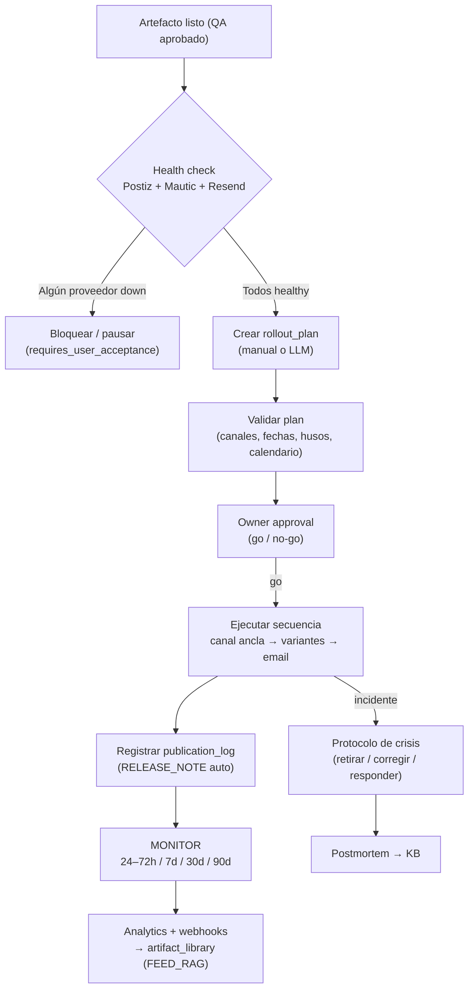

# Diseño — Sistema de Publicación (Postiz + Mautic + Resend)

**Tipo de documento:** diseño de referencia — capa DEPLOY del pipeline unificado
**Estado:** propuesto — pendiente de adopción formal
**Función:** publicar, calendarizar, monitorear y retirar contenido en canales sociales (Postiz), email marketing (Mautic) y email transaccional (Resend), con un **gate de salud obligatorio** antes de cualquier operación, y orquestación dual humano/LLM.

---

## 0. Resumen ejecutivo

El backend ya decide **QUÉ** publicar (Producer-Critic, `format_specs`) y **CÓMO** producirlo (orquestador + `asset_jobs`). Falta la capa que decide **CUÁNDO y DÓNDE** publicarlo, y que cierra el bucle con métricas. Este diseño cubre la fase DEPLOY del diagrama:

- **Postiz** = rollout social (canal ancla → variantes) + analytics
- **Mautic** = email marketing (segmentos, campañas, DNC)
- **Resend** = email transaccional (debriefs, notificaciones, LIGHT_DELIVERY) + transporte opcional de Mautic

Regla de oro: **nada se publica sin un health check previo de los proveedores involucrados**. El LLM propone y calendariza; el código valida y ejecuta.

---

## 1. Principio rector

1. **Health gate obligatorio** — antes de cualquier operación sobre un proveedor, el sistema verifica que su endpoint esté vivo y autenticado. Si no, la operación se bloquea (o se pausa con `requires_user_acceptance=True`, misma filosofía 0007).
2. **LLM escribe datos, el código ejecuta** — el LLM propone el plan de rollout (canales, fechas, variantes, copy); el código valida contra el calendario editorial, los husos y las capacidades de cada canal, y ejecuta la secuencia mecánica.
3. **Trazabilidad total** — cada operación genera un `publication_log` (RELEASE_NOTE auto). Nada se publica sin dejar rastro.
4. **Retiro siempre posible** — cada orden de publicación tiene su contraparte de retiro/corrección (asimetría social vs email, ver §8).
5. **Misma filosofía de seguridad** — claves en `api_keys` (enmascaradas, CRUD por API), nunca en `.env` ni en código.

---

## 2. Posición en el pipeline

Mapeo al diagrama general:

| Nodo del diagrama | Implementación |
|---|---|
| `LOGISTICS` (Pre-Deploy) | Calendarización final por canal/huso → `rollout_plans` |
| `DEPLOY_FINAL` | `POST /publishing/plans/{id}/execute` (owner approval) |
| `ROLLOUT` | Secuencia: canal ancla (Postiz) → variantes → email (Mautic) → amplificación |
| `MONITOR` | Jobs 24–72h / 7d / 30d / 90d + webhooks + analytics |
| `RELEASE_NOTE` | `publication_logs` (auto, append-only) |
| `ROLLBACK_PLAN` | `POST /publishing/orders/{id}/retract` + protocolo de crisis |
| `LIGHT_DELIVERY` | Email transaccional Resend (debrief a cliente Ergalia) |
| `FEED_RAG` | Analytics + webhooks → `artifact_library` (cierre del bucle) |

---

## 3. Capa de proveedores

### 3.1 Interfaz común

```python
class PublishingProvider(Protocol):
    def health(self) -> ProviderHealth: ...
    def capabilities(self) -> dict: ...
    def publish(self, payload: dict) -> ExternalRef: ...
    def retract(self, external_id: str) -> None: ...
    def status(self, external_id: str) -> str: ...
    def analytics(self, **filters) -> dict: ...
```

### 3.2 PostizAdapter

| Operación | Endpoint |
|---|---|
| Crear post (schedule/draft/thread) | `POST /public/v1/posts` |
| Listar posts | `GET /public/v1/posts` (`startDate`/`endDate`/`customer`) |
| Borrar post (idempotente, 404-safe) | `DELETE /public/v1/posts/{id}` |
| Reconciliación | `GET /public/v1/posts/{id}/missing` |
| Release ID | `PUT /public/v1/posts/{id}/release-id` |
| Subir media (≤50 MB) | `POST /public/v1/upload` (multipart) |
| Subir media por URL | `POST /public/v1/upload-from-url` |
| Listar canales | `GET /public/v1/integrations` (+ `?group=`) |
| Grupos/workspaces | `GET /public/v1/integrations/groups` |
| Schema de integraciones | `GET /public/v1/integrations/settings` |
| Tools dinámicas (flairs, playlists…) | `POST /public/v1/integration-trigger/{id}` |
| Analytics por plataforma | `GET /public/v1/analytics/platform` |
| Analytics por post | `GET /public/v1/analytics/post` |

Notas de implementación:

- **Media primero, post después** — el límite de payload es 50 MB; subir archivos y pasar las referencias en `media`.
- `settings` en la respuesta viene como **string JSON** → `JSON.parse` en el adapter.
- Threads: `content` como array + `delay` (minutos entre comentarios).
- `shortLink` configurable (default `true`).
- `type`: `"schedule"` (default) o `"draft"`.

### 3.3 MauticAdapter

| Operación | Endpoint |
|---|---|
| Health probe | `GET /api/ping` (si la instancia lo expone) o `GET /api/contacts?limit=1` |
| Listar contactos | `GET /api/contacts` (`search`/`start`/`limit`/`orderBy`/`where`) |
| Crear contacto | `POST /api/contacts/new` |
| Batch | `POST /api/contacts/batch/new` |
| Borrar contacto | `DELETE /api/contacts/{id}/delete` |
| Quitar DNC | `POST /api/contacts/{id}/dnc/{channel}/remove` |
| Listar campañas | `GET /api/campaigns` (+ `withContactCounts=true`) |
| Contactos de campaña | `GET /api/campaigns/{id}/contacts` |
| Crear/editar campaña | `POST /api/campaigns/new` / `PUT\|PATCH /api/campaigns/{id}/edit` |
| Crear email | `POST /api/emails/new` (`name`, `subject`, `customHtml`, `emailType`, `lists`, `utmTags`, `sendToDnc`) |
| Enviar a contacto/segmento | endpoints dedicados de dispatch |

Notas de implementación:

- **PUT vs PATCH**: PATCH actualiza solo lo enviado; PUT reemplaza todo (o crea si no existe). El adapter expone `update(partial=True|False)`.
- `sendToDnc=true` fuerza el envío ignorando DNC (requiere permiso `email:emails:sendtodnc`) — **nunca usar por defecto**; solo en crisis con aprobación de `lider`.
- `utmTags` como array asociativo.
- `orderBy` en snake_case (`date_added`, no `dateAdded`).

### 3.4 ResendAdapter

| Operación | Endpoint |
|---|---|
| Health probe | `GET /domains` (Bearer, ligero) |
| Enviar email | `POST /emails` (`from`, `to`, `subject`, `html`/`text`, `reply_to`, `tags`, `attachments`) |
| Batch | `POST /emails/batch` |
| Estado de envío | `GET /emails/{id}` |
| Dominios | `GET/POST /domains` |
| Webhooks | eventos de delivery (delivered, bounced, complained, opened, clicked) |

Rol doble:

1. **Transaccional** — debriefs (LIGHT_DELIVERY), notificaciones de estado, alertas de crisis.
2. **Transporte opcional de Mautic** — Mautic puede usar Resend como transporte; así el email marketing y el transaccional comparten reputación de dominio.

### 3.5 Registry

Mismo patrón data-driven que `tool_adapters` (`src/tools/registry.py`): tabla `publishing_providers` + registro en código. El adapter se resuelve por `provider_type`; la config (base_url, auth) vive en la DB. Validación de consistencia al arrancar (como `validate_tool_chain`): todo `provider_type` referenciado debe tener adapter registrado.

---

## 4. Health check / readiness gate (requisito central)

### 4.1 Probes

| Proveedor | Probe | Healthy si |
|---|---|---|
| Postiz | `GET /public/v1/integrations` (auth) | 200 + lista |
| Mautic | `GET /api/ping` o `GET /api/contacts?limit=1` (auth) | 200 |
| Resend | `GET /domains` (Bearer) | 200 |

### 4.2 Servicio

- `PublishingHealthService.check(provider_id=None, force=False)` → `{status, latency_ms, last_error, checked_at}`.
- **Cache con TTL (60 s)** — no martillar los endpoints en cada llamada; `force=True` para re-chequeo explícito.
- Estados: `unknown | healthy | degraded | down`
  - `degraded` = endpoint vivo pero auth falla (401/403) o respuesta inválida.
  - `down` = conexión fallida / timeout / 5xx.
- Persistencia en `publishing_providers.health_status` + `publication_logs` (evento `health_check`).

### 4.3 Gate

- `POST /publishing/plans/{id}/validate` → health check de los proveedores del plan + checklist de publicación. Si algún proveedor requerido está `down` → 503 con detalle; si `degraded` → pausa con `requires_user_acceptance=True`.
- `POST /publishing/plans/{id}/execute` → re-verifica health (TTL) **antes de cada paso** de la secuencia.
- Tools LLM: `check_publishing_health()` es el primer tool que el agente debe llamar; si un proveedor está `down`, el tool devuelve `provider_unavailable` y el LLM puede **reprogramar** (calendarizar) en vez de fallar.

---

## 5. Esquema de datos (migración 0009)

```sql
-- Instancias de proveedores (Postiz, Mautic, Resend)
CREATE TABLE publishing_providers (
    id UUID PRIMARY KEY DEFAULT gen_random_uuid(),
    provider_type VARCHAR(20) NOT NULL,        -- 'postiz' | 'mautic' | 'resend'
    name VARCHAR(100) NOT NULL,
    base_url VARCHAR(500) NOT NULL,
    api_key_id UUID REFERENCES api_keys(id),   -- auth ref (enmascarada)
    auth_mode VARCHAR(20) NOT NULL,             -- 'api_key' | 'basic' | 'oauth2'
    is_active BOOLEAN NOT NULL DEFAULT TRUE,
    health_status VARCHAR(20) NOT NULL DEFAULT 'unknown',
    last_checked_at TIMESTAMPTZ NULL,
    latency_ms INT NULL,
    last_error TEXT NULL,
    created_at TIMESTAMPTZ NOT NULL DEFAULT now(),
    updated_at TIMESTAMPTZ NOT NULL DEFAULT now()
);

-- Espejo de integraciones de Postiz (canales sociales)
CREATE TABLE publishing_channels (
    id UUID PRIMARY KEY DEFAULT gen_random_uuid(),
    provider_id UUID NOT NULL REFERENCES publishing_providers(id),
    external_id VARCHAR(150) NOT NULL,         -- integration id en Postiz
    name VARCHAR(150) NOT NULL,
    platform VARCHAR(50) NOT NULL,              -- linkedin, instagram, x, youtube...
    group_id VARCHAR(150) NULL,                 -- workspace/customer group
    capabilities JSONB NOT NULL DEFAULT '{}',  -- límites de caracteres, media, settings
    is_active BOOLEAN NOT NULL DEFAULT TRUE,
    last_synced_at TIMESTAMPTZ NULL,
    UNIQUE (provider_id, external_id)
);

-- Plan de rollout (una campaña multi-canal)
CREATE TABLE rollout_plans (
    id UUID PRIMARY KEY DEFAULT gen_random_uuid(),
    artifact_id UUID REFERENCES content_artifacts(id),
    brief_id UUID REFERENCES content_briefs(id),
    name VARCHAR(200) NOT NULL,
    status VARCHAR(20) NOT NULL DEFAULT 'draft', -- draft|validated|executing|done|failed|retracted
    anchor_channel_id UUID REFERENCES publishing_channels(id),
    created_by UUID REFERENCES app_users(id) NULL, -- NULL = LLM
    created_by_llm BOOLEAN NOT NULL DEFAULT FALSE,
    requires_user_acceptance BOOLEAN NOT NULL DEFAULT FALSE,
    plan_data JSONB NOT NULL DEFAULT '{}',      -- propuesta LLM: variantes, fechas, copy
    created_at TIMESTAMPTZ NOT NULL DEFAULT now()
);

-- Una orden por (plan, canal, fecha)
CREATE TABLE publication_orders (
    id UUID PRIMARY KEY DEFAULT gen_random_uuid(),
    plan_id UUID NOT NULL REFERENCES rollout_plans(id) ON DELETE CASCADE,
    channel_id UUID NOT NULL REFERENCES publishing_channels(id),
    sequence INT NOT NULL,                      -- 1 = ancla, 2+ = variantes
    status VARCHAR(20) NOT NULL DEFAULT 'scheduled', -- scheduled|published|failed|retracted|cancelled
    external_id VARCHAR(200) NULL,              -- post id (Postiz) / email id (Mautic)
    scheduled_for TIMESTAMPTZ NOT NULL,
    published_at TIMESTAMPTZ NULL,
    content_ref VARCHAR(200) NULL,              -- variante de copy / artefacto
    media_refs JSONB NOT NULL DEFAULT '[]',     -- media ids subidos
    utm_params JSONB NOT NULL DEFAULT '{}',
    error TEXT NULL,
    created_at TIMESTAMPTZ NOT NULL DEFAULT now()
);

-- RELEASE_NOTE: log de auditoría automático (append-only)
CREATE TABLE publication_logs (
    id UUID PRIMARY KEY DEFAULT gen_random_uuid(),
    plan_id UUID REFERENCES rollout_plans(id) NULL,
    order_id UUID REFERENCES publication_orders(id) NULL,
    event_type VARCHAR(50) NOT NULL,  -- health_check|validated|scheduled|published|failed|retracted|monitor|webhook|crisis
    actor VARCHAR(20) NOT NULL,       -- user|llm|system
    payload JSONB NOT NULL DEFAULT '{}',
    created_at TIMESTAMPTZ NOT NULL DEFAULT now()
);

-- Webhooks recibidos (Postiz/Mautic/Resend)
CREATE TABLE publishing_webhook_events (
    id UUID PRIMARY KEY DEFAULT gen_random_uuid(),
    provider_type VARCHAR(20) NOT NULL,
    event_type VARCHAR(100) NOT NULL,
    external_id VARCHAR(200) NULL,
    payload JSONB NOT NULL DEFAULT '{}',
    received_at TIMESTAMPTZ NOT NULL DEFAULT now(),
    processed BOOLEAN NOT NULL DEFAULT FALSE
);

CREATE INDEX ix_pub_orders_plan ON publication_orders (plan_id);
CREATE INDEX ix_pub_orders_status ON publication_orders (status);
CREATE INDEX ix_pub_logs_plan ON publication_logs (plan_id);
CREATE INDEX ix_pub_webhooks_processed ON publishing_webhook_events (processed);
```

---

## 6. Flujo de publicación



### 6.1 Secuencia de rollout

1. **Canal ancla** — el post principal (Postiz, `type=schedule`, media subida previamente).
2. **Variantes derivadas** — posts por canal con copy adaptado (mismo artefacto, `repurpose_plan`).
3. **Email marketing** — campaña Mautic a segmento (si aplica).
4. **Amplificación paga** — si el plan lo incluye (se marca, no se ejecuta desde aquí).
5. **LIGHT_DELIVERY** — email transaccional Resend (debrief a cliente Ergalia si aplica).

Cada paso: health re-check (TTL) → ejecutar → registrar log → actualizar orden.

---

## 7. LLM como orquestador / calendarizador

### 7.1 Specs prompt-as-code (0004)

| Spec | Entrada | Salida |
|---|---|---|
| `publish_planner` | artefacto + canales disponibles + calendario editorial + constraints | plan JSON: secuencia, canales, fechas ISO, variantes de copy, UTMs |
| `publish_monitor` | analytics + webhooks agregados | resumen + recomendación (iterar/promover/retirar) |
| `publish_crisis` | incidente + contexto | recomendación (retirar/corregir/responder) + copy de respuesta |

### 7.2 Tools del agente

| Tool | Función |
|---|---|
| `check_publishing_health()` | estado de los proveedores (primer tool obligatorio) |
| `list_publishing_channels()` | canales disponibles + capacidades |
| `get_calendar_slots()` | slots libres del calendario editorial |
| `create_rollout_plan(plan_json)` | valida + persiste el plan propuesto |
| `execute_rollout(plan_id)` | ejecuta la secuencia (health gate primero) |
| `get_publication_status(order_id)` | estado de una orden |
| `retract_publication(order_id)` | retiro/corrección |
| `get_analytics(artifact_id)` | métricas agregadas |

### 7.3 Calendarización

- El LLM propone fechas; el código valida: huso horario del canal, slots del calendario editorial, eventos asociados (lanzamientos), espaciamiento entre piezas.
- Si la propuesta viola constraints → el código devuelve el error estructurado y el LLM re-propone (máx. 3 intentos, como `PROBE_ITER`).
- Plan LLM puro → `requires_user_acceptance=True` hasta que el owner aprueba (misma filosofía 0007).

---

## 8. Retiro / crisis (ROLLBACK_PLAN)

**Asimetría fundamental**: los posts sociales se pueden borrar; los emails enviados no se pueden "desenviar".

| Proveedor | Retiro | Corrección |
|---|---|---|
| Postiz | `DELETE /public/v1/posts/{id}` (idempotente, 404-safe) | editar + re-publicar |
| Mautic | pausar campaña / quitar de segmento | email de corrección al segmento |
| Resend | no aplica (ya enviado) | email de corrección + actualizar landing/UTM |

Protocolo de crisis:

1. `POST /publishing/orders/{id}/retract` → ejecuta retiro por proveedor + log `crisis`.
2. Notificación (email Resend) al owner.
3. Postmortem → `kb/postmortem_<id>.md` (AUTO_POSTMORTEM).

---

## 9. Endpoints API

```
GET  /publishing/health                    → health de los proveedores
GET  /publishing/providers                 → lista + estado
POST /publishing/providers                 → registrar proveedor (ref api_keys)
PUT  /publishing/providers/{id}             → editar
POST /publishing/providers/{id}/check      → health check forzado
GET  /publishing/channels                   → canales (sync desde Postiz)
POST /publishing/channels/sync             → resync integraciones
POST /publishing/plans                      → crear plan (manual o LLM)
GET  /publishing/plans                     → listar
GET  /publishing/plans/{id}                → detalle
POST /publishing/plans/{id}/validate       → readiness gate (health + checklist)
POST /publishing/plans/{id}/execute        → rollout (owner approval)
POST /publishing/orders/{id}/retract       → retiro/crisis
GET  /publishing/orders                    → listar órdenes + estado
GET  /publishing/logs                     → RELEASE_NOTE (publication_logs)
POST /publishing/webhooks/{provider}       → recibir callbacks
GET  /publishing/analytics/{artifact_id}  → métricas agregadas
```

---

## 10. RBAC y seguridad

| Rol | Puede |
|---|---|
| `lider` | aprobar planes, ejecutar, retirar (crisis) |
| `equipo` | crear planes, programar, monitorear |
| `externo` | nunca (solo recibe emails) |

- Claves en `api_keys` (enmascaradas, CRUD por API) — Postiz (API key o token `pos_`), Mautic (Basic/OAuth2), Resend (Bearer `re_`).
- Webhooks: validar firma/secret por proveedor.
- `publication_logs` es append-only (auditoría).

---

## 11. Fases de implementación

1. **Fase A — Infraestructura**: migración 0009, `src/publishing/` (health, providers, adapters), CRUD de proveedores, health check + gate. *(Desbloquea todo lo demás.)*
2. **Fase B — Postiz**: sync de canales, upload media, crear/listar/borrar posts, webhooks.
3. **Fase C — Mautic + Resend**: contactos/segmentos, emails, campañas, webhooks, LIGHT_DELIVERY.
4. **Fase D — Orquestación**: `rollout_plans`, secuencia, MONITOR jobs, analytics → FEED_RAG.
5. **Fase E — LLM**: specs `publish_planner`/`publish_monitor`/`publish_crisis` + tools del agente + calendarización.

---

## 12. Preguntas abiertas

1. **Postiz: ¿cloud o self-hosted?** — cambia la base URL y el probe de salud.
2. **Mautic: ¿con Resend como transporte o SMTP propio?** — afecta la reputación de dominio y la config.
3. **Amplificación paga: ¿se ejecuta desde aquí o solo se marca en el plan?** — el diseño asume "solo se marca".
4. **¿El calendario editorial vive en este sistema o se sincroniza desde Mautic/Postiz?** — el diseño asume tabla propia (o `pipeline_stages` extendida).
5. **¿Quién dispara MONITOR?** — el diseño asume jobs programados internos (APScheduler/cron) + webhooks.
