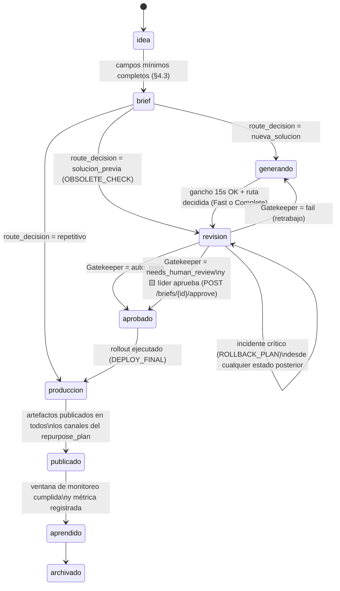
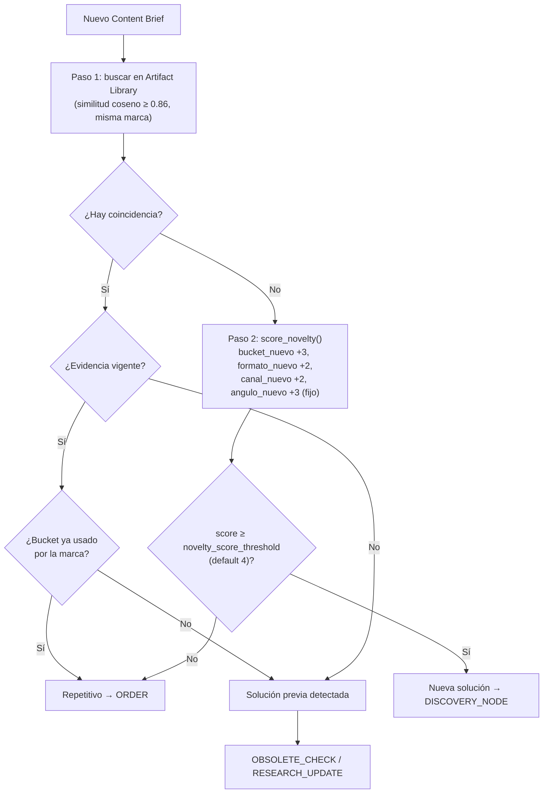
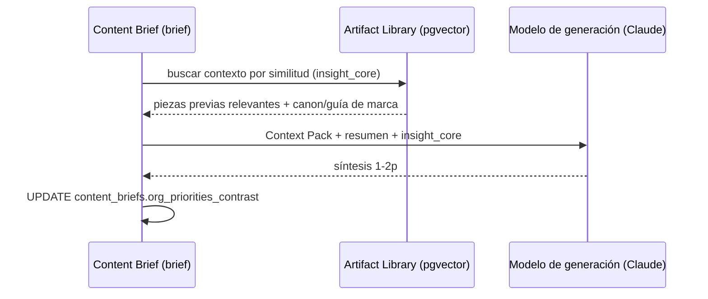
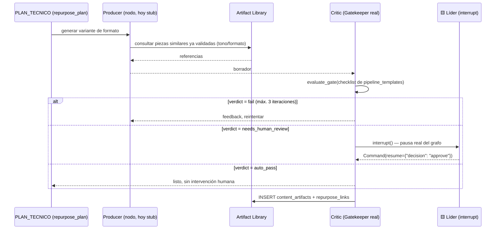

# Pipeline Unificado de Producción de Contenidos — ESCAPE / Ergalia

**Tipo de documento:** operativo unificado, derivado de estrategia y de proceso organizacional
**Estado:** propuesto — pendiente de adopción formal
**Función:** integrar el proceso de gestión de proyectos ya vigente en la organización con la producción de contenido editorial y comercial de ESCAPE y Ergalia, para que cualquier pieza —en cualquier formato, para cualquier red— recorra un único pipeline trazable, reutilizable y medible.

---

## 0. Qué hace este documento y qué integra

Este documento **no crea un proceso nuevo**. Toma el proceso de gestión de proyectos que la organización ya usa (Brief → Discovery/Probe/FullDev → Pre-Deploy → Deploy → Kaizen → Learning, documentado en el diagrama de flujo vigente) y lo **especializa** para el caso de uso "producir contenido en distintos formatos, para distintas redes, para dos marcas con lenguaje visual y tono distintos".

### Fuentes que integra (jerarquía de lectura)

| # | Documento | Qué aporta a este pipeline |
|---|---|---|
| 1 | Diagrama de proceso general de la organización (versión Mermaid entregada por Diego) | La columna vertebral: fases, gates, timeboxes, roles por color, rutas Fast/Complete/Repetitivo, ciclo Kaizen, aprendizaje automatizado |
| 2 | `docs/arquitectura_comercial_y_contenidos_escape_ergalia.md` (canon) | Taxonomía de segmentos, catálogo de ofertas, funnel, campos mínimos de brief, reglas de elegibilidad verde/amarillo/rojo |
| 3 | `docs/ergalia/ergalia_guia_contenidos_y_produccion.md` | Buckets, formatos, reglas de evidencia/anonimización, flujo editorial, métricas Ergalia |
| 4 | `docs/escape/escape_guia_contenidos_y_produccion.md` | Buckets, formatos, palancas persuasivas, gobernanza editorial, flujo editorial, métricas ESCAPE |
| 5 | `docs/ergalia/ergalia_lenguaje_visual.md` | Sistema visual Ergalia (paleta, tipografía, composición, biblioteca de assets) |
| 6 | `docs/escape/escape_lenguaje_visual.md` | Sistema visual ESCAPE (paleta, tipografía, composición, biblioteca de assets) |
| 7 | `docs/ergalia/ergalia_mkt_operativo.md` | Calendario, protocolo de leads/PoC, roles, métricas, crisis Ergalia |
| 8 | `docs/escape/escape_mkt_operativo.md` | Calendario, onboarding, comunidad, roles, métricas, crisis ESCAPE |
| 9 | `docs/ergalia/ergalia_plan_ejecucion.md` / `docs/escape/escape_plan_ejecucion.md` | Fases-gate (G1–G3) del roadmap de cada marca — contexto para `phase_number` |
| 10 | `docs/guia_dashboard.md` §17 ("Strategic Production OS") | Especificación de las entidades técnicas (`ContentBrief`, `PipelineTemplate`, `ContentArtifact`, `RepurposeLink`, IA) que este documento usa como **funcional de referencia** |

### Qué NO reemplaza
- La estrategia de marca (mandan `ergalia_mkt_estrategico.md` y `escape_mkt_estrategico.md`).
- El tono, los buckets y las reglas editoriales de cada marca (mandan las guías de contenido y producción por marca).
- El sistema visual de cada marca (mandan los `_lenguaje_visual.md`).
- El roadmap comercial por fases (mandan los `_plan_ejecucion.md`).

Este documento es la **capa de orquestación**: dice en qué orden, con qué gates, con qué artefactos y con qué responsables se ejecuta todo lo anterior.

### Regla de jerarquía
Si una decisión de este pipeline contradice el canon, una guía de marca o un plan estratégico, **manda el documento de rango superior** (canon > guía de marca > este pipeline en materia de contenido; plan estratégico > todo en materia de negocio). Este documento manda únicamente en materia de **secuencia, gates y trazabilidad de proceso**.

---

## 1. Principio rector: un motor, dos carriles, un proceso ya validado

La organización ya opera un proceso general de gestión de proyectos (Brief → enrutamiento por novedad → Discovery/Probe/FullDev → Pre-Deploy Gate → Deploy → Kaizen → Learning). Ese proceso no es exclusivo de producto o tecnología: es genérico por diseño (así lo demuestra que ya contempla rutas para "producto" y para "producción recurrente"). La decisión de diseño de este documento es **no crear un pipeline paralelo para contenido**, sino declarar que:

> **Toda pieza de contenido —de cualquier bucket, formato o canal, de cualquiera de las dos marcas— es un proyecto que entra por el mismo Brief, se enruta por el mismo criterio de novedad, y sale por el mismo Gate de Pre-Deploy.**

Lo que cambia entre "un proyecto de producto" y "una pieza de contenido" no es la estructura del pipeline: es (a) qué campos lleva el Brief, (b) qué checklist aplica en cada gate, (c) qué lenguaje visual y tono gobiernan la producción, y (d) qué tan pesada es cada fase según el timebox.

### 1.1 Tabla de equivalencia — fase genérica → fase de contenido

| Fase del proceso general | Equivalente en producción de contenido | Marca(s) |
|---|---|---|
| Recepción / Brief | Recepción de idea, dato, hallazgo, solicitud de cliente o slot de calendario → `ContentBrief` | Ambas |
| Cálculo de novelty_score | Clasificar la pieza en **Repetitiva / Solución previa / Nueva solución** (ver §4.4) | Ambas |
| Discovery | Ideación editorial: encontrar el ángulo, el dato incómodo o el mecanismo (el "Chispazo") | Ambas |
| Sprint 2D | Prototipo de una sola pieza (borrador + gancho) probado con 5 lectores/usuarios reales | Ambas |
| Fast-Probe | Publicación piloto de una pieza nueva a audiencia reducida, con KPIs e iteración acotada | Ambas |
| Full Development | Producción de una **pieza madre** que se atomiza en múltiples formatos/canales (campaña) | Ambas |
| Pre-Deploy Gate | Checklist de publicación de marca + revisión de datos/materiales/logística | Ambas, checklist distinto |
| Kaizen / Producción | Producción recurrente de calendario (posts semanales, shorts, newsletters) | Ambas |
| Deploy | Publicación, rollout por canal, monitoreo, manejo de incidente | Ambas |
| Learning & Automation | Métricas, postmortem, alimentación del sistema de IA/plantillas | Ambas |

---

## 2. Mapa completo del pipeline de contenidos

El diagrama siguiente conserva la topología exacta del proceso general de la organización (mismas fases, mismos gates, mismas rutas de decisión) y renombra cada nodo a su equivalente de producción de contenidos. Los colores de rol se mantienen: **🟨 líder** (Estratega/Fundador — decisión, riesgo, aprobación), **🟦 equipo** (CM, Editor, Diseñador, Productor — ejecución), **🟩 externo** (cliente, comunidad, stakeholder — solicitud y feedback).

```mermaid
---
config:
  layout: elk
---
flowchart TB
 subgraph BRIEF_PHASE["📝 RECEPCIÓN / CONTENT BRIEF (0.5–1d)"]
        BRIEF["Recepción de solicitud, dato, hallazgo o slot de calendario"]
        BRIEF_NOTE["Artefacto: /briefs/content_brief_&lt;id&gt;.md\n(ver Content Brief unificado §3)"]
        ALIGNMENT["Revisión de alineamiento estratégico\n(plan de marca + semáforo verde/amarillo/rojo del canon)"]
        LAUNCH_DOC["Documento de Lanzamiento de contenido\n(objetivo, bucket, top-3 riesgos, presupuesto si aplica, stakeholders)"]
        NOVELTY{"Enrutamiento por novedad\n¿Repetitivo / Solución previa / Nueva solución?"}
  end
 subgraph LEARNING_EXPRESS["⚡ Aprendizaje Express (1d)"]
        EXPRESS_LEARNING["IA synth con Context Packs (canon + guía de marca + Artifact Library)\n(Salida: síntesis 1–2p al Documento de Lanzamiento)"]
  end
 subgraph DISCOVERY["🌱 DISCOVERY EDITORIAL"]
        DISCOVERY_NODE["Discovery: encontrar el mecanismo / dato incómodo (Chispazo)"]
        DISCOVERY_NOTE["insight_core del Content Brief"]
        TEAM_INPUTS["Team inputs (datos primarios, 2–3 referentes, casos previos)"]
        LEADER_REFINE["Estratega refina el ángulo y asigna owner"]
        DISCOVERY_TEST{"Test de gancho 15s (n=5)\ncomprensión ≥80%?"}
        DECIDE_ROUTE{"Decidir ruta:\nFast (pieza única) / Complete (campaña multi-formato)"}
        ATLAS_NOTE["/artifacts/atlas_&lt;id&gt;.md (priorización de variantes de formato)"]
  end
 subgraph SPRINT_2D["🎯 Sprint de Diseño y Prueba (2d)"]
        SPRINT2D["Prototipo rápido de la pieza (borrador/mockup) + prueba con 5 lectores del segmento"]
  end
 subgraph PROBE_PHASE["🚀 FAST-PROBE EDITORIAL (7d)"]
        MVP["Pieza mínima publicable + criterio de éxito (metric_primary)"]
        SETUP_EXP["Setup de piloto (audiencia/canal reducido, UTMs)"]
        INSTRUMENTATION["Instrumentación (UTM, pixel, tracking de metric_primary/secondary)"]
        AUTO_DEPLOY["Publicación piloto (programada, con capacidad de retiro/corrección)"]
        FEEDBACK["Recolección de métricas y feedback (24–72h)"]
        PROBE_EVAL{"Evaluar KPIs vs criterio de éxito\n(owner review — usar árbol de decisión de marca)"}
        PROBE_ITER["Iterar gancho/copy/horario (máx. 3 veces)"]
        PROBE_KILL["Retirar pieza → postmortem"]
        PROBE_NOTE["/probes/probe_&lt;id&gt;.md (plan, audiencia, instrumentación, criterio de éxito)"]
  end
 subgraph FULLDEV_PHASE["🏗️ FULL DEVELOPMENT — CAMPAÑA MULTI-FORMATO (10–15d)"]
        SPEC["Spec mínima + repurpose_plan (todas las variantes de formato/canal a producir)"]
        PLAN_TECNICO["Plan de producción (cronograma, responsables por variante, riesgos)"]
        HANDOFF_NOTE["/handoffs/handoff_&lt;id&gt;.md (criterios de aceptación, métricas, owner)"]
        RITUAL_DEV["Micro-ritual: riesgos y mitigaciones (15–30 min)"]
        UX_DESIGN["Aplicación de lenguaje visual de marca + patrones reutilizables"]
        PROD_DEV["Producción modular por formato (derivación desde la pieza madre)"]
        QA_VALID["QA editorial: checklist de publicación de marca + evidencia + anonimización"]
        INTEGRATION["Integración → Paquete de campaña (Beta)"]
        COMPONENTS_NOTE["/components/manifest.md (registro de templates/plantillas reutilizables)"]
  end
 subgraph PRE_DEPLOY["📦 PRE-DEPLOY GATE"]
        PRE_DEPLOY_ENTRY{"PRE-DEPLOY GATE\n(entrada)"}
        DATA_KPIS["Definir metric_primary/secondary + UTMs + hoja de tracking"]
        MATERIALS["Preparar materiales (producir / reutilizar de biblioteca / adquirir sin stock genérico)"]
        LOGISTICS["Calendarización final por canal, huso horario y evento asociado"]
        READINESS{"Readiness check\n(checklist de publicación de marca + visual + OpSec)"}
        OWNER_APPROVAL{"Aprobación del owner\n(go / no-go)"}
        PREDEPLOY_NOTE["Notas: checklist aplicado, owner, plan de retiro"]
  end
 subgraph KAIZEN_PHASE["⚙️ KAIZEN — PRODUCCIÓN RECURRENTE (ciclos 1–3d)"]
        ORDER["Crear Orden de Producción desde el calendario editorial"]
        ORDER_NOTE["/orders/order_&lt;id&gt;.md"]
        EXECUTE_KAIZEN["Ejecutar producción con plantilla existente"]
        MEASURE_KPI["Medir KPIs de proceso: LeadTime, CycleTime, Time-in-Stage, FPQ, Rework Rate"]
        MICRO_KAIZEN["Micro-experimento (hook, horario, formato de apoyo)"]
        MICRO_RITUAL["Micro-ritual: riesgos y mitigaciones (5–10 min)"]
        KAIZEN_DECISION{"¿Mejora significativa?"}
        UPDATE_REGISTRY["Actualizar /components/manifest.md y /kb/kaizen_&lt;id&gt;.md"]
        ARCHIVE_KAIZEN["Archivar experimento / documentar en KB"]
  end
 subgraph DEPLOY_PHASE["🚀 DEPLOY — PUBLICACIÓN"]
        DEPLOY_FINAL["Preparar publicación final y secuencia de canales (owner)"]
        ROLLOUT["Rollout por secuencia: canal ancla → variantes derivadas → amplificación paga si aplica"]
        MONITOR["Monitoreo post-publicación (24–72h / 7d / 30d / 90d)"]
        RELEASE_NOTE["/publications/publication_log_&lt;id&gt;.md (auto)"]
        ROLLBACK_PLAN["Activar protocolo de crisis de marca (retiro / corrección / respuesta)"]
        LIGHT_DELIVERY["Entrega ligera: debrief interno o reporte breve a cliente (si Ergalia)"]
  end
 subgraph LEARNING_AUTOM["📚 LEARNING & AUTOMATION"]
        FEED_RAG["Indexar artefacto + resultado en Artifact Library / Context Packs"]
        AUTO_POSTMORTEM["Postmortem automatizado (para kills y crisis)"]
        KB_POST["/kb/postmortem_&lt;id&gt;.md"]
        TEMPL_PREFILL["/templates/prefill_content_brief.md"]
  end
    BRIEF --> BRIEF_NOTE & ALIGNMENT & FEEDBACK & EXPRESS_LEARNING
    ALIGNMENT --> LAUNCH_DOC
    EXPRESS_LEARNING --> LAUNCH_DOC
    LAUNCH_DOC --> NOVELTY
    NOVELTY -- Nueva solución --> DISCOVERY_NODE
    NOVELTY -- Repetitivo --> ORDER
    NOVELTY -- Solución previa detectada --> OBSOLETE_CHECK["¿Evidencia/ángulo obsoleto?"]
    DISCOVERY_NODE --> DISCOVERY_NOTE
    DISCOVERY_NOTE --> TEAM_INPUTS
    TEAM_INPUTS --> LEADER_REFINE
    LEADER_REFINE --> DISCOVERY_TEST
    DISCOVERY_TEST --> DECIDE_ROUTE
    DECIDE_ROUTE -- Fast --> SPRINT2D
    DECIDE_ROUTE -- Complete --> SPEC
    DECIDE_ROUTE --> ATLAS_NOTE
    SPRINT2D --> MVP
    MVP --> SETUP_EXP
    SETUP_EXP --> INSTRUMENTATION
    INSTRUMENTATION --> AUTO_DEPLOY
    AUTO_DEPLOY --> FEEDBACK
    FEEDBACK --> PROBE_EVAL
    PROBE_NOTE --> FEED_RAG
    PROBE_EVAL -- Iterar (máx 3) --> PROBE_ITER
    PROBE_ITER --> AUTO_DEPLOY
    PROBE_EVAL -- OK --> PRE_DEPLOY_ENTRY
    PROBE_EVAL -- Kill --> PROBE_KILL
    PROBE_KILL --> FEED_RAG
    OBSOLETE_CHECK -- Sí --> RESEARCH_UPDATE["Research / verificación de evidencia"]
    RESEARCH_UPDATE --> RESEARCH_NOTE["/research/research_brief_&lt;id&gt;.md"]
    RESEARCH_NOTE --> UPDATE_BRIEF["Actualizar Content Brief"]
    UPDATE_BRIEF --> LAUNCH_DOC
    OBSOLETE_CHECK -- No, sigue vigente --> ATLAS_NOTE
    ORDER --> ORDER_NOTE
    ORDER_NOTE --> EXECUTE_KAIZEN
    EXECUTE_KAIZEN --> MEASURE_KPI
    MEASURE_KPI --> MICRO_KAIZEN
    MICRO_KAIZEN --> MICRO_RITUAL
    MICRO_RITUAL --> KAIZEN_DECISION
    KAIZEN_DECISION -- Sí --> UPDATE_REGISTRY
    UPDATE_REGISTRY --> PRE_DEPLOY_ENTRY
    KAIZEN_DECISION -- No --> ARCHIVE_KAIZEN
    ARCHIVE_KAIZEN --> FEED_RAG
    SPEC --> PLAN_TECNICO
    PLAN_TECNICO --> HANDOFF_NOTE
    HANDOFF_NOTE --> RITUAL_DEV
    RITUAL_DEV --> UX_DESIGN & PROD_DEV & QA_VALID
    UX_DESIGN --> INTEGRATION
    PROD_DEV --> INTEGRATION
    QA_VALID --> INTEGRATION
    INTEGRATION --> COMPONENTS_NOTE
    COMPONENTS_NOTE --> UPDATE_REGISTRY
    PRE_DEPLOY_ENTRY --> DATA_KPIS & MATERIALS & LOGISTICS
    DATA_KPIS --> READINESS
    MATERIALS --> READINESS
    LOGISTICS --> READINESS
    READINESS -- Pass --> OWNER_APPROVAL
    OWNER_APPROVAL --> DEPLOY_FINAL
    READINESS -- Fail: datos --> DATA_KPIS
    READINESS -- Fail: materiales --> MATERIALS
    READINESS -- Fail: calidad editorial --> FULLDEV_PHASE
    DEPLOY_FINAL --> ROLLOUT
    ROLLOUT --> MONITOR
    MONITOR --> RELEASE_NOTE
    RELEASE_NOTE --> LIGHT_DELIVERY
    LIGHT_DELIVERY --> FEED_RAG
    DEPLOY_FINAL -- Incidente crítico --> ROLLBACK_PLAN
    ROLLBACK_PLAN --> PRE_DEPLOY_ENTRY
    FEED_RAG --> AUTO_POSTMORTEM & TEMPL_PREFILL & KB_POST & LAUNCH_DOC & DISCOVERY_NODE
     BRIEF:::external
     BRIEF_NOTE:::external
     NOVELTY:::leader
     TEAM_INPUTS:::external
     DISCOVERY_TEST:::leader
     DECIDE_ROUTE:::leader
     SPRINT2D:::team
     MVP:::team
     SETUP_EXP:::team
     INSTRUMENTATION:::team
     AUTO_DEPLOY:::team
     FEEDBACK:::external
     PROBE_EVAL:::leader
     PROBE_ITER:::team
     PROBE_NOTE:::team
     SPEC:::leader
     PLAN_TECNICO:::leader
     UX_DESIGN:::team
     PROD_DEV:::team
     QA_VALID:::team
     INTEGRATION:::team
     PRE_DEPLOY_ENTRY:::leader
     READINESS:::leader
     OWNER_APPROVAL:::leader
     ORDER_NOTE:::external
     EXECUTE_KAIZEN:::team
     MEASURE_KPI:::team
     MICRO_KAIZEN:::team
     KAIZEN_DECISION:::leader
     UPDATE_REGISTRY:::team
     RELEASE_NOTE:::team
     LIGHT_DELIVERY:::external
     FEED_RAG:::team
    classDef leader fill:#FFD700,stroke:#B8860B,color:#000,font-weight:bold
    classDef team fill:#87CEFA,stroke:#4682B4,color:#000
    classDef external fill:#C8E6C9,stroke:#388E3C,color:#000
```

**Nota de fidelidad:** se conserva la conexión `BRIEF --> FEEDBACK` del diagrama original. En el proceso general, esto captura una señal temprana del solicitante en paralelo al brief; en contenido, esa señal temprana (expectativa del cliente, reacción inicial de un mando medio, comentario de comunidad) se guarda como contexto y se reutiliza más adelante en `PROBE_EVAL`, sin abrir un canal de recolección distinto.

---

## 3. Entidad central: Content Brief unificado

El Brief es la única ficha que un contenido necesita para atravesar todo el pipeline. Fusiona tres fuentes que hoy viven separadas: los campos del brief genérico de la organización, los campos del canon (§9.2), y la entidad `ContentBrief` propuesta en `docs/guia_dashboard.md` §17.2.1.

**Artefacto:** `/briefs/content_brief_<id>.md`

### 3.1 Bloque A — Identificación y meta (origen: proceso general)

| Campo | Valores / tipo | Descripción |
|---|---|---|
| `id` | string | Identificador único del brief |
| `owner` | string | Responsable que ejecuta y responde por la pieza |
| `status` | `idea` \| `brief` \| `generando` \| `revision` \| `aprobado` \| `produccion` \| `publicado` \| `aprendido` \| `archivado` | Estado dentro del pipeline |
| `created_at` / `updated_at` | fecha | Trazabilidad |

### 3.2 Bloque B — Origen y contexto (origen: Brief genérico de la organización)

| Campo | Descripción |
|---|---|
| `resumen` | Qué se pide y por qué, en 3–5 líneas |
| `insight_core` | El "pergamino" — el mecanismo, dato o ángulo central de la pieza |
| `15s_pitch` | La promesa de la pieza reducida a lo que se entiende en 15 segundos |
| `prior_attempts` | Piezas anteriores sobre el mismo tema/caso (link a Artifact Library) |
| `risks` | Riesgos editoriales, reputacionales o de exposición identificados de entrada |
| `novelty_indicators` | Señales usadas para el enrutamiento (ver §4.4) |
| `suggested_product_type` | Sugerencia inicial de formato, sujeta a validación en Discovery |
| `org_priorities_contrast` | Contraste explícito con las prioridades vigentes del plan de marca (evita piezas "bonitas" sin prioridad real) |

### 3.3 Bloque C — Jerarquía canónica (origen: canon + `phase_number`/`growth_motor_id` del dashboard)

| Campo | Valores | Descripción |
|---|---|---|
| `brand_objective` | `ESCAPE_SOCIAL` \| `ERGALIA_COMERCIAL` \| `HIBRIDO` | Carril de marca — determina lenguaje visual, tono y checklist aplicables |
| `phase_number` | 1–4 | Fase del roadmap de la marca (`_plan_ejecucion.md`) a la que aporta esta pieza |
| `segment_client` | S1–S7 | Segmento-cliente canónico (canon §3.1) |
| `segment_community` | C1–C4 o vacío | Segmento-comunidad canónico (canon §3.2) |
| `interlocutor_profile` | mando medio, sponsor, cliente puente, aliado, etc. | Perfil transversal (canon §3.3) |
| `subprofile` | texto libre | Matiz fino dentro del segmento |
| `audience_tier` | alcance, lead, comunidad, contribuidor, fan/comprador/donante, cliente | Tier de la escalera de valor (canon §7.1) |
| `need` / `need_id` | texto / FK | Necesidad concreta que activa la pieza |
| `change_hypothesis` | texto | "Si publicamos X, esperamos Y" |

### 3.4 Bloque D — Bucket y oferta (origen: guías de marca + canon)

| Campo | Valores | Descripción |
|---|---|---|
| `content_bucket` | difusión científica, comunidad intelectual, debate informado, herramienta gratuita, formación aplicada, servicio formal, caso/autoridad, artefacto físico-digital, captación directa (canon §9.1) | Determina el `PipelineTemplate` aplicable (§9) |
| `service_category` | texto | Solo Ergalia — categoría de servicio |
| `product_anchor` | texto | Producto ancla del catálogo (canon §6) al que apunta la pieza |
| `entry_offer` | texto | Oferta de entrada asociada |

### 3.5 Bloque E — Artefacto y canal

| Campo | Valores | Descripción |
|---|---|---|
| `artifact_type` | post, video corto, video largo, carrusel, one-pager, white paper, PDF/recurso, broadcast, poster/QR, webinar, propuesta, app/herramienta | Tipo de artefacto — ver §7 sistema de formatos por marca |
| `channel` | LinkedIn, TikTok/Reels/Shorts, YouTube, blog/newsletter, WhatsApp, correo, posters/QR, contacto directo, evento | Canal primario de publicación |
| `channel_role` | alcance, confianza, conversión, retención, autoridad, comunidad | Rol funcional del canal para esta pieza |
| `cta` | texto (una sola acción) | CTA único — regla no negociable en ambas marcas |
| `landing` | URL o vacío | Destino si aplica |
| `funnel_stage` | texto | Etapa del funnel (canon §7.2) |

### 3.6 Bloque F — Geografía e idioma

| Campo | Valores |
|---|---|
| `language` | es, en, bilingüe |
| `geography_content` | territorio editorial (canon §8.1) |
| `geography_sales` | territorio comercial, solo Ergalia (canon §8.2) |

### 3.7 Bloque G — Gobernanza, evidencia y reutilización

| Campo | Descripción |
|---|---|
| `evidence_source` | Fuente verificable del claim principal |
| `risk_level` | bajo, medio, alto |
| `debate_governance` | Reglas aplicables si `content_bucket = debate_informado` (steelman, fuente, derecho de corrección) |
| `validation_required` | Qué revisión exige antes de publicar: factual, legal, anonimización, doble lectura, OpSec |
| `repurpose_plan` | **Campo clave para reutilización multi-formato** — lista explícita de las variantes de formato/canal que se derivarán de esta pieza (ver §10) |

### 3.8 Bloque H — Métricas y enrutamiento

| Campo | Descripción |
|---|---|
| `metric_primary` / `metric_secondary` | Métricas de éxito, tomadas de la tabla de métricas por bucket de la guía de marca correspondiente |
| `novelty_score` | Puntaje calculado en Fase 0 (§4.4) |
| `route_decision` | Repetitivo \| Solución previa detectada \| Nueva solución |
| `production_route` | Fast \| Complete (solo si `route_decision = Nueva solución`) |
| `pipeline_template_id` | FK al `PipelineTemplate` del bucket (§9) |

### 3.9 Ciclo de vida del Content Brief (máquina de estados)

El campo `status` no es texto libre: es una máquina de estados real, implementada como ENUM en la base (`brief_status_t`, `sql/001_init.sql` / `alembic/versions/0001_initial_schema.py`) y accionada por el enrutador de novedad (`src/agents/novelty_router.py`) y el Gatekeeper (`src/agents/gatekeeper.py`).

**Regla de gobernanza (no negociable):** el Gatekeeper solo puede bloquear (`fail`) o pedir revisión humana (`needs_human_review`); nunca puede mover un brief a `aprobado` por sí solo salvo en `auto_pass` — reservado a `risk_level = bajo` **y** `route_decision = repetitivo`. Riesgo medio/alto, ruta `nueva_solucion`/`complete`, o segmento S5 (ONG)/S6 (Gobierno) exigen siempre el paso humano por `POST /briefs/{id}/approve`, restringido a rol `lider` (`src/auth.py`). Esto está probado end-to-end, no es solo una intención de diseño.

---

## 4. Fase 0 — Recepción, Brief y Enrutamiento (0.5–1d)

### 4.1 Quién origina un brief
- 🟩 **Cliente o prospecto** (Ergalia): solicitud directa, PoC, brief de gobierno.
- 🟩 **Comunidad** (ESCAPE): pregunta recurrente, patrón detectado en WhatsApp/grupos, solicitud de un Curioso o Solucionador.
- 🟦 **CM / Editor**: idea de calendario, dato incómodo detectado, corrección sectorial.
- 🟨 **Estratega / Fundador**: prioridad estratégica, respuesta a coyuntura, apertura de nuevo bucket o formato.

### 4.2 Secuencia
1. **BRIEF** — se recibe la solicitud y se redacta el Content Brief (bloques A–H de §3, al menos los campos obligatorios de la tabla 4.3).
2. **ALIGNMENT** — el Estratega contrasta la pieza contra:
   - el plan estratégico vigente de la marca correspondiente,
   - el semáforo de elegibilidad verde/amarillo/rojo del canon (§10) si hay componente comercial,
   - la fase-gate activa del roadmap (`_plan_ejecucion.md`) — una pieza no puede exigir capacidad de una fase que la marca todavía no alcanza.
3. **LAUNCH_DOC** — Documento de Lanzamiento de contenido. Se completa en dos niveles de peso:

| Nivel | Cuándo aplica | Contenido mínimo |
|---|---|---|
| **Ligero** | Ruta Repetitivo, o pieza única de ruta Fast | Objetivo, bucket, top-3 riesgos, CTA |
| **Completo** | Ruta Complete (campaña multi-formato) o cualquier pieza con `risk_level = alto` | Objetivo, bucket, MOSCOW de las variantes de formato, FODA express, top-3 riesgos, presupuesto (si Ergalia produce con terceros), stakeholders internos/externos |

4. **NOVELTY** — se calcula el enrutamiento (§4.4) y la pieza sigue una de tres rutas.

### 4.3 Campos obligatorios mínimos para abrir un brief
`resumen`, `insight_core`, `brand_objective`, `segment_client` o `segment_community`, `content_bucket`, `owner`. El resto del schema (§3) se completa progresivamente conforme la pieza avanza de fase — no se exige completo desde el día 0.

### 4.4 Enrutamiento por novedad — cómo se decide

El enrutamiento no es un único número: es una búsqueda seguida de un puntaje.

**Paso 1 — Búsqueda de duplicado.** Antes de puntuar nada, se busca en el Artifact Library (o, mientras esa biblioteca no exista como sistema, en el archivo de piezas publicadas de la marca) una pieza con el mismo `content_bucket` + `segment` + núcleo temático.

- **Si se encuentra una pieza vigente y su evidencia sigue siendo válida** → si además el formato/canal ya está en el calendario recurrente, es **Repetitivo** (va directo a `ORDER`, ruta Kaizen, §5). Si el formato/canal es nuevo pero el ángulo no lo es, tratarlo como **Solución previa detectada** para decidir si conviene reutilizar o refrescar (§6).
- **Si se encuentra una pieza pero su evidencia está desactualizada o el contexto cambió** → **Solución previa detectada** (§6): pasa por chequeo de obsolescencia antes de continuar.
- **Si no se encuentra nada comparable** → se calcula el `novelty_score` (Paso 2).

**Paso 2 — Puntaje de novedad** (solo si no hubo duplicado). Escala 0–10, suma de:

| Componente | Peso si aplica |
|---|---|
| El `content_bucket` nunca se ha producido para esta marca | +3 |
| El `artifact_type` nunca se ha producido para esta marca | +2 |
| El `channel` es nuevo para esta marca | +2 |
| El ángulo/tema no está cubierto en piezas anteriores | +3 |

| Puntaje | Enrutamiento |
|---|---|
| 0–3 | **Repetitivo** — es una variación menor de algo ya calendarizado → `ORDER` |
| 4–10 | **Nueva solución** → `DISCOVERY_NODE` (§7) |

**Regla:** el umbral (3/4) es configurable por trimestre en la revisión trimestral de cada marca (Módulo 7.3 Ergalia / Módulo 6.3 ESCAPE) — no se cambia a mitad de ciclo sin registrar el motivo en `/kb/`.

### 4.5 Diagrama de actividad del enrutamiento

Implementado y probado en `src/agents/novelty_router.py::route_brief` — el diagrama refleja el código real, no una versión idealizada de él.

**Nota de implementación:** el Paso 2 solo se ejecuta si el Paso 1 no encontró nada — por eso `angulo_nuevo` se suma siempre que se llega a `score_novelty()` (si hubiera algo comparable, el flujo ya habría salido en el Paso 1). Ver `tests/test_novelty_router.py` para los casos probados.

---

## 5. Ruta A — Repetitivo → Producción Kaizen directa

Esta ruta es la que **ya opera hoy** en ambas marcas a través de los calendarios semanales/mensuales (`ergalia_mkt_operativo.md` Módulo 6, `escape_mkt_operativo.md` Módulo 4). Este pipeline no la reemplaza: la formaliza como una rama explícita del enrutamiento.

### 5.1 Secuencia
1. **ORDER** — se crea una Orden de Producción a partir de la fila del calendario semanal correspondiente (ej. "martes → Dato incómodo → CM+Diseñador" en Ergalia; "lunes/miércoles/viernes → short → Editor" en ESCAPE).
2. **ORDER_NOTE** (`/orders/order_<id>.md`) — hereda automáticamente `brand_objective`, `content_bucket`, `artifact_type`, `channel` y `owner` de la fila de calendario; solo se completa `insight_core` y el dato/gancho específico de esa semana.
3. **EXECUTE_KAIZEN** — el responsable produce usando una plantilla existente de `/components/manifest.md` (ver §16 sobre la biblioteca de plantillas).
4. **MEASURE_KPI** — se registran tanto las métricas de contenido ya definidas (guardados, respuestas, retención — Módulo 7 Ergalia / Módulo 6 ESCAPE) como las métricas de proceso nuevas: LeadTime, CycleTime, Time-in-Stage, First-Pass-Quality (FPQ), Rework Rate (definiciones en §17).
5. **MICRO_KAIZEN** — ajuste incremental (probar otro horario, otro hook, un formato de apoyo).
6. **MICRO_RITUAL** (5–10 min) — el mismo chequeo de riesgos que ya exige el checklist de publicación de cada marca, en versión exprés.
7. **KAIZEN_DECISION** — ¿la mejora es significativa?
   - **Sí** → `UPDATE_REGISTRY`: se actualiza `/components/manifest.md` (la plantilla mejora para todo el equipo) y `/kb/kaizen_<id>.md`.
   - **No** → `ARCHIVE_KAIZEN`: se documenta igual, sin cambiar la plantilla base.
8. Ambas salidas convergen en `PRE_DEPLOY_ENTRY` (§11).

**Regla:** ningún contenido de ruta Repetitivo debe tardar más de 1–3 días entre `ORDER` y `PRE_DEPLOY_ENTRY`. Si una pieza "repetitiva" empieza a requerir más tiempo, es señal de que el `novelty_score` estuvo mal calculado y debe reabrirse como Discovery.

---

## 6. Ruta B — Solución previa detectada → Chequeo de obsolescencia

Esta ruta existe para que **reutilizar contenido viejo nunca sea un atajo sin revisión**. Es, además, el mecanismo formal de "no repetir sin revalidar" que las guías de marca ya piden implícitamente (regla de "revisión mínima" de Ergalia: fuente verificable + segunda lectura; checklist "Evidencia, CTA y REST" de ESCAPE).

### 6.1 Secuencia
1. **OBSOLETE_CHECK** — el Estratega o el owner responde: ¿la evidencia, el dato o el contexto de la pieza previa sigue vigente?
2. **Si NO está obsoleta** → la pieza pasa directo a `ATLAS_NOTE` (§7) para decidir en qué formato/canal se reutiliza o amplía. No se repite Discovery completo: se reaprovecha el `insight_core` ya validado.
3. **Si SÍ está obsoleta** → `RESEARCH_UPDATE`:
   - Se verifica la fuente contra evidencia actual.
   - Para ESCAPE: se aplica el mismo estándar del checklist de Debate Informado (mejor versión del argumento contrario, fuente más fuerte, distinción hecho/inferencia/opinión).
   - Para Ergalia: se aplica la misma regla de anonimización y prudencia de claims de seguridad ya vigente.
4. **RESEARCH_NOTE** (`/research/research_brief_<id>.md`) documenta qué cambió.
5. **UPDATE_BRIEF** — se actualiza el Content Brief original con la evidencia nueva.
6. El brief actualizado vuelve a `LAUNCH_DOC` y continúa el flujo normal.

**Regla de reutilización sana:** ningún `insight_core` se recicla dos veces sin pasar, al menos una vez, por `OBSOLETE_CHECK`. Esto evita que "reutilizar formatos" (el objetivo original de este documento) degenere en repetir datos vencidos con empaque nuevo.

---

## 7. Ruta C — Nueva solución → Discovery editorial

### 7.1 Aprendizaje Express (1d)
Antes de idear, el equipo recibe una síntesis rápida (1–2 páginas) generada a partir de **Context Packs**: extractos ya preparados del canon, de la guía de marca, del lenguaje visual y de piezas anteriores del mismo bucket (ver §19 sobre `AIContextPack`). Esto evita que cada pieza nueva empiece "desde cero" releyendo seis documentos.

La búsqueda de contexto ocurre **antes** de llamar al modelo, no en paralelo — el Context Pack es insumo, no un paso posterior de verificación.

### 7.2 Discovery (Chispazo)
| Paso | Detalle | Rol |
|---|---|---|
| `DISCOVERY_NODE` | Encontrar el mecanismo o dato incómodo. Para ESCAPE es literalmente su hilo conductor oficial ("el detective de estructuras"); para Ergalia es el bucket "dato incómodo" o "corrección sectorial" | 🟦 equipo |
| `DISCOVERY_NOTE` | Se redacta el `insight_core` — el pergamino inicial | 🟦 equipo |
| `TEAM_INPUTS` | Se aportan datos primarios y 2–3 referentes (casos, fuentes, piezas comparables) | 🟩 externo / 🟦 equipo |
| `LEADER_REFINE` | El Estratega refina el ángulo, decide si cumple la regla de tono de la marca (autoridad sobria + alivio operativo en Ergalia; árbitro informado y compasivo en ESCAPE), y asigna owner | 🟨 líder |

### 7.3 Test de gancho 15s (n=5) — pieza nueva en el pipeline
Este paso **no existe hoy** en las guías de contenido y es la adición de mayor valor práctico de este documento: antes de producir, se lee o muestra únicamente el gancho/primera línea a 5 personas reales del segmento objetivo (o, si no hay acceso directo, a 5 miembros del equipo que simulen el segmento) y se pregunta *"¿qué entendiste que vas a obtener si sigues leyendo/viendo esto?"*.

- **Criterio de paso:** ≥80% (4 de 5) describen correctamente la promesa central.
- Esto formaliza y hace verificable una regla que ya existe en prosa: la "Promesa de Winston" en el checklist de Ergalia y el "gancho emocional" en la secuencia de guion de ESCAPE.
- **Si falla:** se reescribe el gancho y se repite el test una vez más antes de avanzar. Dos fallos consecutivos regresan la pieza a `LEADER_REFINE`.

### 7.4 Decidir ruta: Fast vs. Complete

| Criterio | Fast (Sprint 2D → Fast-Probe) | Complete (Full Development) |
|---|---|---|
| Número de formatos finales | 1 | 2 o más (se atomiza en varios formatos/canales) |
| `repurpose_plan` | vacío o mínimo | obligatorio y detallado |
| Marcas involucradas | 1 | 1 o pieza híbrida (ambas, con transición explícita) |
| `risk_level` | bajo/medio | cualquiera; alto siempre exige Complete |
| Ejemplo | un post LinkedIn, un short | un hallazgo de investigación atomizado en video largo + shorts + carrusel + newsletter; un caso Ergalia convertido en mini-caso + one-pager + white paper |

`ATLAS_NOTE` (`/artifacts/atlas_<id>.md`) registra, en cualquiera de las dos rutas, qué variante de formato se prioriza primero si eventualmente hay más de una.

---

## 8. Sub-ruta Fast — Sprint de Diseño y Prueba + Fast-Probe

Se activa cuando §7.4 decide **Fast**: una sola pieza, un solo formato/canal, riesgo bajo o medio.

### 8.1 Sprint de Diseño y Prueba (2d)
1. **SPRINT2D** — se produce un prototipo rápido de la pieza (borrador de texto, mockup de carrusel en Figma, guion de short) — no la pieza terminada.
2. Se prueba con **5 personas reales** del segmento objetivo (o, si no hay acceso directo, 5 miembros de la comunidad C1–C4 más cercana para ESCAPE, o 5 contactos de confianza del segmento para Ergalia).
3. Este paso reutiliza el mismo criterio del test de gancho (§7.3) pero aplicado a la pieza completa, no solo al hook: ¿la reacción de las 5 personas confirma la hipótesis de `change_hypothesis`?

### 8.2 Fast-Probe (7d)
| Paso | Detalle | Rol |
|---|---|---|
| `MVP` | Se define la pieza mínima publicable + `metric_primary` como criterio de éxito explícito | 🟦 equipo |
| `SETUP_EXP` | Se elige una audiencia/canal reducido para el piloto (ej. una sola lista de WhatsApp, un % de seguidores, un solo canal antes de expandir) | 🟦 equipo |
| `INSTRUMENTATION` | Se configuran UTMs y el tracking de `metric_primary`/`metric_secondary` | 🟦 equipo |
| `AUTO_DEPLOY` | Publicación piloto programada (Buffer/Later u otra herramienta ya en uso), con capacidad de retiro/corrección inmediata | 🟦 equipo |
| `FEEDBACK` | Se recolectan métricas y comentarios en la ventana de 24–72h — la ventana estándar de desempeño de contenido social, no un número arbitrario | 🟩 externo (reacciones) / 🟦 equipo (medición) |
| `PROBE_EVAL` | El owner revisa KPIs contra el criterio de éxito, usando el árbol de decisión **ya existente** en la guía de marca (Módulo 7 Ergalia / Módulo 6 ESCAPE) — este pipeline no inventa un árbol nuevo, reutiliza el que cada marca ya documentó | 🟨 líder |
| `PROBE_ITER` | Si el resultado es ambiguo, se ajusta hook/copy/horario y se repite — máximo 3 iteraciones | 🟦 equipo |
| `PROBE_KILL` | Si tras 3 iteraciones no se cumple el criterio, se retira y se documenta como postmortem (§13) | 🟨 líder |

**Artefacto:** `/probes/probe_<id>.md` (plan, audiencia, instrumentación, criterio de éxito).

Si `PROBE_EVAL = OK`, la pieza pasa a `PRE_DEPLOY_ENTRY` (§11) para el rollout completo (ya no piloto).

---

## 9. Sub-ruta Complete — Full Development (campaña multi-formato)

Se activa cuando §7.4 decide **Complete**: la pieza madre se atomizará en dos o más formatos/canales, o el riesgo es alto, o involucra a ambas marcas.

### 9.1 Secuencia

1. **SPEC** — se formaliza el `repurpose_plan` dentro del Content Brief: la lista explícita de todas las variantes de formato/canal que se van a producir a partir de la pieza madre (ver §10 para las reglas de derivación).
2. **PLAN_TECNICO** — cronograma y responsable por cada variante, usando la tabla de roles de §15 (Diseñador, Editor, CM, Productor).
3. **HANDOFF_NOTE** (`/handoffs/handoff_<id>.md`) — criterios de aceptación (el checklist de publicación de la marca, §11), métricas, owner.
4. **RITUAL_DEV** (15–30 min) — revisión de riesgos y mitigaciones, más pesada que el micro-ritual de Kaizen (§5) porque una campaña multi-formato tiene más superficie de error.
5. **Producción en tres líneas paralelas:**
   - **UX_DESIGN** — aplicación del lenguaje visual de la marca correspondiente (paleta, tipografía, composición por formato) más los patrones reutilizables de `/components/manifest.md`.
   - **PROD_DEV** — producción modular: cada variante se deriva de la pieza madre (§10), no se redacta desde cero.
   - **QA_VALID** — checklist de publicación completo de la marca, revisión de evidencia, revisión de anonimización si aplica.
6. **INTEGRATION** — se ensamblan todas las variantes en un paquete de campaña listo para el gate.
7. **COMPONENTS_NOTE** (`/components/manifest.md`) — se registra cualquier plantilla nueva que valga la pena reutilizar.

### 9.2 El bucle Producer-Critic (implementación real, esqueleto probado)

La producción modular (paso 5, `PROD_DEV` + `QA_VALID`) es exactamente el bucle Producer-Critic implementado en `src/agents/producer_critic.py` (LangGraph 1.2.11). El nodo `critic` ya es real — llama al mismo Gatekeeper de §11; el nodo `producer` es un stub deliberado hasta que haya un ciclo real de contenido corriendo (ver evaluación de arquitectura — construir el generador de IA antes de validar el proceso a mano habría sido adelantarse).

**Ya probado (no solo diseñado):** el grafo compila, ejecuta, se pausa de verdad en `interrupt()` para riesgo alto o segmento S5/S6, y se reanuda con la decisión humana — ver `tests/test_producer_critic.py`. El checklist que usa el Critic en este esqueleto está simulado (todos los ítems en `True`); antes de producción real, cada ítem de `pipeline_templates.checklist` necesita una verificación automática de verdad (longitud de CTA, fuente citada, anonimización vía regex/NER).
